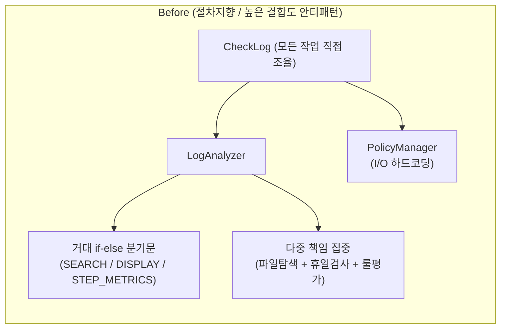
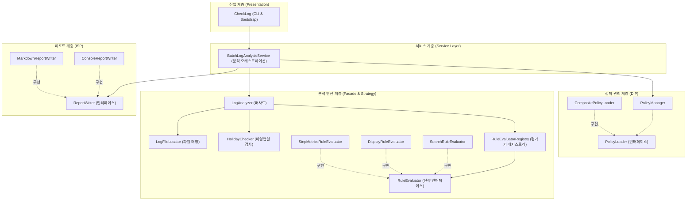

# 객체지향 설계(OOP) 기반 리팩토링 및 SOLID 원칙 가이드

> **작성 일시**: 2026-09-01  
> **대상 프로젝트**: `batchLogAnalyze` (배치로그 분석 및 검증 시스템)  
> **목적**: 절차지향적 구조에서 유지보수성과 확장성이 뛰어난 객체지향(OOP) 구조로의 전환 과정 및 SOLID 원칙 학습 자료

---

## 1. 리팩토링 배경 및 문제점 분석 (Before)

초기 프로토타입 및 1차 모듈화 단계의 코드는 기능적으로 잘 동작했으나, 소프트웨어가 성장함에 따라 다음과 같은 **객체지향 설계 안티패턴(Smells)**이 존재했습니다.

```
┌──────────────────────────────────────────────────────────────────────────────────────────┐
│                        Before (절차지향 / 높은 결합도 안티패턴)                            │
├──────────────────────────────────────────────────────────────────────────────────────────┤
│                                                                                          │
│   [ CheckLog ] ──(직접 조율)──> [ LogAnalyzer ]                                           │
│                                       │                                                  │
│                                       ├─▶ [ if SEARCH / else if DISPLAY ... ] (거대 분기) │
│                                       ├─▶ [ 파일 탐색 + 휴일 검사 + 룰 평가 ] (다중 책임)   │
│                                                                                          │
│   [ CheckLog ] ──(직접 호출)──> [ PolicyManager ] (파일/클래스패스 I/O 하드코딩)           │
│                                                                                          │
└──────────────────────────────────────────────────────────────────────────────────────────┘
```



### 🚨 기존 코드의 한계점
1. **단일 책임 원칙 (SRP) 위반**: `LogAnalyzer` 하나가 파일 탐색, 비영업일 예외 검사, 3가지 룰 평가, 텍스트 파싱 등 너무 많은 역할을 떠안고 있었습니다.
2. **개방-폐쇄 원칙 (OCP) 위반**: 새로운 룰(예: `SQL_COUNT`, `TIMEOUT_CHECK`)이 추가될 때마다 `LogAnalyzer.evaluateRule` 내부의 `if-else` 분기문을 직접 수정해야 했습니다.
3. **의존 역전 원칙 (DIP) 부재**: `PolicyManager`가 클래스패스나 디스크 I/O 같은 구체적인 인프라 로더에 직접 결합되어 있어, 테스트 시 모의(Mock) 정책을 주입하기 어려웠습니다.
4. **출력 형식 결합도**: `ReportGenerator` 내부에 콘솔 출력과 마크다운 파일 생성이 정적 메서드로 얽혀 있어 신규 포맷(HTML, JSON, Slack 등) 확장이 불편했습니다.

---

## 2. 리팩토링 후 OOP 아키텍처 (After)

SOLID 5대 원칙과 디자인 패턴을 적용하여 **책임을 명확히 나누고 인터페이스 기반의 느슨한 결합(Loose Coupling)** 구조로 전면 개선했습니다.

### 🏛️ 시스템 아키텍처 다이어그램 (텍스트 뷰)
```
┌───────────────────────────────────────────────────────────────────────────────────────────┐
│                                 CheckLog (CLI 진입점 & 부트스트랩)                          │
└─────────────────────────────────────────────┬─────────────────────────────────────────────┘
                                              │ (호출)
                                              ▼
┌───────────────────────────────────────────────────────────────────────────────────────────┐
│                    BatchLogAnalysisService (분석 오케스트레이션 / Spring @Service)          │
└──────────────────────┬──────────────────────────────────────────────┬─────────────────────┘
                       │ (정책 관리 위임)                                │ (분석 실행 위임)
                       ▼                                              ▼
┌───────────────────────────────────────────────┐ ┌─────────────────────────────────────────┐
│            PolicyManager (DIP)                │ │            LogAnalyzer (퍼사드)          │
│ ┌───────────────────────────────────────────┐ │ ├─────────────────────────────────────────┤
│ │ <<interface>> PolicyLoader                │ │ │ 1. LogFileLocator  (파일 탐색 전담)      │
│ ├───────────────────────────────────────────┤ │ │ 2. HolidayChecker  (비영업일 검사 전담) │
│ │ └─▶ CompositePolicyLoader (클래스패스/파일) │ │ │ 3. RuleEvaluatorRegistry (전략 관리)   │
│ └───────────────────────────────────────────┘ │ └────────────────────┬────────────────────┘
└───────────────────────────────────────────────┘                      │
                                                                       │ (전략 패턴 위임)
                                                                       ▼
                                                ┌───────────────────────────────────────────┐
                                                │      <<interface>> RuleEvaluator          │
                                                ├───────────────────────────────────────────┤
                                                │ ├─▶ SearchRuleEvaluator     (건수/일치 검증)│
                                                │ ├─▶ DisplayRuleEvaluator    (레이블/수치)  │
                                                │ └─▶ StepMetricsRuleEvaluator(롤백 0건 검증)│
                                                └───────────────────────────────────────────┘
```

### 📊 Mermaid 클래스 관계도 (그래픽 뷰)



---

## 3. SOLID 5대 원칙 적용 상세

### ① S: 단일 책임 원칙 (Single Responsibility Principle)
> *"클래스는 단 하나의 변경 이유만을 가져야 한다."*

| 분리된 컴포넌트 | 전담하는 단일 책임 |
| :--- | :--- |
| **`LogFileLocator`** | `filePrefix`, `rawPattern`, 와일드카드(`%`)를 기반으로 대상 로그 파일 탐색 |
| **`HolidayChecker`** | 로그 원본에서 비영업일 예외 안내 메시지 감지 및 상태 전이 |
| **`SearchRuleEvaluator`** | 출현 빈도(건수) 기반 룰 검증 |
| **`DisplayRuleEvaluator`** | 레이블/수치 추출 및 조건 비교 |
| **`StepMetricsRuleEvaluator`** | Spring Batch Step 실행 통계(Rollback 0건 여부) 검증 |
| **`ConsoleReportWriter`** | 콘솔 표준 출력(터미널) 서식화 |
| **`MarkdownReportWriter`** | GFM 마크다운 보고서 파일 렌더링 및 디스크 저장 |

---

### ② O: 개방-폐쇄 원칙 (Open-Closed Principle) & 전략 패턴 (Strategy Pattern)
> *"소프트웨어 개체는 확장에 대해 열려 있어야 하고, 수정에 대해서는 닫혀 있어야 한다."*

#### [Before] 분기문 직접 수정 (위반)
```java
// 새로운 룰이 추가될 때마다 LogAnalyzer 코드를 열어 else if를 추가해야 함
if ("SEARCH".equalsIgnoreCase(rule.type)) {
    evaluateSearchRule(...);
} else if ("DISPLAY".equalsIgnoreCase(rule.type)) {
    evaluateDisplayRule(...);
} else if ("STEP_METRICS".equalsIgnoreCase(rule.type)) {
    evaluateStepMetricsRule(...);
}
```

#### [After] 전략 패턴(Strategy)과 레지스트리(Registry) 도입
```java
// 1. 공통 전략 인터페이스
public interface RuleEvaluator {
    boolean supports(String ruleType);
    RuleResult evaluate(String fullText, String[] lines, Rule rule);
}

// 2. 신규 룰 추가 시 새 클래스만 작성하면 됨 (기존 코드 수정 0줄)
public class CustomRuleEvaluator implements RuleEvaluator {
    @Override
    public boolean supports(String ruleType) {
        return "CUSTOM_CHECK".equalsIgnoreCase(ruleType);
    }
    @Override
    public RuleResult evaluate(String fullText, String[] lines, Rule rule) {
        // 독립된 신규 알고리즘 구현
    }
}

// 3. 레지스트리에 동적 등록
registry.register(new CustomRuleEvaluator());
```

---

### ③ L: 리스코프 치환 원칙 (Liskov Substitution Principle)
> *"서브타입은 언제나 자신의 기반타입(Base type)으로 교체할 수 있어야 한다."*

- `RuleEvaluator`를 구현한 `SearchRuleEvaluator`, `DisplayRuleEvaluator`, `StepMetricsRuleEvaluator`는 모두 동일한 규약에 따라 `RuleResult`를 반환합니다.
- 호출자인 `RuleEvaluatorRegistry`나 `LogAnalyzer`는 구체 구현체의 내부 로직을 알 필요 없이 `evaluator.evaluate(...)`를 안심하고 실행할 수 있습니다.

---

### ④ I: 인터페이스 분리 원칙 (Interface Segregation Principle)
> *"클라이언트는 자신이 사용하지 않는 메서드에 의존하지 않아야 한다."*

- 거대한 다기능 인터페이스 대신, **역할에 특화된 최소한의 인터페이스**로 분리했습니다.
  - `RuleEvaluator`: `supports()`, `evaluate()`
  - `PolicyLoader`: `load(location)`
  - `ReportWriter`: `write(folderName, results, total, pass, fail)`

---

### ⑤ D: 의존 역전 원칙 (Dependency Inversion Principle)
> *"상위 수준의 모듈은 하위 수준의 모듈에 의존해서는 안 된다. 둘 모두 추상화에 의존해야 한다."*

#### [Before]
`PolicyManager`가 파일 시스템 I/O 및 클래스패스 읽기 로직을 직접 구현하여 특정 I/O 방식에 강하게 결합되어 있었습니다.

#### [After]
`PolicyManager`는 `PolicyLoader`라는 추상 인터페이스를 주입받아 동작합니다:
```java
public class PolicyManager {
    private final PolicyLoader policyLoader;

    // 생성자 주입(DI) 지원: 테스트 시 가짜(Mock) 로더를 주입 가능
    public PolicyManager(PolicyLoader policyLoader) {
        this.policyLoader = policyLoader != null ? policyLoader : new CompositePolicyLoader();
    }

    public void loadPolicies() {
        String json = policyLoader.load(metaPath); // 구체 I/O 기술을 몰라도 됨
        ...
    }
}
```

---

## 4. 디자인 패턴 적용 카탈로그

| 디자인 패턴 | 적용 클래스 | 핵심 가치 및 이점 |
| :--- | :--- | :--- |
| **전략 패턴 (Strategy)** | `RuleEvaluator`, `SearchRuleEvaluator`, `DisplayRuleEvaluator`, `StepMetricsRuleEvaluator` | 룰별 검증 알고리즘을 캡슐화하여 런타임에 동적으로 교체 및 확장 |
| **레지스트리 & 팩토리 (Registry & Factory)** | `RuleEvaluatorRegistry` | 룰 타입(`SEARCH`, `DISPLAY` 등)에 따라 적절한 전략 객체를 찾아 실행하고 미지원 룰에 대한 안전한 Fallback 제공 |
| **퍼사드 패턴 (Facade)** | `LogAnalyzer`, `ReportGenerator` | 복잡한 서브시스템(파일탐색, 비영업일 검사, 룰 평가 등)을 단순하고 직관적인 단일 진입점 API로 감싸서 제공 |
| **컴포지트/체인 로더 (Composite Loader)** | `CompositePolicyLoader` | 외부 설정 경로 $\rightarrow$ 클래스패스 리소스 $\rightarrow$ 루트 경로를 순차적으로 탐색하는 유연한 데이터 로딩 체인 |

---

## 5. 하위 호환성 (Backward Compatibility) 유지 전략

대규모 OOP 리팩토링 시 가장 주의해야 할 점은 **기존 시스템 및 테스트 코드의 중단(Breaking Change)을 방지**하는 것입니다.

- **위임(Delegation) 기법 적용**: 기존의 `LogAnalyzer.checkJob(...)`, `LogAnalyzer.evaluateRule(...)`, `ReportGenerator.printConsoleReport(...)`, `CheckLog.runAnalysis(...)` 등의 공개 정적 메서드를 그대로 유지하면서 내부에서 신규 OOP 서비스 객체로 처리를 위임하도록 구성했습니다.
- **결과**: 기존 작성된 **67개 단위/통합 테스트가 코드 수정 없이 100% 정상 통과(`BUILD SUCCESSFUL`)**합니다.

---

## 6. 객체지향 개발자 체크리스트 (Self-Check)

코드를 작성하거나 리뷰할 때 다음 질문을 던져보세요:

- [ ] **SRP**: 이 클래스를 변경해야 하는 이유가 2개 이상인가? (그렇다면 클래스를 분리하라)
- [ ] **OCP**: 새로운 요구사항(새로운 타입/조건)이 들어왔을 때 기존 `switch`나 `if-else`를 수정하고 있는가? (그렇다면 전략 패턴과 인터페이스를 고려하라)
- [ ] **DIP**: `new File(...)`, `new HttpClient(...)` 같은 인프라 구체 클래스를 비즈니스 로직 한가운데에서 직접 생성하고 있는가? (그렇다면 인터페이스를 도입하고 주입받아라)
- [ ] **Testability**: 이 클래스를 단위 테스트할 때 파일 생성이나 외부 API 호출 없이 순수하게 메모리 상에서 테스트할 수 있는가?
