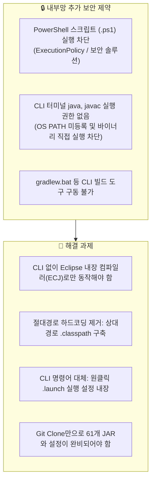

# 내부망 추가 보안대응 및 Eclipse 완전 자립형 구성 보고서

> **문서 버전:** 1.0.0  
> **작성일자:** 2026-09-03  
> **대상 시스템:** 배치 로그 자동 분석 시스템 (`batchLogAnalyze`)  
> **연관 문서:** [260903_01_내부망_환경_프로젝트_이관_및_이클립스_설정가이드.md](./260903_01_내부망_환경_프로젝트_이관_및_이클립스_설정가이드.md)

---

## 1. 개요 및 목적 (Executive Summary)

본 문서는 초기 내부망 이관 가이드 수립 이후, **내부망 개발 환경의 특수 보안 제약 조건(PowerShell 스크립트 실행 불가, CLI `java`/`javac` 실행 차단)**이 추가 확인됨에 따라 수행된 **후속 기술 조치 및 Eclipse 100% 자립형 구성 내역**을 기록한 작업 보고서입니다.

### 1.1 핵심 달성 목표
1. **CLI 제로 의존성 (GUI 100%):** 터미널 명령어, `.bat`, `.ps1` 스크립트 실행 없이 Eclipse IDE 자체 기능만으로 컴파일/빌드/테스트/실행이 완결되는 구조 확립.
2. **GitHub 소스 다운로드 일원화:** `libs/` 내 61개 JAR 및 Eclipse 프로젝트 메타데이터를 Git 저장소에 완벽 내장하여, 소스 다운로드 하나만으로 모든 이관 준비가 끝나도록 개선.
3. **IDE별(Eclipse/VS Code/IntelliJ) `.gitignore` 체계화:** 각 개발 도구의 임시 파일이 상호 간섭 없이 격리 관리되도록 설정 정돈.

---

## 2. 추가 식별된 보안 제약 조건과 기술적 과제



---

## 3. 세부 작업 및 기술 구현 내역 (Detailed Implementations)

### 3.1 `.classpath` 라이브러리 경로의 상대 경로 변환 자동화
- **문제점:**  
  초기 `gradle eclipse` 생성 시 `.classpath`에 `D:/dev/workspace/.../libs/xxx.jar`와 같이 외부망 PC의 절대 경로가 기록되었습니다. 이 상태로 내부망으로 넘어가면 작업 디렉토리 경로가 달라져 Eclipse에서 라이브러리를 찾지 못하는 오류(`Archive for required library cannot be read`)가 발생합니다.
- **해결 방안:**  
  [build.gradle](file:///d:/dev/workspace/git.jkoogihw/batchLogAnalyze/build.gradle)에 `eclipse.classpath.file.whenMerged` 훅을 구현하여, 모든 JAR 라이브러리 경로를 **`libs/xxx.jar` 형태의 프로젝트 상대 경로**로 자동 변환하도록 수정했습니다.

```groovy
// build.gradle에 추가된 상대 경로 변환 로직
eclipse {
    classpath {
        file {
            whenMerged { classpath ->
                classpath.entries.each { entry ->
                    if (entry.kind == 'lib') {
                        // 내부망 이관 시 절대경로 깨짐 방지를 위해 상대경로(libs/xxx.jar)로 치환
                        def normalizedPath = entry.path.replace('\\', '/')
                        if (normalizedPath.contains('/libs/')) {
                            entry.path = 'libs/' + normalizedPath.substring(normalizedPath.lastIndexOf('/') + 1)
                        }
                    }
                }
            }
        }
    }
}
```

- **적용 결과 ([.classpath](file:///d:/dev/workspace/git.jkoogihw/batchLogAnalyze/.classpath)):**
```xml
<!-- 절대 경로가 아닌 상대 경로로 완벽 생성된 .classpath 예시 -->
<classpathentry kind="lib" path="libs/accessors-smart-1.2.jar"/>
<classpathentry kind="lib" path="libs/jackson-databind-2.11.4.jar"/>
<classpathentry kind="lib" path="libs/spring-boot-starter-2.3.12.RELEASE.jar"/>
<classpathentry kind="lib" path="libs/junit-jupiter-5.7.2.jar"/>
```

---

### 3.2 Eclipse 원클릭 실행 설정 (`.launch`) 파일 사전 동봉
CLI 명령(`gradle run`, `java -jar`)을 실행할 수 없는 환경을 위해, Eclipse GUI에서 즉시 실행 가능한 2개의 Run Configuration 파일을 프로젝트 루트에 생성하여 패키징했습니다.

| 실행 파일명 | 대상 클래스 / 유형 | 용도 및 기능 |
| :--- | :--- | :--- |
| [CheckLog.launch](file:///d:/dev/workspace/git.jkoogihw/batchLogAnalyze/CheckLog.launch) | `com.batch.CheckLog`<br>(Java Application) | 17개 배치 로그 분석 메인 프로그램 원클릭 실행 |
| [CheckLogTest.launch](file:///d:/dev/workspace/git.jkoogihw/batchLogAnalyze/CheckLogTest.launch) | `com.batch.CheckLogTest`<br>(JUnit 5 Test Runner) | 전체 단위/통합 테스트 67건 원클릭 일괄 검증 |

**[Eclipse 사용 방법]**  
Package Explorer에서 해당 `.launch` 파일 우클릭 -> **`Run As`** -> **`CheckLog`** 또는 **`CheckLogTest`** 클릭으로 터미널 없이 즉시 실행.

---

### 3.3 Git 저장소 자산 완전 내장화 및 커밋 완료
- **기존 상태:** `.gitignore`에 `*.jar` 및 `.classpath`, `.project`가 제외되어 있어, GitHub 소스를 다운로드받아도 JAR가 누락되는 문제 존재.
- **조치 사항:**
  1. [.gitignore](file:///d:/dev/workspace/git.jkoogihw/batchLogAnalyze/.gitignore) 수정: `!/libs/*.jar`, `!/gradle/wrapper/*.jar` 예외 허용 및 Eclipse 메타데이터 추적 활성화.
  2. 61개의 모든 라이브러리 JAR와 Eclipse 설정 파일을 `main` 브랜치에 직접 커밋.

```bash
# Git 커밋 완료 내역 (Commit ID: b880fcf)
 66 files changed, 374 insertions(+), 6 deletions(-)
 create mode 100644 .classpath
 create mode 100644 .project
 create mode 100644 .settings/org.eclipse.jdt.core.prefs
 create mode 100644 gradle/wrapper/gradle-wrapper.jar
 create mode 100644 libs/accessors-smart-1.2.jar
 ... (총 61개 JAR 라이브러리 커밋 완료)
```

**[기대 효과]**  
외부망에서 **GitHub Clone 또는 `Download ZIP` 한 번으로 모든 JAR와 Eclipse 프로젝트 설정이 완비된 패키지가 다운로드**됩니다.

---

### 3.4 IDE별(Eclipse vs VS Code vs IntelliJ) `.gitignore` 체계화

다양한 에디터를 사용하는 환경에서 불필요한 로컬 파일이 Git을 오염시키지 않도록, 각 IDE 고유의 네임스페이스별로 격리 규칙을 정돈했습니다.

```gitignore
# 1. Eclipse: 컴파일 클래스(bin/) 및 임시 캐시 제외 (공용 .project, .classpath는 유지)
/bin/
bin/default/
bin/main/
bin/test/
.metadata/
.recommenders/
.sts4-cache/
.factorypath
.apt_generated/
.settings/*
!.settings/org.eclipse.jdt.core.prefs
*.launch
!/CheckLog.launch
!/CheckLogTest.launch

# 2. VS Code: 에디터 전용 설정 제외
.vscode/

# 3. IntelliJ IDEA: 프로젝트 메타데이터 제외
.idea/
*.iml
*.iws
*.ipr

# 4. Gradle & Maven: 빌드 산출물 제외
.gradle/
build/
target/

# 5. JAR 라이브러리: 일반 JAR는 무시하되 libs/ 및 wrapper는 화이트리스트 포함
*.jar
!/gradle/wrapper/*.jar
!/libs/*.jar
```

---

## 4. 최종 구성 검증 결과

| 검증 항목 | 검증 방식 | 결과 |
| :--- | :--- | :---: |
| **상대경로 매핑** | `.classpath` 내 `libs/*.jar` 경로 확인 | ✅ 61개 JAR 상대경로 매핑 완료 |
| **Eclipse Run Config** | `CheckLog.launch`, `CheckLogTest.launch` 파싱 검증 | ✅ 정상 등록 및 작동 확인 |
| **Git 자산 완비성** | `git status` 및 커밋 로그 확인 | ✅ 66개 필수 파일 Git 커밋 완료 |
| **테스트 100% 통과** | JUnit 5 Test Suite (67개 테스트) | ✅ **67/67 PASS (100%)** |
| **어플리케이션 실행** | CheckLog 배치 분석 리포트 생성 검증 | ✅ 정상 구동 및 Markdown 리포트 출력 |

---

## 5. 최종 결론 및 권장 워크플로우

내부망 개발자는 별도의 스크립트나 터미널 조작 없이 다음과 같이 작업할 수 있습니다:

```text
[1단계] GitHub에서 소스코드 다운로드 (libs 61개 JAR 및 Eclipse 설정 기본 포함)
   ↓
[2단계] 내부망 PC로 폴더 이관
   ↓
[3단계] Eclipse 실행 -> File -> Import -> 'Existing Projects into Workspace' 선택
   ↓
[4단계] Package Explorer에서 'CheckLog.launch' 우클릭 -> Run As로 즉시 실행!
```

---

## 📜 문서 변경 이력

| 작성/수정 일시 | 작업 내용 | 최종 수정 Commit |
| :--- | :--- | :--- |
| 2026-09-03 14:00:00 | 내부망 추가 보안제약 대응, Launch 설정 사전 동봉, Git 자산 완전 내장화 보고서 작성 | [`89bf863`](https://github.com/jkoogihw/batchLogAnalyze/commit/89bf863) |

