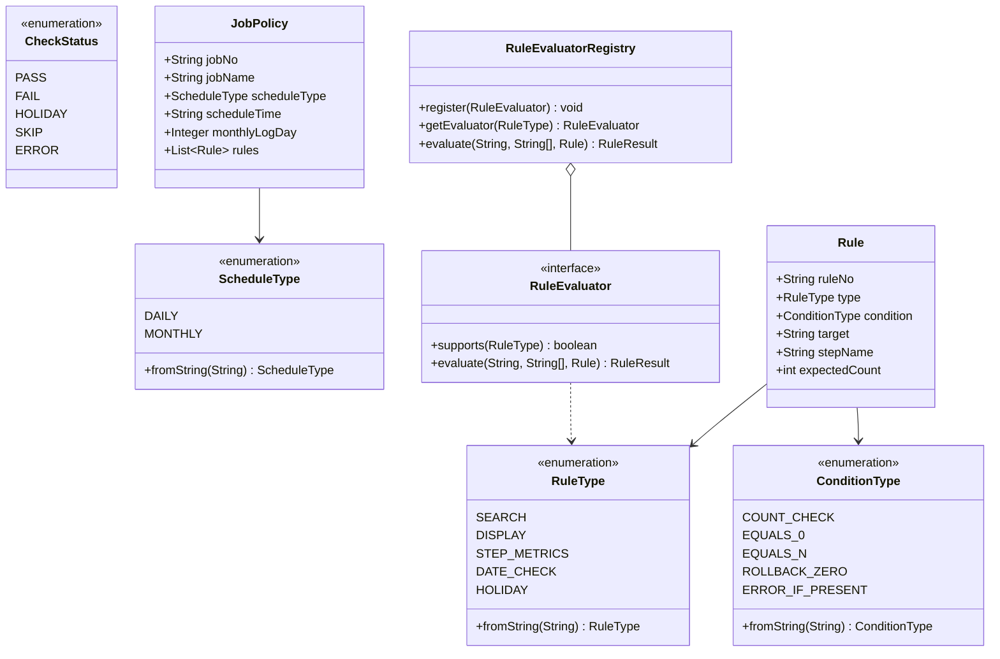

# [구현 계획] OOP 설계 기반 서비스/테스트 개선 및 Enum 규격화 계획서

본 문서는 `batchLogAnalyze` 시스템의 객체지향(OOP) 설계를 점검하여, **상태값 Enum 규격화**, **하드코딩 제거**, **테스트 가능성(Testability) 극대화**, **배치 및 규칙 유형 확장의 유연성(OCP)**을 달성하기 위한 구체적인 구현 계획을 제시합니다.

---

## 🎯 핵심 개선 목표

1. **상태값의 Enum 규격화 (타입 안전성 확보)**:
   - `RuleType` (`SEARCH`, `DISPLAY`, `STEP_METRICS`, `DATE_CHECK`, `HOLIDAY`)
   - `ConditionType` (`COUNT_CHECK`, `EQUALS_0`, `EQUALS_N`, `ROLLBACK_ZERO`, `ERROR_IF_PRESENT`)
   - `ScheduleType` (`DAILY`, `MONTHLY`)
   - `CheckStatus` (`PASS`, `FAIL`, `HOLIDAY`, `SKIP`, `ERROR`)
   - *JSON 및 기존 String 코드와의 100% 양방향 호환성 유지*

2. **하드코딩 제거 및 공통 상수/설정 체계화**:
   - `LogConstants`: 시스템 기본값(`09:05`, `2일`, 기본 마커, 기본 정규식) 중앙집중 상수 관리
   - `CheckResult.formatScheduleInfo`의 하드코딩 시각을 `Config` 및 상수로 치환

3. **실용적 SOLID 원칙 및 테스트 용이성(Testability) 개선**:
   - `LogAnalyzer` / `BatchLogAnalysisService`에 생성자 기반 의존성 주입(DI) 지원 추가 (기존 정적 퍼사드 메서드는 100% 유지하여 하위 호환성 보장)
   - `RuleEvaluatorRegistry`의 동적 등록(OCP)을 단위 테스트에서 쉽게 격리 검증할 수 있도록 개선

4. **설계 구조에 맞춘 견고한 테스트 스위트 재구성**:
   - Enum 변환 및 매핑 단위 테스트
   - 서비스 계층 Mock/Fake 테스트 및 OCP 신규 룰 확장 검증 테스트
   - 18개 전체 실로그 통합 테스트와의 완벽한 연계

---

## 🏛️ 제안 아키텍처 및 도메인 다이어그램



---

## 📋 세부 변경 계획 (Proposed Changes)

### 1. 도메인 모델 (`com.batch.model`)
- [NEW] [RuleType.java](file:///d:/dev/workspace/git.jkoogihw/batchLogAnalyze/src/main/java/com/batch/model/RuleType.java): 규칙 유형 Enum (`SEARCH`, `DISPLAY`, `STEP_METRICS`, `DATE_CHECK`, `HOLIDAY`)
- [NEW] [ConditionType.java](file:///d:/dev/workspace/git.jkoogihw/batchLogAnalyze/src/main/java/com/batch/model/ConditionType.java): 검증 조건 Enum (`COUNT_CHECK`, `EQUALS_0`, `EQUALS_N`, `ROLLBACK_ZERO`, `ERROR_IF_PRESENT`)
- [NEW] [ScheduleType.java](file:///d:/dev/workspace/git.jkoogihw/batchLogAnalyze/src/main/java/com/batch/model/ScheduleType.java): 스케줄 주기 Enum (`DAILY`, `MONTHLY`)
- [NEW] [CheckStatus.java](file:///d:/dev/workspace/git.jkoogihw/batchLogAnalyze/src/main/java/com/batch/model/CheckStatus.java): 검증 상태 Enum (`PASS`, `FAIL`, `HOLIDAY`, `SKIP`, `ERROR`)
- [NEW] [LogConstants.java](file:///d:/dev/workspace/git.jkoogihw/batchLogAnalyze/src/main/java/com/batch/model/LogConstants.java): 시스템 공통 상수 관리 (기본 분기시각 `09:05`, 월간 기본일자 `2`, 공통 마커)
- [MODIFY] [Rule.java](file:///d:/dev/workspace/git.jkoogihw/batchLogAnalyze/src/main/java/com/batch/model/Rule.java): `RuleType`, `ConditionType` Getter/Setter 및 String 생성자 호환
- [MODIFY] [JobPolicy.java](file:///d:/dev/workspace/git.jkoogihw/batchLogAnalyze/src/main/java/com/batch/model/JobPolicy.java): `ScheduleType` Enum 연동 및 헬퍼 메서드 제공
- [MODIFY] [CheckResult.java](file:///d:/dev/workspace/git.jkoogihw/batchLogAnalyze/src/main/java/com/batch/model/CheckResult.java): 하드코딩 제거 및 `ScheduleType` 활용

### 2. 평가기 및 분석 엔진 (`com.batch.analyzer`)
- [MODIFY] [RuleEvaluator.java](file:///d:/dev/workspace/git.jkoogihw/batchLogAnalyze/src/main/java/com/batch/analyzer/evaluator/RuleEvaluator.java): `supports(RuleType)` 및 `supports(String)` 다형성 지원
- [MODIFY] [RuleEvaluatorRegistry.java](file:///d:/dev/workspace/git.jkoogihw/batchLogAnalyze/src/main/java/com/batch/analyzer/evaluator/RuleEvaluatorRegistry.java): Enum 기반 라우팅 및 Fallback 로직 강화
- [MODIFY] [SearchRuleEvaluator.java](file:///d:/dev/workspace/git.jkoogihw/batchLogAnalyze/src/main/java/com/batch/analyzer/evaluator/SearchRuleEvaluator.java): `ConditionType` Enum 매핑 및 가독성 개선
- [MODIFY] [DisplayRuleEvaluator.java](file:///d:/dev/workspace/git.jkoogihw/batchLogAnalyze/src/main/java/com/batch/analyzer/evaluator/DisplayRuleEvaluator.java): `ConditionType` Enum 매핑 및 가독성 개선
- [MODIFY] [StepMetricsRuleEvaluator.java](file:///d:/dev/workspace/git.jkoogihw/batchLogAnalyze/src/main/java/com/batch/analyzer/evaluator/StepMetricsRuleEvaluator.java): `ConditionType` Enum 매핑 및 가독성 개선
- [MODIFY] [LogAnalyzer.java](file:///d:/dev/workspace/git.jkoogihw/batchLogAnalyze/src/main/java/com/batch/analyzer/LogAnalyzer.java): 인스턴스 DI 생성자 및 정적 퍼사드 오버로딩 지원 (테스트 시 가짜 Evaluator/DateChecker 주입 가능)
- [MODIFY] [LogDateChecker.java](file:///d:/dev/workspace/git.jkoogihw/batchLogAnalyze/src/main/java/com/batch/analyzer/LogDateChecker.java): `ScheduleType` Enum 연동 및 하드코딩 상수화

### 3. 정책 관리자 (`com.batch.policy`)
- [MODIFY] [PolicyManager.java](file:///d:/dev/workspace/git.jkoogihw/batchLogAnalyze/src/main/java/com/batch/policy/PolicyManager.java): JSON 파싱 시 Enum(`RuleType`, `ConditionType`, `ScheduleType`) 자동 변환 및 안전한 디폴트 처리

### 4. 서비스 및 리포트 (`com.batch.service`, `com.batch.report`)
- [MODIFY] [BatchLogAnalysisService.java](file:///d:/dev/workspace/git.jkoogihw/batchLogAnalyze/src/main/java/com/batch/service/BatchLogAnalysisService.java): `LogAnalyzer` 생성자 DI 지원 추가
- [MODIFY] [ConsoleReportWriter.java](file:///d:/dev/workspace/git.jkoogihw/batchLogAnalyze/src/main/java/com/batch/report/ConsoleReportWriter.java): 하드코딩 제거 및 Enum 상태 서식 연동
- [MODIFY] [MarkdownReportWriter.java](file:///d:/dev/workspace/git.jkoogihw/batchLogAnalyze/src/main/java/com/batch/report/MarkdownReportWriter.java): 하드코딩 제거 및 Enum 상태 서식 연동

### 5. 테스트 스위트 강화 (`src/test/java/com/batch`)
- [NEW] [EnumTypeTest.java](file:///d:/dev/workspace/git.jkoogihw/batchLogAnalyze/src/test/java/com/batch/model/EnumTypeTest.java): `RuleType`, `ConditionType`, `ScheduleType`, `CheckStatus` 변환/대소문자/예외 단위 테스트
- [MODIFY] [ModelTest.java](file:///d:/dev/workspace/git.jkoogihw/batchLogAnalyze/src/test/java/com/batch/model/ModelTest.java): Enum 속성 및 모델 상태 검증 보강
- [MODIFY] [LogAnalyzerTest.java](file:///d:/dev/workspace/git.jkoogihw/batchLogAnalyze/src/test/java/com/batch/analyzer/LogAnalyzerTest.java): DI를 통한 인스턴스 분석기 테스트 및 커스텀 `RuleEvaluator` OCP 확장 검증 테스트 추가
- [MODIFY] [PolicyManagerTest.java](file:///d:/dev/workspace/git.jkoogihw/batchLogAnalyze/src/test/java/com/batch/policy/PolicyManagerTest.java): Enum 파싱 무결성 검증 추가
- [MODIFY] [LogSampleVerificationTest.java](file:///d:/dev/workspace/git.jkoogihw/batchLogAnalyze/src/test/java/com/batch/analyzer/LogSampleVerificationTest.java): 18개 전체 배치 100% 통과 보장

---

## 🧪 검증 계획 (Verification Plan)

### 자동화 테스트 (Automated Tests)
1. **전체 단위/통합 테스트 스위트 실행**:
   ```powershell
   $env:JAVA_HOME="D:\dev\bin\java\jdk-17.0.2"; .\gradlew test
   ```
   - 신규 Enum 테스트 및 OCP 확장 테스트 포함 **90개 이상 테스트 100% PASS** 확인.
2. **실제 월간 18개 배치 로그 일괄 분석 실행 검증**:
   ```powershell
   .\gradlew run --args="src/test/resources/log_monthly"
   ```
   - 18 PASS / 0 FAIL 정상 리포트 출력 확인.

---

## 💡 사용자 검토 요청

- 기존의 문자열 기반 JSON 정책(`policy_meta.json`, `policy_meta_test.json`)은 Enum 도입 후에도 **단 한 줄의 변경 없이 100% 동일하게 호환**됩니다.
- 본 계획에 대해 승인해 주시면 구현을 진행하겠습니다.
