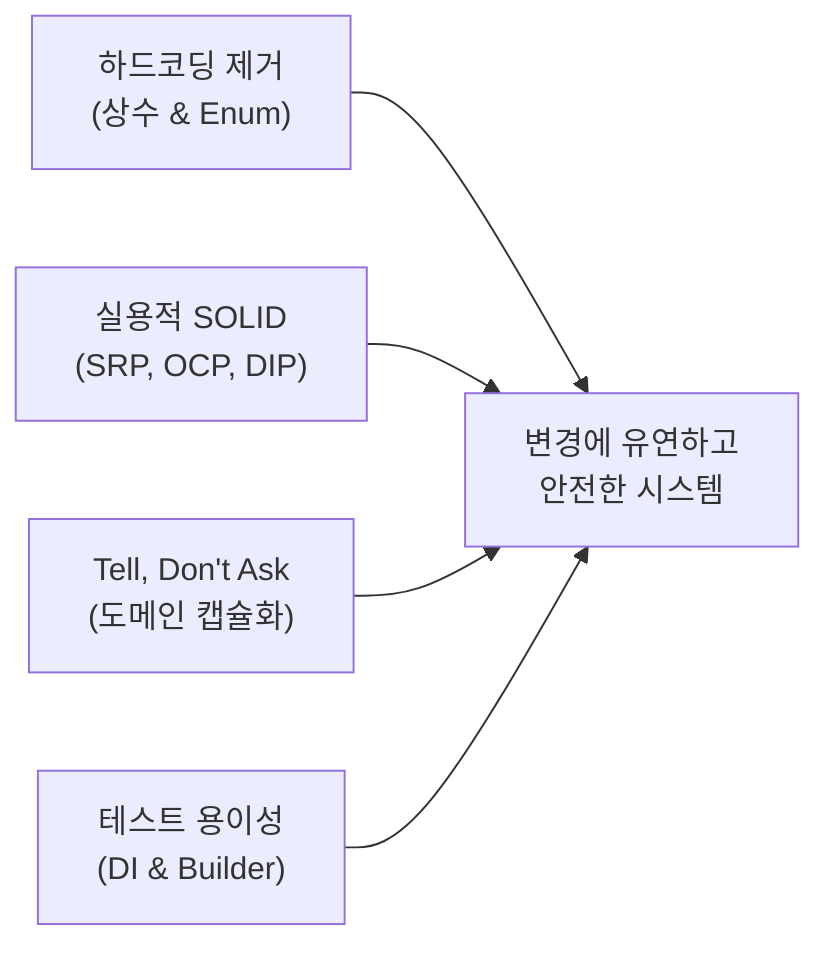

# 실용적 객체지향(OOP) 설계 및 테스트 아키텍처 학습 가이드

> **대상 독자**: Java/Spring 및 배치 시스템을 처음 접하거나, 객체지향 설계와 단위 테스트를 실무에 어떻게 적용해야 할지 고민하는 주니어 개발자  
> **문서 목적**: 이론적인 SOLID 원칙의 경직된 적용을 지양하고, **실무에서 유연하게 변경을 수용하며 견고한 테스트망을 구축하는 실용적 OOP 아키텍처**를 실제 코드 Before/After를 통해 학습합니다.

---

## 1. 아키텍처 개선 개요 및 설계 철학

배치 로그 분석 시스템은 새로운 배치 JOB의 추가, 로그 포맷 변경, 새로운 검증 룰 유형의 등장 등 **요구사항 변경이 빈번하게 일어나는 시스템**입니다.  
과거의 코드는 절차적 방식과 문자열 하드코딩에 의존하여 새로운 기능이 추가될 때마다 기존 코드가 깨지기 쉬웠습니다.

### 💡 실용적 OOP 설계의 4대 핵심 철학



1. **하드코딩 최소화 & 상태값 Enum 규격화**:
   - 매직 넘버("09:05", "01")나 매직 스트링("PASS", "SEARCH", "DAILY")을 제거하고, 타입 안정성을 보장하는 열거형(Enum)과 상수 클래스로 중앙 집중화합니다.
2. **실용적 SOLID (과도한 추상화 지양)**:
   - 모든 클래스에 불필요한 인터페이스(`ILogAnalyzer`, `ILogDateChecker`)를 무조건 만들지 않습니다.
   - 전략 변경이나 확장이 실제 필요한 지점(`RuleEvaluator`)에만 다형성을 적용(OCP)합니다.
3. **묻지 말고 시켜라 (Tell, Don't Ask)**:
   - 외부에서 객체의 내부 상태(필드)를 꺼내서 if문으로 판단하지 않고, 도메인 객체 스스로 판단(`cr.isPassed()`, `cr.isHoliday()`)하게 합니다.
4. **테스트 용이성 (Testability) & 가독성 높은 픽스처 (Builder Pattern)**:
   - 생성자 주입(DI)을 통해 외부 I/O 없이도 메모리 상에서 1ms 단위로 테스트할 수 있게 하며, Fluent Builder로 테스트 코드의 가독성을 극대화합니다.

---

## 2. Before vs After 핵심 코드 구조 비교

### [패턴 1] 상태값 규격화: 매직 스트링 vs Enum & 상수

#### 🔴 Before (취약한 하드코딩 방식)
```java
// 오타에 취약하고 대소문자나 유효하지 않은 값에 대해 런타임 에러 발생
if (policy.scheduleType.equals("DAILY")) { ... }
if (rule.type.equals("SEARCH")) { ... }
if (rule.condition.equals("EQUALS_0")) { ... }

// 기본 설정값들이 코드 곳곳에 중복 산재
String cutoff = Config.get("log.cutoff.time", "09:05");
result.ruleNo = "01";
result.description = "배치파일점검";
```

#### 🟢 After (Enum 규격화 & 대소문자 무시 양방향 호환)
```java
// [RuleType.java] 열거형으로 규격화 + JSON/외부 문자열 안전 변환
public enum RuleType {
    SEARCH("SEARCH", "키워드/정규식 검색"),
    DISPLAY("DISPLAY", "레이블 값 추출"),
    STEP_METRICS("STEP_METRICS", "스텝 메트릭"),
    DATE_CHECK("DATE_CHECK", "배치 실행일자 점검"),
    HOLIDAY("HOLIDAY", "비영업일 예외"),
    UNKNOWN("UNKNOWN", "미정의");

    public static RuleType fromString(String text) {
        if (text == null) return UNKNOWN;
        for (RuleType t : values()) {
            if (t.name().equalsIgnoreCase(text.trim())) return t;
        }
        return UNKNOWN;
    }
}

// [LogConstants.java] 공통 상수 중앙화
public final class LogConstants {
    public static final String DEFAULT_CUTOFF_TIME = "09:05";
    public static final String DEFAULT_DATE_CHECK_RULE_NO = "01";
    public static final String MSG_NORMAL_FILE_COLLECTED = "정상파일수집";
}
```

---

### [패턴 2] OCP(개방-폐쇄 원칙): 거대한 switch-case vs 전략 패턴(Registry)

#### 🔴 Before (새로운 룰 추가 시 기존 핵심 메서드를 직접 수정해야 함)
```java
public class LogAnalyzer {
    public static RuleResult evaluateRule(String text, String[] lines, Rule rule) {
        // 새로운 룰(예: TIMEOUT_CHECK)이 추가될 때마다 이 거대한 switch-case를 고쳐야 함 -> OCP 위반
        switch (rule.type) {
            case "SEARCH":
                return evaluateSearch(text, lines, rule);
            case "DISPLAY":
                return evaluateDisplay(text, lines, rule);
            case "STEP_METRICS":
                return evaluateStepMetrics(lines, rule);
            default:
                throw new IllegalArgumentException("Unknown type: " + rule.type);
        }
    }
}
```

#### 🟢 After (RuleEvaluator 인터페이스 + Registry 동적 라우팅)
```java
// 1. 공통 평가 인터페이스
public interface RuleEvaluator {
    boolean supports(String ruleType);
    RuleResult evaluate(String fullText, String[] lines, Rule rule);
}

// 2. 레지스트리 (새로운 평가기는 register만 하면 기존 코드 수정 0줄)
public class RuleEvaluatorRegistry {
    private final List<RuleEvaluator> evaluators = new ArrayList<>();

    public void register(RuleEvaluator evaluator) {
        evaluators.add(evaluator);
    }

    public RuleResult evaluate(String fullText, String[] lines, Rule rule) {
        return evaluators.stream()
                .filter(e -> e.supports(rule.getRuleType()))
                .findFirst()
                .map(e -> e.evaluate(fullText, lines, rule))
                .orElseGet(() -> createUnknownResult(rule));
    }
}
```

---

### [패턴 3] 도메인 캡슐화: Tell, Don't Ask

#### 🔴 Before (외부에서 객체의 속성을 꺼내 if문으로 상태를 판정)
```java
// CheckResult를 사용하는 외부 클래스 곳곳에서 동일한 if문 반복
if (cr.fileFound && cr.overallPassed) {
    printSuccess();
} else if (cr.isHoliday) {
    printHolidayNotice();
} else if (!cr.fileFound) {
    printNotFound();
}
```

#### 🟢 After (도메인 객체 스스로 상태를 계산하여 응답)
```java
public class CheckResult {
    // 도메인 메서드 제공 (외부에서는 어떻게 계산되는지 알 필요 없음)
    public CheckStatus getStatus() {
        if (isHoliday) return CheckStatus.HOLIDAY;
        if (!fileFound) return CheckStatus.FILE_NOT_FOUND;
        return overallPassed ? CheckStatus.PASS : CheckStatus.FAIL;
    }

    public boolean isPassed() {
        return getStatus().isPassed(); // PASS, HOLIDAY, SKIP은 성공으로 간주
    }
}

// 호출자 코드: 매우 간결하고 명확해짐
if (cr.isPassed()) {
    summary.passCount++;
}
```

---

### [패턴 4] 테스트 빌더 패턴: 복잡한 픽스처 준비 vs Fluent Builder

#### 🔴 Before (생성자에 null, 매직 파라미터가 난무하여 의도를 알기 어려움)
```java
// 어떤 값이 무슨 필드인지 파악하기 어렵고, 변경 시 수많은 테스트 코드 수정 필요
JobPolicy p = new JobPolicy("18", "smpmJob206", "협회코드", "18_");
p.scheduleType = "MONTHLY";
p.monthlyLogDay = 2;
p.scheduleTime = "00:45";
Rule r1 = new Rule("02", "SEARCH", "HTTP/1.1 200", "COUNT_CHECK", "거래성공");
p.rules.add(r1);
```

#### 🟢 After (Fluent Builder & Rule Factory Method)
```java
// 읽기 쉽고(자연어처럼 읽힘), 필드 순서나 누락 걱정 없이 안전하게 테스트 픽스처 생성
JobPolicy policy = JobPolicy.builder("18", "smpmJob206")
        .title("206_협회코드및보험사코드수집")
        .monthly(2, "00:45")
        .addRule(Rule.search("HTTP/1.1 200", ConditionType.COUNT_CHECK, "거래성공"))
        .addRule(Rule.display("prodList.size", ConditionType.COUNT_CHECK, "정리건수"))
        .addRule(Rule.search("TB_SMPM1002.insIntgCode", ConditionType.EQUALS_N, 151, "조회건수"))
        .build();
```

---

## 3. 설계 의도, 장단점 및 트레이드오프 분석

| 설계 기법 | 도입 의도 | 장점 (Pros) | 단점 및 트레이드오프 (Cons & Trade-offs) |
| :--- | :--- | :--- | :--- |
| **Enum 규격화** | 상태값 및 조건 타입의 오타 방지 및 도메인 의미 명확화 | 컴파일 타임 검증, IDE 자동완성 지원, 안전한 분기 처리 | 외부 입력(JSON)과의 변환 계층(`fromString()`) 필요 |
| **전략 레지스트리 (OCP)** | 신규 규칙 유형(RuleType) 추가 시 기존 엔진 무수정 확장 | 기존 코드 영향도 0, 개별 평가기 단위의 독립 단위 테스트 용이 | 클래스 파일 수가 늘어나고 단순 switch문 대비 초기 학습 비용 존재 |
| **생성자 주입 (DIP)** | 정적(Static) 결합을 해소하고 Mock/Fake 객체 주입 가능케 함 | I/O 없는 순수 메모리 단위 테스트 가능, 스프링 빈 생태계와 자연스러운 연동 | 인스턴스 생성 및 관리 흐름이 추가됨 (정적 편의 메서드와 하이브리드로 절충) |
| **Fluent Builder** | 객체 생성의 가독성 향상 및 복잡한 도메인 조합 단순화 | 생성자 파라미터 순서 혼동 방지, 필수값/선택값의 명확한 분리 | 빌더 클래스 작성 및 유지보수 코드량 증가 |

---

## 4. 초보자를 위한 단계별 테스트 작성 가이드

견고한 소프트웨어를 만드는 테스트는 피라미드 구조를 가집니다.

```
       / \
      / 통합 \      -> LogSampleVerificationTest (실제 로그 파일 I/O & 전체 파이프라인 검증)
     /--------\
    / 도메인/규칙 \    -> LogAnalyzerTest, ValueExtractorTest (메모리 상의 핵심 알고리즘 검증)
   /------------\
  /  Enum / 모델  \   -> EnumTypeTest, ModelTest (타입 무결성, 빌더, 상태 전이 검증)
 /----------------\
```

### 테스트 작성 3단계 공식 (Given - When - Then)
1. **Given (준비)**: 테스트할 가상 데이터(로그 텍스트, 룰 객체)를 준비합니다.
2. **When (실행)**: 검증하려는 단일 메서드를 실행합니다.
3. **Then (검증)**: `assertAll()`을 통해 모든 기대 결과가 일치하는지 단언합니다.

```java
@Test
@DisplayName("SEARCH 규칙 - EQUALS_0 조건: 오류 키워드가 0건일 때 통과(PASS)")
public void testEvaluateSearchRule_EQUALS_0_Success() {
    // 1. [Given] 테스트 데이터 준비 (디스크 파일 대신 메모리 문자열 사용 -> 1ms 실행)
    String logText = "Job started\nJob completed successfully\n";
    String[] lines = logText.split("\n");
    Rule rule = Rule.search("ERROR", ConditionType.EQUALS_0, "오류 미발생 검증");

    // 2. [When] 평가 실행
    RuleResult result = LogAnalyzer.evaluateRule(logText, lines, rule);

    // 3. [Then] 단언 (assertAll을 쓰면 여러 검증 중 하나가 실패해도 끝까지 검사함)
    assertAll("SEARCH EQUALS_0 성공 검증",
        () -> assertTrue(result.passed, "ERROR가 0개이므로 통과해야 함"),
        () -> assertEquals("0건", result.extractedValue, "추출값이 0건이어야 함")
    );
}
```

---

## 5. 향후 관리 및 확장 방안

1. **신규 배치 JOB 추가 시**:
   - `policy_meta.json`에 신규 JOB JSON 정의 블록 추가.
   - 테스트 코드(`LogSampleVerificationTest` 또는 `ModelTest`)에서 `JobPolicy.builder()`로 정책 테스트 작성.
2. **신규 규칙 유형(RuleType) 추가 시**:
   - `RuleType` Enum에 신규 코드 추가.
   - `RuleEvaluator` 인터페이스를 구현하는 신규 평가기 클래스 생성 (예: `TimeCostRuleEvaluator`).
   - `RuleEvaluatorRegistry`에 `register(new TimeCostRuleEvaluator())` 호출.
3. **대용량 로그 추가 시**:
   - `LogSlimmer.slimDirectory(...)`를 활용하여 핵심 키워드 라인만 보존한 채 99% 이상 경량화하여 형상관리(Git)에 등록.

---

## 문서 변경 이력

| 작성일시 | 작업 내용 | 최종수정 Commit 링크 |
| :--- | :--- | :--- |
| 2026-09-04 00:08 | 실용적 OOP 설계 및 테스트 아키텍처 초보자용 학습 가이드 최초 작성 | [Current Commit](https://github.com/jkoogihw/batchLogAnalyze/commit/HEAD) |
