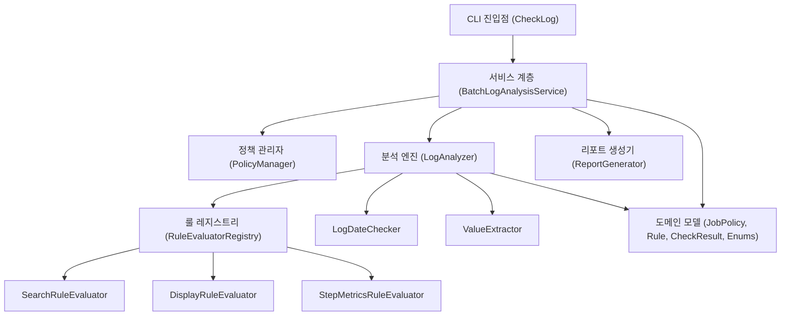
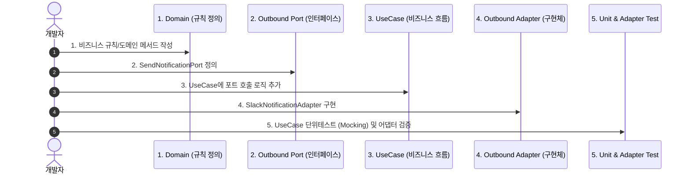

# 현재 설계 vs 헥사고날 아키텍처 비교 및 전환 가이드

> **문서 목적**: 현재의 실용적 레이어드 OOP 설계와 헥사고날 아키텍처(클린 아키텍처)의 구조적 차이점과 장단점을 비교하고, 향후 전환 시 필요한 작업 절차, 트레이드오프, 초급 개발자 학습 로드맵, 테스트 및 운영 매뉴얼을 체계적으로 정리합니다.  
> **상태**: 아키텍처 분석 및 가이드 수립 (실제 코드 전환 작업은 보류)

---

## 1. 아키텍처 비교 개요

### 1.1 현재 아키텍처 (실용적 레이어드 + 전략 패턴 OOP)
현재 시스템은 **실용적 계층형 아키텍처(Layered Architecture)**에 **전략 패턴(Strategy Pattern)**과 **도메인 캡슐화(Tell, Don't Ask)**를 접목한 형태입니다.



- **특징**:
  - 직관적이고 계층 간 흐름이 명확하며, 파일 수가 적어 전체 코드 흐름을 한눈에 파악하기 쉽습니다.
  - 핵심 평가 로직은 `RuleEvaluatorRegistry`로 OCP(개방-폐쇄 원칙)를 만족합니다.
  - 단, `BatchLogAnalysisService` 및 `LogAnalyzer`가 `java.io.File`, `System.out`, 로컬 파일 시스템에 일부 직접 결합되어 있습니다.

---

### 1.2 헥사고날 아키텍처 (Hexagonal / Ports & Adapters Architecture)
헥사고날 아키텍처는 **도메인 비즈니스 로직(Core)을 중심에 두고**, 모든 외부 환경(CLI, 파일 시스템, 데이터베이스, 슬랙, 웹 API 등)을 **포트(Port, 인터페이스)**와 **어댑터(Adapter, 구현체)**로 완벽하게 격리하는 아키텍처입니다.

```mermaid
flowchart LR
    subgraph DrivingAdapters ["Driving (Inbound) Adapters"]
        CLI_Adapter["CLI 어댑터<br/>(CliCheckLogAdapter)"]
        REST_Adapter["REST API 어댑터<br/>(BatchLogApiController)"]
    end

    subgraph Hexagon ["Core Domain & Application (비즈니스 핵심)"]
        InboundPort["<< Inbound Port >><br/>AnalyzeBatchLogUseCase"]
        
        subgraph UseCases ["Application Services"]
            Service_Core["BatchLogAnalysisUseCaseImpl"]
        end
        
        subgraph PureDomain ["Pure Domain Model"]
            DomainEntities["JobPolicy, Rule, CheckResult<br/>RuleType, ConditionType..."]
            DomainServices["LogEvaluationEngine<br/>DateValidationPolicy"]
        end
        
        OutboundPort_Policy["<< Outbound Port >><br/>LoadPolicyPort"]
        OutboundPort_Log["<< Outbound Port >><br/>LoadLogFilePort"]
        OutboundPort_Report["<< Outbound Port >><br/>SaveReportPort"]
    end

    subgraph DrivenAdapters ["Driven (Outbound) Adapters"]
        FileLog_Adapter["로컬 파일 로그 어댑터<br/>(LocalFileLogAdapter)"]
        S3Log_Adapter["AWS S3 로그 어댑터<br/>(S3LogAdapter)"]
        JsonPolicy_Adapter["JSON 메타데이터 어댑터<br/>(JsonPolicyFileAdapter)"]
        DbPolicy_Adapter["RDB 정책 어댑터<br/>(DatabasePolicyAdapter)"]
        MdReport_Adapter["Markdown 리포트 어댑터<br/>(MarkdownReportFileAdapter)"]
        SlackReport_Adapter["Slack 알림 어댑터<br/>(SlackNotificationAdapter)"]
    end

    CLI_Adapter --> InboundPort
    REST_Adapter --> InboundPort
    InboundPort --> Service_Core
    Service_Core --> PureDomain
    Service_Core --> OutboundPort_Policy
    Service_Core --> OutboundPort_Log
    Service_Core --> OutboundPort_Report
    
    OutboundPort_Policy <|.. JsonPolicy_Adapter
    OutboundPort_Policy <|.. DbPolicy_Adapter
    OutboundPort_Log <|.. FileLog_Adapter
    OutboundPort_Log <|.. S3Log_Adapter
    OutboundPort_Report <|.. MdReport_Adapter
    OutboundPort_Report <|.. SlackReport_Adapter
```

---

## 2. 두 아키텍처의 심층 장단점 비교

| 평가 항목 | 현재 설계 (실용적 레이어드 OOP) | 헥사고날 아키텍처 (클린 아키텍처) |
| :--- | :--- | :--- |
| **구조의 단순성** | **매우 높음** (직관적, 탐색 용이, 적은 파일 수) | **보통/낮음** (포트, 어댑터, DTO 매퍼 등 파일 수 급증) |
| **도메인 순수성** | **보통** (도메인이 파일 시스템, 콘솔 출력과 일부 엮임) | **최상** (순수 Java POJO로만 구성, 프레임워크/I/O 무의존) |
| **외부 인프라 교체 용이성** | **보통** (파일 -> DB/S3 교체 시 서비스 계층 수정 필요) | **최상** (어댑터만 새로 작성하여 DI 주입하면 끝) |
| **단위 테스트 격리성** | **우수** (주요 알고리즘 메모리 테스트 가능) | **최상** (모든 외부 의존성이 포트로 격리되어 100% Mocking 가능) |
| **초기 개발/학습 비용** | **매우 낮음** (주니어 개발자도 하루 만에 코드 파악 가능) | **높음** (DIP, Ports, In/Out DTO 매핑 개념 학습 필요) |
| **오버엔지니어링 위험** | **거의 없음** (현재 배치 로그 분석 요구사항에 딱 맞음) | **존재함** (단순 CLI 툴에 적용 시 다소 과도할 수 있음) |

---

## 3. 헥사고날 전환 시 필요한 작업 및 예상 트레이드오프

### 3.1 전환 작업 4단계 로드맵

```
[1단계: Core 도메인 정제] 
  - Domain Model에서 java.io.File, Framework 애노테이션 완전 제거
  - 순수 Java로 규칙 판정 및 일자 검증 로직 격리

[2단계: 포트(Port) 인터페이스 정의]
  - Inbound Port: AnalyzeBatchLogUseCase (입력 계약)
  - Outbound Port: LoadPolicyPort, LoadLogFilePort, SaveReportPort (출력 계약)

[3단계: 유스케이스(Application Service) 구현]
  - 포트들을 조합하여 비즈니스 오케스트레이션 수행

[4단계: 어댑터(Adapter) 분리 구현]
  - Inbound Adapter: CliAdapter (인자 파싱 및 실행)
  - Outbound Adapter: LocalDiskLogAdapter, JsonPolicyAdapter, MarkdownFileReportAdapter
```

### 3.2 패키지 구조 재배치 설계안

#### 현재 구조
```
com.batch
├── analyzer/          (분석기, 날짜체커, 룰평가기)
├── config/            (설정)
├── extract/           (값 추출)
├── model/             (도메인 엔티티 & Enums)
├── policy/            (정책 파일 파서)
├── report/            (콘솔 & 마크다운 출력)
└── service/           (배치 오케스트레이터)
```

#### 헥사고날 전환 후 구조
```
com.batch
├── domain/                         # [Core Domain] 순수 비즈니스 로직
│   ├── model/                      # JobPolicy, Rule, CheckResult, Enums (순수 POJO)
│   ├── evaluator/                  # RuleEvaluator, RuleEvaluatorRegistry
│   └── service/                    # DateValidationPolicy, ValueExtractor
│
├── application/                    # [Application Layer] 유스케이스 & 포트
│   ├── port/
│   │   ├── in/                     # AnalyzeBatchLogUseCase, AnalyzeLogCommand
│   │   └── out/                    # LoadPolicyPort, LoadLogPort, SaveReportPort
│   └── usecase/                    # AnalyzeBatchLogService (포트 조립 및 실행)
│
└── adapter/                        # [Infrastructure / Adapters] 외부 세계와의 연결
    ├── in/
    │   └── cli/                    # CliCheckLogAdapter (args 파싱, 메인 실행)
    └── out/
        ├── persistence/            # JsonPolicyFileAdapter, LocalDiskLogAdapter
        └── report/                 # ConsoleReportAdapter, MarkdownReportFileAdapter
```

### 3.3 예상되는 트레이드오프 (Trade-offs)
- **장점**:
  1. **완벽한 유연성**: 로그 출처가 로컬 폴더에서 `AWS S3`, `Kafka`, `Elasticsearch`로 바뀌거나 리포트가 `Slack Webhook`, `DB`로 변경되어도 도메인 코드는 **단 1줄도 수정하지 않음**.
  2. **병렬 개발 가능**: 포트(인터페이스)만 먼저 정의되면 프론트엔드/인프라/도메인 개발자가 각자 독립적으로 모의 객체(Mock)를 만들어 개발 가능.
- **단점 및 주의점**:
  1. **코드량 및 클래스 수 2~3배 증가**: 단순한 데이터 조회를 위해서도 `Port -> UseCase -> OutPort -> Adapter -> Entity -> DTO Mapper`를 거쳐야 함.
  2. **초급 개발자의 인지 부하(Cognitive Load)**: "도대체 실제 코드가 어디서 실행되는가?"를 찾기 위해 인터페이스를 여러 번 타고 들어가야 함.

---

## 4. 초급 개발자를 위한 핵심 학습 가이드

초급 개발자가 헥사고날 아키텍처를 쉽게 이해할 수 있도록 일상생활의 비유와 핵심 개념을 정리합니다.

### 💡 핵심 비유: "노트북의 USB 포트와 어댑터"
- **노트북 본체 (Core Domain)**: 연산과 비즈니스 로직을 수행합니다. 마우스가 로지텍인지, 키보드가 삼성인지 알 필요가 없습니다.
- **USB-C 포트 (Port)**: 노트북 본체가 세상과 소통하기 위해 규격화해 둔 구멍(인터페이스)입니다.
- **USB 젠더/마우스 (Adapter)**: 실제 하드웨어(로컬 파일, DB, 슬랙)를 USB 규격에 맞게 변환해 주는 장치입니다.

### 1) DIP (의존성 역전 원칙) 쉽게 이해하기
- **과거의 생각**: 고수준(비즈니스)이 저수준(파일 읽기, JSON 파싱)을 불러다 쓴다. (의존성: 비즈니스 ➡️ 파일)
- **헥사고날의 생각**: 비즈니스가 "나는 이런 데이터를 원한다"라는 계약(포트)을 선언하고, 파일 읽기 모듈이 그 계약에 맞춘다. (의존성: 파일 ➡️ 비즈니스 포트)

### 2) 도메인에 외부 라이브러리를 넣지 않는 이유
- 도메인 엔티티(`JobPolicy`, `Rule`)에 Spring 애노테이션(`@Autowired`, `@Component`)이나 Jackson(`@JsonProperty`)을 붙이지 않는 이유는, 프레임워크가 바뀌거나 버전이 올라가도 **우리 회사의 비즈니스 규칙은 영원히 안전해야 하기 때문**입니다.

---

## 5. 실무 작업 방식 및 단계별 작업 매뉴얼

새로운 기능(예: "배치 분석 결과를 슬랙으로 전송하는 기능")을 추가할 때의 표준 작업 매뉴얼입니다.



### 단계별 체크리스트
1. **도메인 작성**: 외부 의존성(Spring, I/O)이 없는 순수 Java 클래스로 작성했는가?
2. **포트 정의**: 포트 메서드의 인자와 반환값에 외부 기술 종속적인 타입(예: `File`, `HttpServletRequest`)이 들어가 있지 않은가?
3. **유스케이스 구현**: 실제 인프라를 직접 생성(`new File()`)하지 않고 생성자 주입(`DI`)으로 포트를 받았는가?
4. **어댑터 구현**: 외부 API 호출이나 파일 I/O 실패 시 적절한 도메인 예외로 변환하여 던지는가?

---

## 6. 테스트 작성 매뉴얼 (Test Manual)

헥사고날 아키텍처에서는 테스트 대상의 성격에 따라 테스트를 명확히 3단계로 분리합니다.

### 1) UseCase 단위 테스트 (순수 로직 검증 - 실행 속도: < 5ms)
- 외부 포트를 Mockito로 모킹하여 파일 시스템이나 네트워크 없이 순수 비즈니스 오케스트레이션을 검증합니다.

```java
@Test
@DisplayName("배치 로그 분석 성공 시 리포트 저장 포트가 정상 호출된다")
void testAnalyzeBatchLog_Success() {
    // Given (포트 모킹)
    LoadPolicyPort policyPort = mock(LoadPolicyPort.class);
    LoadLogPort logPort = mock(LoadLogPort.class);
    SaveReportPort reportPort = mock(SaveReportPort.class);
    
    when(policyPort.loadPolicies()).thenReturn(List.of(JobPolicy.builder("01", "job1").build()));
    when(logPort.loadLogContent(any())).thenReturn("Job Success Log");

    AnalyzeBatchLogUseCase useCase = new AnalyzeBatchLogService(policyPort, logPort, reportPort);

    // When
    AnalysisResult result = useCase.analyze(new AnalyzeLogCommand("log_folder", false));

    // Then
    assertTrue(result.isSuccess());
    verify(reportPort, times(1)).saveReport(any()); // 리포트 저장 포트 호출 확인
}
```

### 2) Adapter 테스트 (인프라 연동 검증)
- 실제 JSON 파일이나 디스크 파일 I/O를 직접 수행하여 어댑터가 포트 규격을 준수하는지 검증합니다.

### 3) 아키텍처 규칙 검증 (ArchUnit)
- 코드가 아키텍처 원칙을 위반하지 않는지(예: 도메인 패키지가 어댑터 패키지를 import하지 못하도록) 자동 검증합니다.

```java
@ArchTest
public static final ArchRule domain_should_not_depend_on_adapters =
    noClasses().that().resideInAPackage("..domain..")
               .should().dependOnClassesThat().resideInAPackage("..adapter..");
```

---

## 7. 서비스 운영 및 모니터링 관점 (Operations)

### 1) 유연한 장애 격리 (Fault Isolation)
- 특정 어댑터(예: Slack 전송 어댑터)에 타임아웃이나 장애가 발생하더라도, 유스케이스 계층에서 서킷 브레이커나 Fallback 처리를 통해 핵심 배치 분석 리포트 생성이 중단되지 않도록 보호할 수 있습니다.

### 2) 무중단 인프라 교체 및 멀티 채널 지원
- 로컬 파일 시스템 저장 방식에서 사내 포털 연동(REST API), AWS S3 아카이빙, DB 적재 등으로 요구사항이 확장될 때, 기존 비즈니스 로직을 건드리지 않고 **새로운 Adapter 클래스를 추가하고 설정(Config)에서 빈을 교체**하는 것만으로 즉시 운영 반영이 가능합니다.

### 3) 표준 예외 체계 (Domain Exception Hierarchy)
- `DomainException`: 정책 누락, 잘못된 룰 포맷 등 비즈니스 규칙 위반
- `InfrastructureException`: 파일 읽기 실패, 디스크 풀, 네트워크 오류 등 인프라 장애
- 두 예외를 분리하여 운영 알림 채널(Slack/SMS)을 차등화(인프라 장애는 긴급 호출, 도메인 검증 실패는 일반 리포트)할 수 있습니다.

---

## 8. 결론 및 향후 로드맵 제언

현재 시스템은 **이미 OCP(룰 레지스트리)와 도메인 캡슐화, Enum 규격화, Fluent Builder가 탄탄하게 구현**되어 있어, 현 단계(로컬 배치 로그 분석 CLI)에서는 매우 균형 잡히고 민첩한 상태입니다.

향후 다음과 같은 비즈니스 확장이 일어날 때 헥사고날 아키텍처로의 전환을 권장합니다:
1. **분석 대상 로그가 로컬 파일에서 S3, CloudWatch, Kafka 스트림 등으로 다변화될 때**
2. **분석 결과를 마크다운 파일뿐 아니라 웹 대시보드(REST API), Slack 알림, DB 적재 등 여러 채널로 동시 전송해야 할 때**
3. **분석 엔진을 사내 타 시스템에서 라이브러리(Jar)나 독립 마이크로서비스로 임베딩해야 할 때**

---

## 문서 변경 이력

| 작성일시 | 작업 내용 | 최종수정 Commit 링크 |
| :--- | :--- | :--- |
| 2026-09-04 00:25 | 현재 설계 vs 헥사고날 아키텍처 비교, 전환 가이드, 학습 로드맵 및 운영 매뉴얼 작성 | [`1e60b3c`](https://github.com/jkoogihw/batchLogAnalyze/commit/1e60b3c) |
