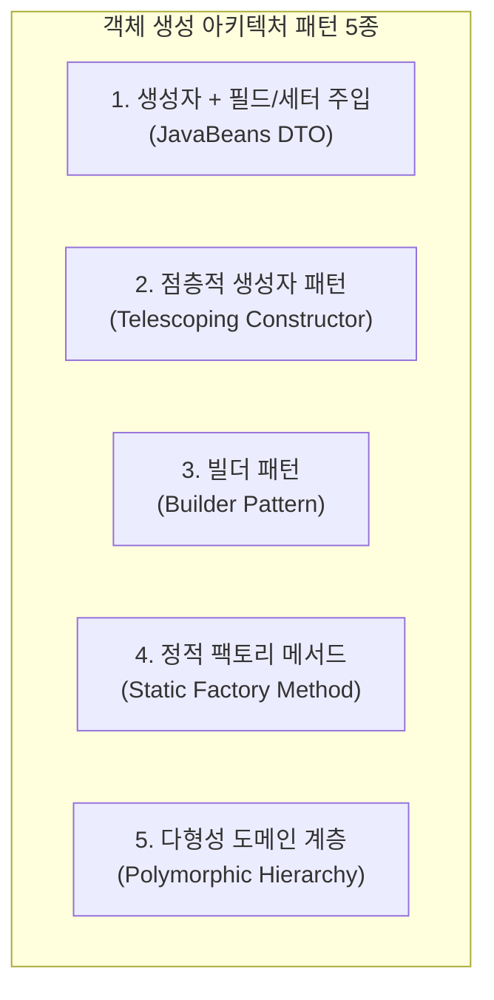

# [리팩토링 케이스 스터디] 객체 생성 안티패턴 개선 및 정적 팩토리 메서드·빌더 도입

> **문서 번호**: 260904_03  
> **대상 독자**: Java/객체지향 설계를 학습하고, 도메인 객체 생성 방식의 안티패턴과 리팩토링 기법을 체계화하려는 개발자  
> **관련 소스**: `com.batch.model.Rule`, `LogAnalyzerTest`, `ValueExtractorTest`, `ModelTest`

---

## 1. 문제 제기 및 배경 분석

### 1.1 발견된 코드 패턴
단위 테스트 및 비즈니스 로직 작성 중 다음과 같이 **생성자로 객체를 인스턴스화한 뒤, 필드에 직접 접근하거나 세터(Setter)를 호출하여 추가 속성을 주입하는 코드**가 존재했습니다.

```java
// [기존 코드 - LogAnalyzerTest.java]
Rule rule = new Rule("SEARCH", "SUCCESS", "EQUALS_N", "성공 횟수 3건 일치 검증");
rule.expectedCount = 3; // ⚠️ 객체 생성 후 별도 필드 직접 대입
```

### 1.2 왜 이런 구조가 발생했는가? (태생적 배경)
1. **조건부 필수 속성(Optional Context)**:
   - `Rule` 모델에서 `type`, `target`, `condition`, `description`은 대부분의 검증에 공통으로 쓰이지만,
   - `expectedCount`는 `EQUALS_N` 조건에서만 쓰이고, `stepName`은 `STEP_METRICS`에서만, `regex`는 정규식 검증에서만 선택적으로 쓰입니다.
2. **점층적 생성자 폭발(Telescoping Constructor) 회피**:
   - `new Rule(ruleNo, type, target, regex, stepName, condition, expectedCount, description)`과 같이 모든 파라미터 조합의 생성자를 만들면 생성자가 너무 많아지고 순서 혼동이 발생하므로, 공통 4개 필드만 생성자로 받고 나머지는 `public` 필드 직접 주입으로 처리했던 레거시 과도기 형태입니다.
3. **DTO 중심의 절차적 사고**:
   - 객체를 "행위와 캡슐화를 가진 도메인 모델"이 아닌 "단순 데이터 바구니(Data Transfer Object)"로 취급하던 초기 설계의 흔적입니다.

---

## 2. 객체 생성 및 속성 주입의 5대 패턴 케이스 스터디

객체지향 설계에서 선택적 속성을 가진 객체를 생성하는 5가지 대표적 패턴을 비교 분석합니다.



---

### [패턴 1] 생성자 + 필드 직접 대입 / 세터 (JavaBeans 패턴) — 🔴 안티패턴

```java
Rule rule = new Rule("SEARCH", "SUCCESS", "EQUALS_N", "성공 검증");
rule.expectedCount = 3;
```

* **동작 원리**: 필수적인 몇 개 필드만 생성자로 받고, 나머지 특수 필드는 생성 후 세터나 `public` 필드 대입으로 채움.
* **장점**:
  * 구현이 가장 단순하고 직관적임.
  * JSON 파서나 리플렉션 기반 직렬화 라이브러리와의 호환이 쉬움.
* **단점 및 위험성 (안티패턴 요인)**:
  * **불완전한 객체 상태(Inconsistent State)**: 생성자가 끝난 직후부터 2번째 라인이 실행되기 전까지, 객체는 `expectedCount`가 0(기본값)인 채로 불완전하게 노출됩니다.
  * **불변성(Immutability) 훼손**: 객체 생성 이후에도 외부에서 언제든 상태를 바꿀 수 있어 사이드 이펙트 발생 위험이 있습니다.
  * **필수값 누락 위험**: 개발자가 `rule.expectedCount = 3;` 작성을 깜빡해도 컴파일러가 잡아내지 못하고 런타임에 실패합니다.

---

### [패턴 2] 점층적 생성자 패턴 (Telescoping Constructor) — 🟡 제한적 사용

```java
public Rule(String type, String target, String condition, String desc) { ... }
public Rule(String type, String target, String condition, int expectedCount, String desc) { ... }
public Rule(String ruleNo, String type, String target, String regex, String stepName, String condition, int expectedCount, String desc) { ... }
```

* **동작 원리**: 필요한 매개변수 조합마다 오버로딩 생성자를 단계별로 추가.
* **장점**:
  * 생성 시점에 모든 값이 한 번에 채워져 객체의 일관성과 불변성을 확보할 수 있음.
* **단점**:
  * 매개변수 개수가 늘어날수록 호출 코드의 가독성이 급격히 저하됨 (예: `new Rule("01", "SEARCH", "SUCCESS", null, null, "EQUALS_N", 3, "설명")`).
  * 타입이 같은 인자가 연속될 때(String, String...) 순서를 바꿔 넣는 실수를 컴파일 타임에 감지하기 어려움.

---

### [패턴 3] 빌더 패턴 (Builder Pattern) — 🟢 범용 도메인/픽스처에 적합

```java
Rule rule = Rule.builder(RuleType.SEARCH)
        .target("SUCCESS")
        .condition(ConditionType.EQUALS_N)
        .expectedCount(3)
        .description("성공 횟수 3건 일치 검증")
        .build();
```

* **동작 원리**: 메서드 체이닝을 통해 어떤 필드에 어떤 값이 들어가는지 명시적으로 지정하고 `build()`로 최종 객체 생성.
* **장점**:
  * 파라미터 순서 혼동이 원천 차단되며, 읽는 사람에게 자연어처럼 읽힘.
  * 필요한 필드만 유연하게 조합하면서도 불변 객체(`final`)를 안전하게 생성 가능.
* **단점**:
  * `RuleType.SEARCH`일 때 `expectedCount`가 필수인지 여부를 컴파일 타임에 강제하기 어려움 (런타임 `build()` 시점 검증 필요).
  * 빌더 클래스 작성에 따른 보일러플레이트 코드 증가.

---

### [패턴 4] 도메인 특화 정적 팩토리 메서드 (Static Factory Method) — 🟢 실무 최적 권장안

```java
// 1. 단순 검색 룰
Rule r1 = Rule.search("ERROR", ConditionType.EQUALS_0, "오류 미발생 검증");

// 2. N건 일치 검색 룰 (expectedCount를 필수 매개변수로 컴파일 타임 강제)
Rule r2 = Rule.search("SUCCESS", ConditionType.EQUALS_N, 3, "성공 횟수 3건 일치 검증");

// 3. 정규식 검색 룰
Rule r3 = Rule.searchRegex("ERROR:\\s*\\d+", ConditionType.EQUALS_N, 2, "정규식 에러 카운트");

// 4. 스텝 메트릭 룰 (stepName을 필수 매개변수로 강제)
Rule r4 = Rule.stepMetrics("ProcessStep", ConditionType.ROLLBACK_ZERO, "롤백 미발생 검증");
```

* **동작 원리**: 생성자 대신 이름을 가진 정적 메서드(`search`, `display`, `stepMetrics`)를 통해 도메인 유형별로 필요한 매개변수 조합을 엄격하게 제한하여 생성.
* **장점**:
  * **의도의 명확성**: 생성자 이름(`new Rule(...)`) 대신 `Rule.search(...)`, `Rule.stepMetrics(...)`처럼 생성 의도가 드러남.
  * **타입 및 제약 조건의 컴파일 타임 보장**: `EQUALS_N` 조건에는 `expectedCount`를 인자로 반드시 넘기도록 시그니처를 설계하여 필수값 누락을 원천 차단.
  * **테스트 코드 가독성 극대화**: Given 절에서 테스트 픽스처를 한 줄로 깔끔하고 명확하게 준비 가능.
* **단점**:
  * 지원할 규칙의 종류가 수십 가지로 늘어나면 팩토리 메서드의 개수가 많아질 수 있음.

---

### [패턴 5] 다형성을 활용한 서브타이핑 (Polymorphic Hierarchy) — 🔵 도메인 고도화 모델

```java
public abstract class Rule { ... }
public class SearchRule extends Rule { private final String target; private final int expectedCount; ... }
public class StepMetricsRule extends Rule { private final String stepName; ... }
```

* **장점**:
  * 객체지향 캡슐화의 극치. 각 룰마다 고유한 필드만 보유하여 불필요한 필드(`null` 낭비)가 전혀 없음.
* **트레이드오프**:
  * 클래스 개수가 늘어나고 JSON 파일과의 역직렬화 매퍼(Type Discriminator) 설정이 복잡해짐.

---

## 3. 패턴 종합 비교 매트릭스

| 평가 기준 | 1. 생성자 + 세터 | 2. 점층적 생성자 | 3. 빌더 패턴 | 4. 정적 팩토리 메서드 (권장) | 5. 서브클래싱 다형성 |
| :--- | :---: | :---: | :---: | :---: | :---: |
| **불변성 (Immutability)** | ❌ 취약 | ✅ 보장 | ✅ 보장 | ✅ 보장 | ✅ 보장 |
| **필수값 컴파일 검증** | ❌ 누락 위험 | ⚠️ 순서 혼동 | ⚠️ 런타임 검증 | ✅ 완벽 강제 | ✅ 완벽 강제 |
| **가독성 (Readability)** | ⚠️ 분산됨 | ❌ 최악 | ✅ 뛰어남 | ⭐️ 최고 (도메인 특화) | ✅ 뛰어남 |
| **유연성 및 확장성** | 🟢 높음 | ❌ 낮음 | ⭐️ 최고 | 🟢 높음 | 🟢 높음 |
| **구현 및 유지보수 비용** | 🟢 최저 | 🟡 중간 | 🟡 보통 | 🟢 낮음 / 직관적 | 🔴 높음 |

---

## 4. 실제 리팩토링 Before vs After (전체 도메인 모델 전수 적용)

프로젝트 내 모든 핵심 도메인 모델(`Rule`, `StepMetrics`, `RuleResult`, `JobPolicy`, `CheckResult`)에 대해 객체 생성 안티패턴을 해소하고 전면적인 팩토리 & 빌더 표준화를 완료했습니다.

### 4.1 `Rule.java` 리팩토링
- **Before**: `new Rule(...)` 생성 후 `rule.expectedCount = 3`, `rule.stepName = "..."` 필드 대입
- **After**:
  - `Rule.search(target, ConditionType.EQUALS_N, 3, description)`
  - `Rule.searchRegex(regex, ConditionType.EQUALS_N, 2, description)`
  - `Rule.display(target, condition, description)` / `Rule.displayRegex(regex, condition, description)`
  - `Rule.stepMetrics(stepName, condition, description)`
  - `Rule.builder(RuleType.SEARCH)...build()`

```java
// [Before]
Rule rule = new Rule("SEARCH", "SUCCESS", "EQUALS_N", "성공 검증");
rule.expectedCount = 3;

// [After]
Rule rule = Rule.search("SUCCESS", ConditionType.EQUALS_N, 3, "성공 검증");
```

---

### 4.2 `StepMetrics.java` 리팩토링
- **Before**: `new StepMetrics(stepName)` 생성 후 `sm.readCount = 100; sm.writeCount = 90;` 등 필드 수동 대입
- **After**:
  - All-args 생성자 `StepMetrics(stepName, readCount, writeCount, commitCount, rollbackCount)`
  - 정적 팩토리 `StepMetrics.of(stepName, readCount, writeCount, commitCount, rollbackCount)`
  - 빌더 패턴 `StepMetrics.builder(stepName).readCount(100).rollbackCount(0).build()`

```java
// [Before]
StepMetrics sm = new StepMetrics("DataProcessStep");
sm.readCount = 1000;
sm.writeCount = 950;
sm.commitCount = 19;
sm.rollbackCount = 0;

// [After]
StepMetrics sm = StepMetrics.of("DataProcessStep", 1000, 950, 19, 0);
```

---

### 4.3 `RuleResult.java` 리팩토링
- **Before**: `new RuleResult()` 생성 후 `rr.type = ...; rr.passed = true; rr.extractedValue = ...;` 필드 흩뿌리기
- **After**:
  - `RuleResult.pass(ruleNo, description, type, extractedValue, message)`
  - `RuleResult.fail(ruleNo, description, type, extractedValue, message)`
  - `RuleResult.builder().type(...).passed(true).extractedValue(...).build()`

```java
// [Before]
RuleResult rr = new RuleResult();
rr.type = "CUSTOM_CHECK";
rr.passed = true;
rr.extractedValue = "커스텀값";
rr.message = "사용자 정의 검증 성공";

// [After]
RuleResult rr = RuleResult.pass("", "사용자 정의 검증", "CUSTOM_CHECK", "커스텀값", "사용자 정의 검증 성공");
```

---

### 4.4 `JobPolicy.java` 리팩토링
- **Before**: `new JobPolicy(...)` 생성 후 `policy.scheduleTime = "03:05"; policy.monthlyLogDay = 2;` 대입
- **After**:
  - `JobPolicy.daily("01", "job1", "03:05")`
  - `JobPolicy.monthly("18", "smpmJob206", 2, "00:45")`
  - `JobPolicy.builder("01", "job1").title("...").daily("03:05").addRule(...).build()`

```java
// [Before]
JobPolicy policy = new JobPolicy("01", "gagastJob002", "추천터치고객", "01_");
policy.scheduleTime = "03:05";

// [After]
JobPolicy policy = JobPolicy.daily("01", "gagastJob002", "03:05");
```

---

### 4.5 `CheckResult.java` 리팩토링
- **Before**: `new CheckResult(jobNo, jobName, jobTitle)` 생성 후 `cr.scheduleInfo = ...; cr.fileFound = true;` 대입
- **After**:
  - `CheckResult.of(policy)` (정책 기반 자동 서식화 생성)
  - `CheckResult.builder("01", "job1").jobTitle("...").fileFound(true).build()`

---

## 5. 실무 적용 가이드라인 & Best Practice

1. **상태값과 조건은 반드시 Enum으로 전달하라**:
   - 문자열 매직 스트링(`"EQUALS_N"`) 대신 `ConditionType.EQUALS_N`을 넘겨 컴파일 타임 오타 검증을 받도록 합니다.
2. **도메인 성격에 따라 생성 전략을 이원화하라**:
   - **자주 쓰이고 정형화된 규칙**: `Rule.search(...)`, `Rule.display(...)` 같은 **정적 팩토리 메서드**를 우선 사용합니다.
   - **다양한 옵션 조합이 필요한 복합 정책**: `JobPolicy.builder(...)`, `Rule.builder(...)` 같은 **빌더 패턴**을 사용합니다.
   - **외부 JSON 역직렬화**: 하위 호환용 DTO/기본 생성자를 열어두되, 도메인 핵심 영역으로 진입할 때 유효성을 검증합니다.
3. **테스트 픽스처의 간결성이 곧 유지보수성이다**:
   - 테스트 코드의 `Given` 절이 5~10줄씩 늘어지면 테스트의 본래 의도를 파악하기 어렵습니다. 팩토리 메서드로 `Given`을 1~2줄로 압축하면 테스트 가독성이 비약적으로 향상됩니다.

---

## 문서 변경 이력

| 작성일시 | 작업 내용 | 담당 |
| :--- | :--- | :--- |
| 2026-09-04 09:55 | 객체 생성 안티패턴 개선 및 정적 팩토리 메서드·빌더 도입 케이스 스터디 문서 작성 | Antigravity AI |
