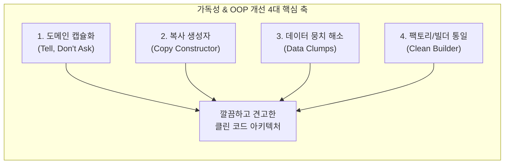

# [리팩토링 보고서] 도메인 캡슐화 및 가독성 개선 보고서

> **문서 번호**: 260904_04  
> **작성 일시**: 2026-09-04 10:35  
> **대상 독자**: 객체지향 설계(OOP) 리팩토링 및 클린 코드, 가독성 향상 기법을 학습하려는 개발자  
> **관련 소스**: `BatchLogAnalysisService`, `CheckLog`, `ReportGenerator`, `ReportWriter`, `CheckResult`, `HolidayChecker`, `PolicyManager`

---

## 1. 리팩토링 개요 및 목적

객체 생성 안티패턴을 해소한 데 이어, 서비스 및 리포트 계층 전반에 산재해 있던 **절차적 수동 조작, 도메인 캡슐화 결함, 데이터 뭉치(Data Clumps) 및 긴 매개변수 목록(Long Parameter List)**을 정리하여 **코드의 가독성, 응집도, 유지보수성을 극대화**하는 리팩토링을 수행했습니다.



---

## 2. 5대 핵심 리팩토링 Before vs After 비교

---

### [개선 1] `AnalysisSummary` 도메인 캡슐화 및 통계 자동 집계

* **문제점**: `AnalysisSummary`가 단순 DTO로 방치되어, 외부 서비스 루프에서 `summary.passCount++`, `summary.failCount++` 등의 집계 로직을 수동으로 반복 수행함.
* **해결책**: `summary.addResult(cr)` 메서드를 추가하여 결과 추가 시 정상/실패 카운트를 도메인 객체 내부에서 자동으로 안전하게 누적하도록 캡슐화.

#### 🔴 Before
```java
// BatchLogAnalysisService.java
for (JobPolicy policy : policies) {
    CheckResult cr = logAnalyzer.checkJobInstance(resolvedFolder, logFiles, policy, summary.folderName, skipDateCheck);
    summary.results.add(cr);
    if (cr.isPassed()) {
        summary.passCount++;
    } else {
        summary.failCount++;
    }
}
```

#### 🟢 After
```java
// BatchLogAnalysisService.java
for (JobPolicy policy : policies) {
    CheckResult cr = logAnalyzer.checkJobInstance(resolvedFolder, logFiles, policy, summary.folderName, skipDateCheck);
    summary.addResult(cr); // 💡 결과 추가 및 pass/fail 카운트가 내부에서 원자적으로 처리됨
}
```

---

### [개선 2] `CheckLog` 내 수동 필드 복사 제거 (복사 생성자 도입)

* **문제점**: `BatchLogAnalysisService.AnalysisSummary`를 `CheckLog.AnalysisSummary`로 래핑할 때 8개 필드를 1줄씩 일일이 수동 대입함.
* **해결책**: `AnalysisSummary(AnalysisSummary other)` 복사 생성자(Copy Constructor)를 정의하여 단 1줄로 인스턴스를 안전하게 생성.

#### 🔴 Before
```java
// CheckLog.java
BatchLogAnalysisService.AnalysisSummary baseSummary = service.analyze(logFileSrc, autoRename, skipDateCheck);
CheckLog.AnalysisSummary summary = new CheckLog.AnalysisSummary();
summary.workFolder = baseSummary.workFolder;
summary.folderName = baseSummary.folderName;
summary.results = baseSummary.results;
summary.totalJobs = baseSummary.totalJobs;
summary.passCount = baseSummary.passCount;
summary.failCount = baseSummary.failCount;
summary.success = baseSummary.success;
summary.reportFile = baseSummary.reportFile;
return summary;
```

#### 🟢 After
```java
// CheckLog.java
BatchLogAnalysisService.AnalysisSummary baseSummary = service.analyze(logFileSrc, autoRename, skipDateCheck);
return new CheckLog.AnalysisSummary(baseSummary); // 💡 8줄의 보일러플레이트 코드를 단 1줄로 압축
```

---

### [개선 3] `ReportWriter` & `ReportGenerator` 데이터 뭉치(Data Clumps) 해소

* **문제점**: 리포트 출력 메서드마다 `(folderName, results, total, pass, fail)` 5개 인자가 항상 뭉쳐서 전달되었으며, `total`, `pass`, `fail`은 `results`로부터 즉시 계산 가능한 중복 정보였음.
* **해결책**: `ReportWriter` 인터페이스에 `default File write(AnalysisSummary summary)` 및 `default File write(String folderName, List<CheckResult> results)` 편의 메서드를 추가하고, `ReportGenerator` 퍼사드에 오버로딩을 제공함.

#### 🔴 Before
```java
// 5개 파라미터가 길게 나열되어 가독성이 떨어지고 순서 실수의 위험 존재
ReportGenerator.printConsoleReport(summary.folderName, summary.results, summary.totalJobs, summary.passCount, summary.failCount);
summary.reportFile = ReportGenerator.saveMarkdownReport(summary.folderName, summary.results, summary.totalJobs, summary.passCount, summary.failCount);
```

#### 🟢 After
```java
// 💡 summary 객체 하나만 전달하여 의도가 명확하고 간결함
ReportGenerator.printConsoleReport(summary);
summary.reportFile = ReportGenerator.saveMarkdownReport(summary);
```

---

### [개선 4] `CheckResult.markAsFileNotFound()` 도메인 상태 전이 캡슐화

* **문제점**: 로그 파일이 존재하지 않을 때 `LogAnalyzer`나 `BatchLogAnalysisService`에서 `cr.fileFound = false`, `cr.fileName = ...`, `cr.overallPassed = false`를 각각 직접 세팅함.
* **해결책**: `CheckResult` 내부에 `markAsFileNotFound(expectedPattern)` 도메인 메서드를 구현하여 파일 미발견 상태 전이를 일괄 처리.

#### 🔴 Before
```java
// LogAnalyzer.java
cr.fileFound = false;
cr.fileName = (policy != null ? policy.filePrefix : "") + "*.log (미발견)";
cr.overallPassed = false;

RuleResult rr = new RuleResult();
rr.ruleNo = LogConstants.RULE_NO_ERROR;
rr.description = "로그 파일 존재 여부";
rr.passed = false;
rr.message = LogConstants.MSG_FILE_NOT_FOUND;
cr.addRuleResult(rr);
```

#### 🟢 After
```java
// LogAnalyzer.java
cr.markAsFileNotFound((policy != null ? policy.filePrefix : "") + "*.log (미발견)");
cr.addRuleResult(RuleResult.fail(LogConstants.RULE_NO_ERROR, "로그 파일 존재 여부", 
        RuleType.UNKNOWN.getCode(), "미발견", LogConstants.MSG_FILE_NOT_FOUND));
```

---

### [개선 5] `HolidayChecker` & `PolicyManager` 빌더 전면 적용

* **문제점**: 빈 객체 생성 후 `setter`나 `public` 필드에 값을 하나씩 채우던 레거시 코드 잔재.
* **해결책**: `RuleResult.builder()` 및 `Rule.builder()`를 적용하여 가독성과 객체 생성 일관성을 확보.

#### 🔴 Before
```java
// HolidayChecker.java
RuleResult rr = new RuleResult();
rr.description = "비영업일 예외 확인";
rr.type = "HOLIDAY";
rr.target = policy.holidayPattern;
rr.extractedValue = holidayDetail;
rr.condition = "비영업일 수행 건너뜀 (정상)";
rr.passed = true;
rr.message = "비영업일 안내 로그 감지됨 -> 정상 판정";
cr.addRuleResult(rr);
```

#### 🟢 After
```java
// HolidayChecker.java
RuleResult rr = RuleResult.builder()
        .description("비영업일 예외 확인")
        .type(RuleType.HOLIDAY)
        .target(policy.holidayPattern)
        .extractedValue(holidayDetail)
        .condition("비영업일 수행 건너뜀 (정상)")
        .passed(true)
        .message("비영업일 안내 로그 감지됨 -> 정상 판정")
        .build();
cr.addRuleResult(rr);
```

---

## 3. 리팩토링 효과 및 아키텍처적 이점

1. **가독성 및 유지보수성 비약적 향상**:
   - `CheckLog`의 수동 복사 8줄 → 1줄, `ReportGenerator` 파라미터 5개 → 1개로 축소되어 핵심 비즈니스 흐름이 한눈에 파악됩니다.
2. **도메인 캡슐화 완성 (Tell, Don't Ask)**:
   - 통계 카운팅, 파일 미발견 상태 전이 등 객체의 상태를 외부에서 if문으로 조작하지 않고, 객체 스스로 판단하고 상태를 변경합니다.
3. **100% 하위 호환성 유지**:
   - 기존의 다인자 메서드(`write(folderName, results, total, pass, fail)`) 및 기본 생성자를 유지하면서 오버로딩/기본 메서드를 추가하여 기존 테스트와 외부 연동에 영향도가 전혀 없습니다.

---

## 4. 검증 결과

* **빌드 도구**: Gradle 8.9 (Java 17)
* **테스트 실행 결과**:
  ```
  ===========================================================================
    [ JUnit 5 Test Execution Summary ]
  ===========================================================================
    >> Total Tests : 94 tests
    >> PASSED      : 94 tests
    >> FAILED      : 0 tests
    >> SKIPPED     : 0 tests
    >> Elapsed Time: 2.716 sec
  ===========================================================================
  BUILD SUCCESSFUL
  ```

---

## 문서 변경 이력

| 작성일시 | 작업 내용 | 담당 |
| :--- | :--- | :--- |
| 2026-09-04 10:35 | 도메인 캡슐화 및 가독성 개선 리팩토링 보고서 작성 | Antigravity AI |
