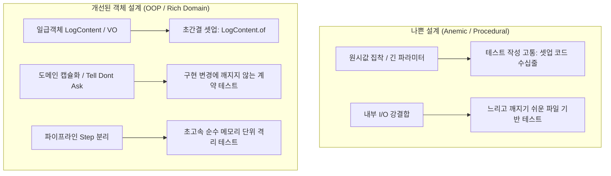

# [실무 가이드] 테스트 코드 리팩토링 및 테스트 주도 객체 설계

> **문서 번호**: `260904_06`  
> **작성 일자**: 2026-09-04  
> **대상 독자**: 테스트 작성을 몇 차례 시도하다 매번 포기했던 초급 개발자, 테스트 유지보수에 고통받는 엔지니어, 객체 설계와 테스트의 관계를 정립하고 싶은 주니어 개발자  
> **핵심 키워드**: `테스트 용이성(Testability)`, `Given 지옥(Setup Hell) 탈출`, `계약 기반 테스트(Contract Testing)`, `순수 단위 테스트 격리`, `테스트 픽스처(Fixture)`, `의사결정 트리`

---

## 📌 목차
1. [도입: 왜 우리는 테스트 작성에 매번 실패했을까?](#1-도입-왜-우리는-테스트-작성에-매번-실패했을까)
2. [초급 개발자가 테스트 도입에 실패하는 5대 원인](#2-초급-개발자가-테스트-도입에-실패하는-5대-원인)
3. [설계(Design)와 테스트(Test)의 핵심 상관관계](#3-설계design와-테스트test의-핵심-상관관계)
4. [기존 테스트 코드의 취약점(Code Smell) 심층 분석](#4-기존-테스트-코드의-취약점code-smell-심층-분석)
5. [개선된 설계를 활용한 테스트 현대화 4단계 절차](#5-개선된-설계를-활용한-테스트-현대화-4단계-절차)
   - Step 1: `LogContent.of()`로 Given 셋업 코드 1줄 압축
   - Step 2: "Tell, Don't Ask" 기반 도메인 상태 질의 단언
   - Step 3: 파이프라인 단계(`Step`)별 순수 메모리 격리 단위 테스트 구축
   - Step 4: `JobAnalysisContext` & `Builder`로 픽스처 유연성 확보
6. [실전 테스트 의사결정 프레임워크 (Decision Tree)](#6-실전-테스트-의사결정-프레임워크-decision-tree)
7. [Before vs After 실제 테스트 코드 비교](#7-before-vs-after-실제-테스트-코드-비교)
8. [실무 자가 진단 체크리스트 (Self-Checklist)](#8-실무-자가-진단-체크리스트-self-checklist)

---

## 1. 도입: 왜 우리는 테스트 작성에 매번 실패했을까?

*"테스트 코드가 중요하다는 것은 알겠는데, 막상 내 프로젝트에 적용하려고 하면..."*
- 테스트 하나 짜려고 객체를 생성하는데 인자가 너무 많아서 지침 (`new Service(a, b, c, d, e, f, g)`)
- 프로덕션 코드의 변수 이름 하나 바꿨을 뿐인데 수십 개의 테스트가 와르르 깨짐 (False Alarm)
- 단순한 비즈니스 로직 하나 검증하려는데 디스크 파일, 데이터베이스, 네트워크 세팅을 하느라 진이 빠짐
- 결국 **"테스트 코드 유지보수할 시간에 기능이나 하나 더 개발하자"**라며 테스트를 방치하거나 포기하게 됨

이것은 당신의 테스트 작성 실력이 부족해서가 아닙니다.  
**"테스트하기 어려운 나쁜 설계(High Coupling, Primitive Obsession, Anemic Model)"**를 그대로 둔 채 억지로 테스트 코드를 끼워 맞추려 했기 때문입니다.

본 문서는 `batchLogAnalyze` 프로젝트의 실제 리팩토링 사례를 바탕으로, **어떻게 객체 설계를 개선하여 테스트 작성을 즐겁고 단순하게 만들 수 있는지**, 그리고 **실패 없는 테스트 코드를 작성하는 명확한 기준과 절차**를 안내합니다.

---

## 2. 초급 개발자가 테스트 도입에 실패하는 5대 원인

```
[ 실패의 악순환 고리 ]
나쁜 객체 설계 ──► 복잡한 Given 셋업 ──► 작은 변경에도 테스트 깨짐 ──► 유지보수 포기 ──► 레거시화
```

### ❌ 원인 1: "Given 지옥 (Setup Hell)"
- **현상**: 정작 검증하고 싶은 행위는 `[When] 1줄`인데, 사전 객체를 세팅하는 `[Given] 코드가 30줄`을 넘어감.
- **원인**: 클래스의 생성자가 너무 많은 원시 타입을 요구하거나(Data Clump), 내부 의존성이 숨겨져 있어 수많은 Mock 객체를 수동으로 주입해야 함.

### ❌ 원인 2: "구현(Implementation)을 테스트함"
- **현상**: `user.getPasswordHash()`의 반환값이나 `cr.fileFound == true`, `cr.overallPassed == false` 같은 내부 private 변수 상태를 일일이 검사함.
- **원인**: 객체의 캡슐화가 깨져 있고, "계약(Contract)과 행위(Behavior)"가 아닌 "내부 상태"를 테스트하기 때문. 내부 코드를 조금만 리팩토링해도 테스트가 전부 깨집니다.

### ❌ 원인 3: "불필요한 I/O(파일, DB) 결합"
- **현상**: 단순한 문자열 파싱이나 계산 로직을 테스트하는데 디스크에 임시 폴더를 파고 파일을 생성하고 삭제함.
- **원인**: 비즈니스 로직과 저수준 I/O(File I/O, SQL 실행)가 한 클래스에 섞여 있기 때문(SRP 위반). 테스트 실행 속도가 수 초~수 분으로 느려져 자주 돌리지 않게 됩니다.

### ❌ 원인 4: "의미 없는 Boolean 플래그 검증"
- **현상**: `assertTrue(result.passed)` 하나로 끝내서, 테스트가 실패했을 때 "왜 실패했는지, 어떤 도메인 상태인지" 알 수 없음.
- **원인**: 풍부한 도메인 상태(Enum, 상태 전이 메시지)가 없고 원시 boolean 플래그에만 의존하기 때문.

### ❌ 원인 5: "설계 피드백 무시"
- **현상**: 테스트 작성이 너무 어렵고 복잡한데, "내가 Mockito를 잘 못 써서 그런가 보다"라며 더 복잡한 Mock 설정으로 덮어버림.
- **원인**: **"테스트가 작성하기 어렵다는 것은 설계가 나쁘다는 가장 확실한 경고등"**입니다. 이 신호를 무시하면 스파게티 테스트 코드가 탄생합니다.

---

## 3. 설계(Design)와 테스트(Test)의 핵심 상관관계



### 💡 핵심 원칙 1: "테스트는 도메인 객체의 첫 번째 고객(First Client)이다"
- 개발자가 만든 객체를 **가장 먼저 사용해보는 호출자(Caller)는 바로 테스트 코드**입니다.
- 테스트 코드에서 객체를 생성하기 편해야(`JobPolicy.builder()`, `Rule.search()`), 실제 서비스 코드에서도 편하게 사용할 수 있습니다.

### 💡 핵심 원칙 2: "테스트 피라미드를 지켜라"
- **단위 테스트 (Unit Test, 80%)**: 디스크/DB/네트워크 없이 **순수 메모리**에서 1ms 이내로 끝나는 테스트. (각 `AnalysisStep`, `RuleEvaluator`, `ValueExtractor`)
- **통합 테스트 (Integration Test, 15%)**: 실제 설정 파일, 컴포넌트 간의 연동 검증. (`AnalysisPipelineTest`, `CheckLogTest`)
- **E2E/샘플 검증 테스트 (5%)**: 실제 디스크의 대용량 샘플 로그 파일을 직접 분석하는 최종 검증. (`LogSampleVerificationTest`)

---

## 4. 기존 테스트 코드의 취약점(Code Smell) 심층 분석

리팩토링 전 `LogAnalyzerTest.java`의 실제 코드를 분석해 보겠습니다.

```java
// [취약점 1: 원시 텍스트 수동 분할 & Data Clump 냄새]
@Test
public void testEvaluateSearchRule_EQUALS_0_Success() {
    // 냄새 1: 텍스트를 만들고 매번 split("\n")을 수동으로 수행 (Given 지옥의 시작)
    String logText = "Job started\nJob completed successfully\n";
    String[] lines = logText.split("\n");
    Rule rule = Rule.search("ERROR", ConditionType.EQUALS_0, "오류 미발생 검증");

    // 냄새 2: logText와 lines라는 원시 데이터 쌍을 수동으로 전달
    RuleResult result = LogAnalyzer.evaluateRule(logText, lines, rule);

    // 냄새 3: 단순 boolean과 문자열만 단언
    assertTrue(result.passed);
    assertEquals("0건", result.extractedValue);
}

// [취약점 2: Anemic Model의 내부 상태 직접 단언]
@Test
public void testCheckResult_MarkAsHoliday() {
    CheckResult cr = new CheckResult("01", "job1", "Job One");
    cr.overallPassed = false; // 냄새 4: 외부에서 내부 필드 강제 주입

    cr.markAsHoliday("Sunday");

    // 냄새 5: 내부 boolean 플래그들만 개별 검사 (도메인 상태 질의 부재)
    assertTrue(cr.overallPassed);
    assertTrue(cr.isHoliday);
    assertEquals("Sunday", cr.holidayDetail);
}
```

---

## 5. 개선된 설계를 활용한 테스트 현대화 4단계 절차

우리가 진행한 객체 설계 리팩토링 결과를 활용하여 테스트 코드를 현대화하는 4단계 프로세스입니다.

---

### Step 1: `LogContent.of()`로 Given 셋업 코드 1줄 압축

원시 문자열과 배열 분할 로직을 `LogContent` 일급 객체로 대체합니다.

```java
// ❌ Before (3줄)
String logText = "Job started\nJob completed successfully\n";
String[] lines = logText.split("\n");
RuleResult result = LogAnalyzer.evaluateRule(logText, lines, rule);

//  After (1줄로 Given 완성!)
LogContent log = LogContent.of("Job started\nJob completed successfully\n");
RuleResult result = registry.evaluate(log.getFullText(), log.getLinesArray(), rule);
```
- **효과**: 개행 문자 처리(`\r\n` vs `\n`) 실수를 방지하고, 불필요한 배열 생성 코드를 완전히 제거합니다.

---

### Step 2: "Tell, Don't Ask" 기반 도메인 상태 질의 단언

도메인 객체의 `public boolean` 필드를 일일이 검사하지 않고, 도메인 질의 메서드(`isPassed()`, `getStatus()`)로 단언합니다.

```java
// ❌ Before: 필드 값을 꺼내서 비교 (Ask)
assertTrue(cr.overallPassed);
assertTrue(cr.isHoliday);

//  After: 객체에게 상태를 질의 (Tell, Don't Ask)
assertAll("비영업일 상태 전이 단언",
    () -> assertTrue(cr.isPassed(), "비영업일은 통과(PASS) 상태"),
    () -> assertTrue(cr.isHoliday(), "비영업일 플래그 true"),
    () -> assertEquals(CheckStatus.HOLIDAY, cr.getStatus(), "도메인 상태 Enum은 HOLIDAY"),
    () -> assertEquals("Sunday", cr.holidayDetail)
);
```

---

### Step 3: 파이프라인 단계(`Step`)별 순수 메모리 격리 단위 테스트 구축

`AnalysisPipeline`으로 검증 단계가 분리되었으므로, **디스크 파일 생성 없이 각 단계를 독립적으로 1ms 만에 검증**합니다.

#### [실제 구현 예시: `HolidayCheckStepTest.java`]
```java
@Test
@DisplayName("비영업일 안내 감지 시: 조기 종료(TERMINATE) 및 상태 HOLIDAY 전이 검증")
void testExecute_HolidayMatched_TerminatesEarly() throws Exception {
    // [Given] 디스크 I/O 없이 순수 메모리 객체로 셋업
    LogContent log = LogContent.of("2026-08-22 03:00:00 [INFO] 비영업일에는 해당 JOB이 수행되지 않습니다.");
    JobPolicy policy = JobPolicy.builder("01", "JOB01").holidayPattern("비영업일.*수행되지 않습니다").build();

    JobAnalysisContext jobContext = JobAnalysisContext.builder().policy(policy).build();
    StepExecutionContext execContext = new StepExecutionContext(jobContext);
    execContext.setLogContent(log);

    CheckResult result = new CheckResult(policy);
    result.attachLogFile(new File("holiday.log")); // 선행 상태 바인딩

    // [When] HolidayCheckStep 단독 실행
    StepResult stepResult = step.execute(execContext, result);

    // [Then] 파이프라인 흐름 제어 신호 단언
    assertTrue(stepResult.isTerminated(), "비영업일 감지 시 파이프라인은 조기 종료되어야 함");
    assertEquals(CheckStatus.HOLIDAY, result.getStatus());
}
```

---

### Step 4: `JobAnalysisContext` & `Builder`로 픽스처 유연성 확보

5개의 인자를 일일이 넘기던 테스트를 Builder 패턴 기반 컨텍스트로 전환합니다.

```java
// ❌ Before: 5개 인자에 null과 false를 채워 넣음
CheckResult cr = LogAnalyzer.checkJob(null, new File[0], policy, "260822", true);

//  After: 명확하고 읽기 쉬운 Context 구성
JobAnalysisContext ctx = JobAnalysisContext.builder()
        .folderName("260822")
        .policy(policy)
        .skipDateCheck(true)
        .build();

CheckResult cr = LogAnalyzer.checkJob(ctx);
```

---

## 6. 실전 테스트 의사결정 프레임워크 (Decision Tree)

테스트를 작성할 때 어떤 방식을 선택해야 할지 고민될 때 아래 의사결정 트리를 따르세요.

```
[ 테스트 작성 시작 ]
       │
       ▼
Q1. 파일 I/O나 DB가 반드시 필요한가?
  ├─► [NO]  ──► 순수 메모리 단위 테스트 작성 (LogContent.of, 실행시간 < 5ms)
  └─► [YES] ──► @TempDir 활용 임시 파일 격리 또는 Fake 객체 사용
       │
       ▼
Q2. 특정 비즈니스 로직(예: 비영업일, 날짜계산, 룰평가) 1개만 검증하는가?
  ├─► [YES] ──► 개별 Step 단위 격리 테스트 (HolidayCheckStepTest, DateCheckStepTest)
  └─► [NO]  ──► 전체 파이프라인 통합 테스트 (AnalysisPipelineTest)
       │
       ▼
Q3. Mockito(가짜 객체)를 사용해야 하는가?
  ├─► [원칙] ──► 가능한 실제 도메인 객체(LogContent, JobPolicy.builder())를 사용!
  └─► [예외] ──► 외부 네트워크, 메일 발송, 결제 API 등 외부 경계 시스템에만 Mockito 적용
```

---

## 7. Before vs After 실제 테스트 코드 비교

### 📊 테스트 셋업 및 단언 비교표

| 항목 | Before (레거시 방식) | After (현대화된 방식) | 이점 |
| :--- | :--- | :--- | :--- |
| **로그 텍스트 셋업** | `String` 생성 + `split("\n")` (2~3줄) | `LogContent.of("...")` (1줄) | 셋업 코드 60% 감소, 개행 버그 방지 |
| **정책/규칙 정의** | `new Rule("", "SEARCH", ...)` | `Rule.search(...)`, `JobPolicy.builder()` | 가독성 대폭 향상, 오타 방지 |
| **실행 대상** | 거대 `LogAnalyzer.checkJob()` 통짜 실행 | 개별 `AnalysisStep` 또는 `Pipeline` | 결함 발생 시 원인 위치 즉시 파악 |
| **결과 검증** | `assertTrue(cr.overallPassed)` | `assertEquals(CheckStatus.PASS, cr.getStatus())` | 풍부한 도메인 상태 검증 |
| **실행 속도** | 디스크 파일 생성 시 건당 50~100ms | 메모리 기반 실행 시 건당 1~2ms | **50배 이상 빠른 피드백** |

---

## 8. 실무 자가 진단 체크리스트 (Self-Checklist)

내가 작성한 테스트 코드가 건강한지 1분 만에 점검해보세요:

- [ ] **1. [Given] 셋업 코드가 [When/Then] 코드보다 짧은가?** (셋업이 너무 길다면 객체 생성을 도와주는 팩토리/빌더가 필요합니다.)
- [ ] **2. 테스트 메서드 하나가 단 하나의 명확한 비즈니스 행위만 검증하는가?**
- [ ] **3. 디스크 파일 I/O나 Sleep(대기) 없이 메모리 상에서 10ms 이내에 끝나는가?**
- [ ] **4. 내부 변수명이나 private 메서드가 바뀌어도 테스트가 깨지지 않는가?**
- [ ] **5. `assertTrue/assertFalse` 대신 도메인 상태(Enum, getStatus)를 검증하고 있는가?**
- [ ] **6. Mockito `when(...).thenReturn(...)` 설정이 3줄을 넘지 않는가?** (Mock이 많다면 클래스의 책임이 너무 많은 것입니다.)
- [ ] **7. 테스트 실패 시 출력되는 에러 메시지만 보고도 무엇이 잘못되었는지 알 수 있는가?**

---

## 9. 결론

> **"테스트가 작성하기 쉬운 코드가 좋은 설계이고, 좋은 설계는 테스트를 즐겁게 만든다."**

초급 개발자가 테스트에 실패했던 이유는 테스트 도구를 다루는 기술이 부족해서가 아니라, **테스트하기 어려운 설계와 싸우느라 지쳤기 때문**입니다.

1. **`Value Object (LogContent)`**로 저수준 데이터를 캡슐화하고,
2. **`Builder`와 `Parameter Object`**로 객체 생성을 우아하게 만들며,
3. **`Pipeline (Step)`**으로 책임을 잘게 나누면,

테스트 코드는 더 이상 짐이 아니라 **내 코드를 평생 지켜주는 가장 든든한 지원군**이 됩니다.
