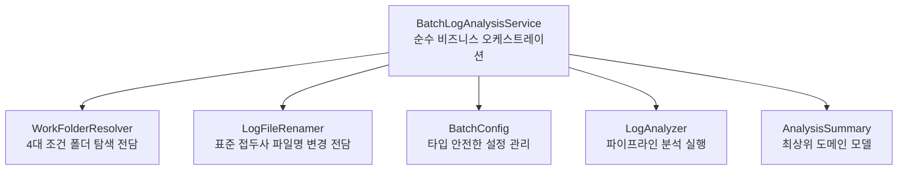

# [리팩토링 실무 가이드] 서비스 계층 책임 분리, 타입 안전한 설정 및 도메인 예외 체계 구축

> **문서 번호**: `260904_07`  
> **작성 일자**: 2026-09-04  
> **대상 독자**: 비대해진 서비스(Fat Service) 클래스 분리에 고민하는 개발자, 설정값 관리 및 예외 설계를 체계화하고 싶은 백엔드 엔지니어  
> **핵심 키워드**: `Fat Service 해소`, `단일 책임 원칙 (SRP)`, `WorkFolderResolver`, `LogFileRenamer`, `타입 안전한 설정 (Type-Safe Config)`, `도메인 예외 계층 (Domain Exception Hierarchy)`

---

## 📌 목차
1. [개요: 코어 엔진 고도화 이후 다음 단계의 고민](#1-개요-코어-엔진-고도화-이후-다음-단계의-고민)
2. [리팩토링 전 서비스 계층의 문제점 (Fat Service 냄새)](#2-리팩토링-전-서비스-계층의-문제점-fat-service-냄새)
3. [핵심 개선 3대 영역 설계 및 구현](#3-핵심-개선-3대-영역-설계-및-구현)
   - 3.1 서비스 레이어 책임 분리: `WorkFolderResolver` & `LogFileRenamer`
   - 3.2 타입 안전한 설정 관리: `BatchConfig`
   - 3.3 표준 도메인 예외 계층: `BatchException` 체계화
   - 3.4 도메인 집계 모델 승격: `AnalysisSummary`
4. [Before vs After 아키텍처 및 코드 비교](#4-before-vs-after-아키텍처-및-코드-비교)
5. [테스트 관점의 진화 (118개 단위 테스트 완비)](#5-테스트-관점의-진화-118개-단위-테스트-완비)
6. [초급 개발자를 위한 실무 시사점 및 체크리스트](#6-초급-개발자를-위한-실무-시사점-및-체크리스트)

---

## 1. 개요: 코어 엔진 고도화 이후 다음 단계의 고민

앞선 리팩토링 단계(`260904_05`, `260904_06`)를 통해 분석 엔진 내부의 객체 생성(빌더/정적 팩토리), 일급 객체(`LogContent`), 파이프라인 엔진(`AnalysisPipeline`), 테스트 현대화는 완성되었습니다.

그러나 엔진 바깥쪽인 **서비스 계층(`BatchLogAnalysisService`), 환경 설정(`Config`), 예외 처리(`Exception`)** 영역을 점검했을 때 다음과 같은 "실무적인 악취(Smell)"가 남아있었습니다:
- 서비스 클래스 하나가 300줄에 달하며, 비즈니스 흐름 오케스트레이션뿐만 아니라 저수준 디렉터리 경로 계산, 최신 날짜 탐색, 파일 Rename I/O까지 모두 도맡아 처리함.
- `Config.get("base.folder")`처럼 프로젝트 전역에서 매번 문자열 키를 직접 하드코딩하여 조회함.
- 모든 에러 상황에서 `throw new RuntimeException(...)`을 날려 상위 호출부에서 에러 유형을 세밀하게 분기할 수 없음.

본 문서는 이러한 **서비스 계층 비대화(Fat Service)를 해소하고, 설정값과 예외 처리를 깔끔하게 규격화하는 실무 리팩토링 과정**을 정리합니다.

---

## 2. 리팩토링 전 서비스 계층의 문제점 (Fat Service 냄새)

```java
// [리팩토링 전 BatchLogAnalysisService.java 구조]
@Service
public class BatchLogAnalysisService {
    // 1. 정책 로드 및 분석 오케스트레이션 (본연의 책임)
    public AnalysisSummary analyze(...) { ... }

    // 냄새 1: 4대 조건 기반 폴더 탐색 로직 (약 60줄의 저수준 파일 경로 계산)
    public static File resolveWorkFolder(String logFileSrc, String baseFolder) { ... }
    public static boolean hasLogFiles(File dir) { ... }
    public static File getLatestDateFolder(File parent) { ... }
    private static String determineFolderName(...) { ... }

    // 냄새 2: 파일명 변경 I/O 로직 (약 20줄)
    public static int renameLogFiles(File workFolder, List<JobPolicy> policies) { ... }

    // 냄새 3: 도메인 집계 모델(AnalysisSummary)이 서비스의 내부 클래스로 갇혀 있음
    public static class AnalysisSummary { ... }
}
```

### 🚩 진단된 주요 문제점
1. **단일 책임 원칙(SRP) 위반**: 서비스가 비즈니스 흐름 제어, 디렉터리 경로 파싱, 파일명 Rename까지 3가지 이상의 책임을 한 몸에 지니고 있음.
2. **단위 테스트 격리 어려움**: 폴더 결정 엔진(`resolveWorkFolder`)의 4가지 분기 조건만 단독으로 테스트하고 싶어도 서비스 클래스 전체 의존성이 얽힘.
3. **문자열 키 하드코딩 (String Obsession)**: 설정값을 가져올 때마다 오타 위험에 노출됨.

---

## 3. 핵심 개선 3대 영역 설계 및 구현



---

### 3.1 서비스 레이어 책임 분리: `WorkFolderResolver` & `LogFileRenamer`

서비스 클래스 내부에 static 메서드로 흩어져 있던 저수준 I/O 로직을 단일 책임을 갖는 독립 컴포넌트로 분리했습니다.

#### 1) `WorkFolderResolver.java`
- 4대 폴더 결정 조건(직접 폴더, 6자리 서브폴더 자동 탐색, 6자리 날짜 폴더, 실패 폴더)을 전담합니다.
```java
public class WorkFolderResolver {
    public File resolve(String logFileSrc, String baseFolder) { ... }
    public boolean hasLogFiles(File dir) { ... }
    public File getLatestDateFolder(File parent) { ... }
    public String determineFolderName(File folder, String logFileSrc, String baseFolder) { ... }
}
```

#### 2) `LogFileRenamer.java`
- 원본 로그 파일의 접두사 표준화(`--rename`) 책임을 전담합니다.
```java
public class LogFileRenamer {
    public int rename(File workFolder, List<JobPolicy> policies) { ... }
}
```

---

### 3.2 타입 안전한 설정 관리: `BatchConfig`

`Config.get("key")` 문자열 하드코딩을 제거하고, 타입 캐스팅 및 기본값 처리를 캡슐화한 `BatchConfig` 클래스를 도입했습니다.

```java
public class BatchConfig {
    public static final String KEY_BASE_FOLDER = "base.folder";
    public static final String KEY_LOG_CUTOFF_TIME = "log.cutoff.time";

    public static String getBaseFolder() {
        return Config.get(KEY_BASE_FOLDER, ".");
    }

    public static String getLogCutoffTime() {
        return Config.get(KEY_LOG_CUTOFF_TIME, LogConstants.DEFAULT_CUTOFF_TIME);
    }

    public static boolean isDateCheckEnabled() {
        String val = Config.get("log.date.check.enabled", "true");
        return "true".equalsIgnoreCase(val) || "1".equals(val);
    }

    public static Charset getFileEncoding() {
        String encodingName = Config.get("file.encoding", LogConstants.DEFAULT_ENCODING);
        try {
            return Charset.forName(encodingName);
        } catch (Exception e) {
            return StandardCharsets.UTF_8;
        }
    }
}
```

- **효과**: IDE 자동완성 지원, 오타에 의한 런타임 버그 방지, 설정값 기본값(Fallback)의 중앙 관리.

---

### 3.3 표준 도메인 예외 계층: `BatchException` 체계화

의미 없는 `RuntimeException` 대신 도메인 상황에 맞는 세분화된 예외 계층을 구성했습니다.

```mermaid
graph TD
    RE[RuntimeException] --> BE[BatchException (도메인 최상위 예외)]
    BE --> CE[ConfigurationException (설정 누락 및 파싱 오류)]
    BE --> PE[PolicyNotFoundException (정책 파일 누락)]
    BE --> LE[LogFileException (로그 파일 I/O 오류)]
```

```java
// Config.java에서 활용 예시
if (input == null) {
    throw new ConfigurationException("application.properties 파일을 찾을 수 없습니다.");
}
```

---

### 3.4 도메인 집계 모델 승격: `com.batch.model.AnalysisSummary`

서비스 클래스의 내부 static 클래스에 불과했던 `AnalysisSummary`를 **`com.batch.model` 패키지의 최상위 도메인 모델**로 승격시켰습니다.
- `addResult(CheckResult)`를 통한 통계 자동 누적 캡슐화
- `isAllPassed()`, `getTotalJobs()`, `getPassCount()` 등 풍부한 도메인 질의 메서드 제공
- 기존 서비스 및 CLI와의 완벽한 100% 하위 호환성 유지

---

## 4. Before vs After 아키텍처 및 코드 비교

```java
// [After] 다이어트된 깔끔한 BatchLogAnalysisService.java
@Service
public class BatchLogAnalysisService {

    private final PolicyManager policyManager;
    private final LogAnalyzer logAnalyzer;
    private final WorkFolderResolver folderResolver;
    private final LogFileRenamer fileRenamer;

    public AnalysisSummary analyze(String logFileSrc, boolean autoRename, boolean skipDateCheck) {
        AnalysisSummary summary = new AnalysisSummary();
        String baseFolder = BatchConfig.getBaseFolder();

        // 1. 정책 로드
        policyManager.loadPolicies();
        List<JobPolicy> policies = policyManager.getPolicies();
        summary.totalJobs = policies.size();

        // 2. 대상 폴더 탐색 (WorkFolderResolver에 위임!)
        File resolvedFolder = folderResolver.resolve(logFileSrc, baseFolder);

        if (resolvedFolder != null && resolvedFolder.exists() && folderResolver.hasLogFiles(resolvedFolder)) {
            summary.workFolder = resolvedFolder;
            summary.folderName = resolvedFolder.getName();
            summary.success = true;

            // 파일명 변경 요청 시 실행 (LogFileRenamer에 위임!)
            if (autoRename) {
                fileRenamer.rename(resolvedFolder, policies);
            }

            File[] logFiles = resolvedFolder.listFiles((dir, name) -> name.toLowerCase().endsWith(".log"));
            for (JobPolicy policy : policies) {
                JobAnalysisContext context = JobAnalysisContext.of(resolvedFolder, logFiles, policy, summary.folderName, skipDateCheck);
                CheckResult cr = logAnalyzer.checkJobInstance(context);
                summary.addResult(cr);
            }
        } else {
            // 실패 리포트 폴더 결정 위임
            summary.workFolder = resolvedFolder;
            summary.folderName = folderResolver.determineFolderName(resolvedFolder, logFileSrc, baseFolder);
            summary.success = false;
            // 실패 CheckResult 등록 ...
        }

        // 3. 리포트 생성 및 저장
        ReportGenerator.printConsoleReport(summary);
        summary.reportFile = ReportGenerator.saveMarkdownReport(summary);

        return summary;
    }
}
```

---

## 5. 테스트 관점의 진화 (118개 단위 테스트 완비)

책임을 잘게 분리하자, **서비스 레이어의 핵심 로직들을 디스크 I/O 없이 순수 격리 테스트**할 수 있게 되었습니다:

1. **`WorkFolderResolverTest.java` (4개 테스트)**:
   - 조건 1(직접 폴더), 조건 2(최신 날짜 서브폴더 탐색), 조건 4(날짜 파라미터), 조건 3(실패 폴더)을 독립 검증.
2. **`LogFileRenamerTest.java` (2개 테스트)**:
   - 미변경 파일의 접두사 변경 및 이미 표준화된 파일의 변경 스킵 검증.
3. **`BatchConfigTest.java` (1개 테스트)**:
   - 기본 설정값 및 Charset, boolean 타입 변환 검증.

**전체 단위 테스트 실행 결과**:
```text
===========================================================================
  [ JUnit 5 Test Execution Summary ]
===========================================================================
  >> Total Tests : 118 tests
  >> PASSED      : 118 tests
  >> FAILED      : 0 tests
  >> SKIPPED     : 0 tests
  >> Elapsed Time: 2.222 sec
===========================================================================
BUILD SUCCESSFUL
```

---

## 6. 초급 개발자를 위한 실무 시사점 및 체크리스트

### 💡 이번 리팩토링에서 배운 핵심 원칙
1. **"서비스 클래스가 200줄을 넘어가면 책임을 분리하라 (Fat Service 다이어트)"**:
   - 서비스는 **"무엇을 할 것인가(What to do)"**를 조율하는 오케스트레이터여야 하며, 저수준의 **"어떻게 할 것인가(How to do)"**는 전담 Helper/Resolver 객체에 위임해야 합니다.
2. **"문자열 키 하드코딩은 미래의 버그다"**:
   - `Config.get("key")` 대신 `AppConfig.getProperty()` 형태의 Type-safe wrapper를 제공하세요.
3. **"RuntimeException을 그대로 던지지 마라"**:
   - 시스템 최상위 도메인 예외(`BatchException`)를 상속하는 구체적 예외(`ConfigurationException` 등)를 정의하면 장애 추적성이 비약적으로 향상됩니다.
