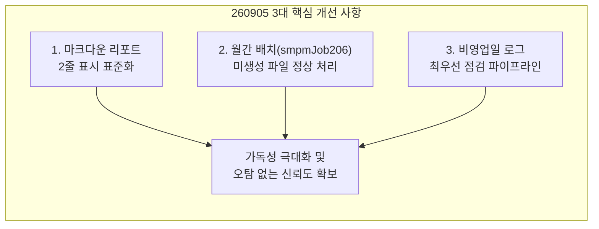
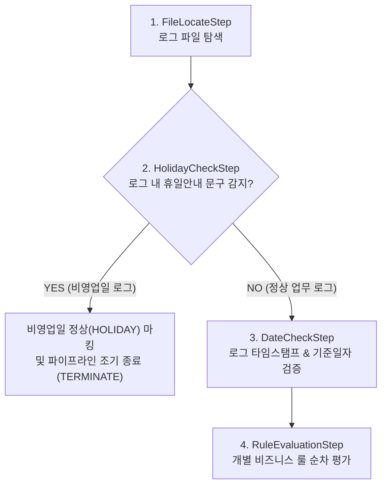

# [작업 보고서] 보고서 출력 서식 보완, 월간 배치 정상 처리 및 비영업일 점검 로직 개선

> **문서 번호**: 260905_01  
> **작성 일시**: 2026-09-05 15:55  
> **대상 독자**: 배치로그 분석 시스템 개발자, 운영자 및 코드 유지보수 담당자  
> **관련 소스**: `MarkdownReportWriter`, `CheckResult`, `FileLocateStep`, `AnalysisPipeline`, `HolidayChecker`, `LogDateChecker`, `JobPolicy`, `README.md`

---

## 1. 개요 및 배경

배치로그 분석 시스템의 마크다운 리포트 가독성을 높이고, 일간 분석 시 월간 배치(`smpmJob206`)와 비영업일 예외 상황에서 발생하던 오탐(False Positive)을 원천 차단하기 위해 3대 핵심 로직 개선을 수행했습니다.



---

## 2. 3대 핵심 개선 내역 (Before vs After)

---

### [개선 1] 마크다운 리포트 표 2줄 표시 표준화

* **배경 및 필요성**: 기존 리포트에서는 `JOB ID` 열의 2행에 스케줄 정보(`scheduleInfo`)가 표시되고, `JOB 이름` 열은 1행만 표시되어 열 간의 균형과 정보 식별성이 다소 부족했습니다.
* **개선 내용**:
  - `JOB ID` 열: 1행 = `jobName` (예: `smrmJob102`), 2행 = 파일ID (`rawPattern`, 예: `_11401_`)
  - `JOB 이름` 열: 1행 = `cleanedJobTitle` (예: `102_조사대상결과반영`), 2행 = 스케줄 정보 (`scheduleInfo`, 예: `11:00 [전일 / 일]`)
* **효과**: JOB ID 열에서 파일 식별자(Pattern)를 즉시 확인하고, JOB 이름 열에서 업무명과 실행 스케줄을 한눈에 파악할 수 있도록 2줄 표시 서식을 통일했습니다.

#### 🔴 Before
| 번호 | JOB ID | JOB 이름 | 점검항목 | 점검내용 | 점검결과 |
| :---: | :--- | :--- | :--- | :--- | :---: |
| 04 | smrmJob102<br/>11:00 [전일 / 일] | [전일] smrmJob102 불판 확인 SMS 발송(FP?) | **[01] 배치파일점검**<br/>`2026-09-01 11:00:02` | ✅ 정상파일수집 | ✅ 정상 |
| 18 | smpmJob206<br/>00:45 [2일 / 월] | 206_협회코드및보험사코드수집 | **[01] 배치파일점검**<br/>`2026-09-02 00:45:03` | ✅ 정상파일수집 | ✅ 정상 |

#### 🟢 After
| 번호 | JOB ID | JOB 이름 | 점검항목 | 점검내용 | 점검결과 |
| :---: | :--- | :--- | :--- | :--- | :--- |
| 04 | smrmJob102<br/>_11401_ | 102_조사대상결과반영<br/>11:00 [전일 / 일] | **[01] 배치파일점검**<br/>`2026-09-01 11:00:02` | ✅ 정상파일수집 | ✅ 정상 |
| 18 | smpmJob206<br/>_11294_ | 206_협회코드및보험사코드수집<br/>00:45 [2일 / 월] | **[01] 배치파일점검**<br/>`2026-09-02 00:45:03` | ✅ 정상파일수집 | ✅ 정상 |

---

### [개선 2] 월간 배치(`smpmJob206`) 미생성 로그 정상(PASS) 처리

* **배경 및 필요성**: 월간 배치는 매월 특정 일자(예: 2일)에만 실행되므로, 평일/일간 배치 분석 실행 시에는 해당 로그 파일이 존재하지 않는 것이 정상입니다. 기존에는 파일 미발견 시 무조건 `FAIL (FILE_NOT_FOUND)`로 처리되어 일간 리포트가 실패로 집계되는 문제가 있었습니다.
* **개선 내용**:
  - `policy.isMonthly()` (`ScheduleType.MONTHLY`)인 정책에 대해 대상 로그 파일이 없는 경우, 오류가 아닌 **정상(PASS)** 상태로 마킹.
  - `CheckResult.markAsMonthlyNotRun(...)` 도메인 메서드 도입 (`fileFound = false`, `isMonthlyNotRun = true`, `overallPassed = true`).
  - `[01] 배치파일점검` 룰 결과에 `✅ 월간배치 미실행일 (정상)` (추출값: `-`)을 기록하고 후속 룰 검증을 건너뛰도록 파이프라인 조기 종료(`StepResult.terminate`).
* **효과**: 일간 배치 점검 시 18개 전체 정책을 돌려도 월간 배치가 불필요하게 실패로 잡히지 않고 100% 정상 판정됩니다.

```java
// FileLocateStep.java 개선 로직
if (targetFile == null) {
    if (policy != null && policy.isMonthly()) {
        String expectedPattern = (policy.filePrefix != null ? policy.filePrefix : "") + "*.log (미생성)";
        result.markAsMonthlyNotRun(expectedPattern);
        result.addRuleResult(RuleResult.pass(
                LogConstants.DEFAULT_DATE_CHECK_RULE_NO,
                LogConstants.DATE_CHECK_DESCRIPTION,
                RuleType.DISPLAY.getCode(),
                "-",
                "월간배치 미실행일 (정상)"
        ));
        return StepResult.terminate("월간배치 대상 로그 파일 미생성 (정상 처리)");
    }
    // 일반 일간 배치 파일 미발견 시 기존대로 FAIL 처리
    result.markAsFileNotFound(expectedPattern);
    ...
}
```

---

### [개선 3] 비영업일(휴일) 로그 우선 점검 및 파이프라인 최적화

* **배경 및 필요성**:
  - 시스템은 외부 캘린더나 날짜 속성을 조회하지 않고, **로그 본문 내의 비영업일 안내 메시지(`holidayPattern`, 예: `"비영업일에는 해당 JOB이 (수행|수혈)되지 않습니다."`)**를 기준으로 비영업일 여부를 판정합니다.
  - 기존 파이프라인 순서(`FileLocateStep` -> `DateCheckStep` -> `HolidayCheckStep` -> `RuleEvaluationStep`)에서는 일자 검증(`DateCheckStep`)이 먼저 실행되어 비영업일 실행 시 일자 불일치 오탐이 발생할 수 있었습니다.
* **개선 내용**:
  - 파이프라인 순서를 `FileLocateStep` -> **`HolidayCheckStep` (휴일 로그 최우선 검사)** -> `DateCheckStep` -> `RuleEvaluationStep`으로 재조정.
  - 로그 텍스트에서 비영업일 패턴이 감지되면 즉시 `markAsHoliday()` 마킹 및 조기 종료(`TERMINATE`)하여 일자 검증과 업무 룰 평가를 건너뛰고 정상(`HOLIDAY`, 통과) 처리.
  - 비영업일 메시지가 없는 경우에만 정상 업무 로그로 간주하여 일자 검증 및 비즈니스 룰 검증을 순차 진행.



---

## 3. 변경 및 추가 파일 명세

| 패키지 | 클래스 / 파일 | 상태 | 설명 |
| :--- | :--- | :---: | :--- |
| `com.batch.model` | [CheckResult.java](file:///d:/dev/workspace/git.jkoogihw/batchLogAnalyze/src/main/java/com/batch/model/CheckResult.java) | [MODIFY] | `rawPattern`, `isMonthlyNotRun` 필드 및 `markAsMonthlyNotRun()` 메서드 추가, `getStatus()` 상태 반환 개선 |
| `com.batch.analyzer.pipeline` | [FileLocateStep.java](file:///d:/dev/workspace/git.jkoogihw/batchLogAnalyze/src/main/java/com/batch/analyzer/pipeline/FileLocateStep.java) | [MODIFY] | 월간 배치 파일 미발견 시 정상(PASS) 및 `[01] 배치파일점검` pass 처리 후 조기 종료 |
| `com.batch.analyzer.pipeline` | [AnalysisPipeline.java](file:///d:/dev/workspace/git.jkoogihw/batchLogAnalyze/src/main/java/com/batch/analyzer/pipeline/AnalysisPipeline.java) | [MODIFY] | 파이프라인 실행 순서를 `FileLocateStep` -> `HolidayCheckStep` -> `DateCheckStep` -> `RuleEvaluationStep`으로 변경 |
| `com.batch.report` | [MarkdownReportWriter.java](file:///d:/dev/workspace/git.jkoogihw/batchLogAnalyze/src/main/java/com/batch/report/MarkdownReportWriter.java) | [MODIFY] | `JOB ID` 열(1행: jobName, 2행: rawPattern) 및 `JOB 이름` 열(1행: cleanedJobTitle, 2행: scheduleInfo) 2줄 서식 적용 |
| - | [README.md](file:///d:/dev/workspace/git.jkoogihw/batchLogAnalyze/README.md) | [MODIFY] | 마크다운 리포트 표 서식 예시 갱신 |
| `com.batch.report` | [MarkdownReportWriterTest.java](file:///d:/dev/workspace/git.jkoogihw/batchLogAnalyze/src/test/java/com/batch/report/MarkdownReportWriterTest.java) | [NEW] | 마크다운 표 2줄 서식 렌더링 검증 단위 테스트 신규 작성 |
| `com.batch.analyzer.pipeline` | [FileLocateStepTest.java](file:///d:/dev/workspace/git.jkoogihw/batchLogAnalyze/src/test/java/com/batch/analyzer/pipeline/FileLocateStepTest.java) | [MODIFY] | 월간 배치 파일 부재 시 정상 통과 격리 검증 단위 테스트 추가 |
| `com.batch.model` | [ModelTest.java](file:///d:/dev/workspace/git.jkoogihw/batchLogAnalyze/src/test/java/com/batch/model/ModelTest.java) | [MODIFY] | `CheckResult`의 `rawPattern`, `isMonthlyNotRun`, `getStatus()` 상태 전이 검증 추가 |
| `com.batch.analyzer.pipeline` | [AnalysisPipelineTest.java](file:///d:/dev/workspace/git.jkoogihw/batchLogAnalyze/src/test/java/com/batch/analyzer/pipeline/AnalysisPipelineTest.java) | [MODIFY] | 비영업일 감지 시 `HolidayCheckStep` 우선 실행 및 조기 종료 검증 테스트 현행화 |
| `com.batch.analyzer` | [LogSampleVerificationTest.java](file:///d:/dev/workspace/git.jkoogihw/batchLogAnalyze/src/test/java/com/batch/analyzer/LogSampleVerificationTest.java) | [MODIFY] | `smpmJob206` 일간 폴더 분석 시 정상 판정 통합 테스트 추가 |

---

## 4. 검증 결과

### 1) JUnit 5 단위 및 통합 테스트 결과
* **총 121개 테스트 전수 통과 (0 FAILED)**
* 실행 시간: 약 2.6초

```
===========================================================================
  [ JUnit 5 Test Execution Summary ]
===========================================================================
  >> Total Tests : 121 tests
  >> PASSED      : 121 tests
  >> FAILED      : 0 tests
  >> SKIPPED     : 0 tests
  >> Elapsed Time: 2.643 sec
===========================================================================
BUILD SUCCESSFUL in 6s
```

### 2) 실제 리포트 출력 검증 샘플

```markdown
| 번호 | JOB ID | JOB 이름 | 점검항목 | 점검내용 | 점검결과 |
| :--- | :--- | :--- | :--- | :--- | :---: |
| 01 | gagastJob002<br/>_10702_ | 추천터치고객 통계 데이터 적립<br/>03:05 [당일 / 일] | **[01] 배치파일점검**<br/>`2026-09-02 03:05:02` | ✅ 정상파일수집 | ✅ 정상 |
| | | | **[02] DB Insert GA Count 0건 체크**<br/>`0` | ✅ 정상 (0건) | |
| 04 | smrmJob102<br/>_11401_ | 102_조사대상결과반영<br/>11:00 [전일 / 일] | **[01] 배치파일점검**<br/>`2026-09-01 11:00:02` | ✅ 정상파일수집 | ✅ 정상 |
| | | | **[04] UMS 발송결과 -> 리턴코드 200 검색 1건**<br/>`1건` | ✅ 정상 (1건 일치) | |
| 18 | smpmJob206<br/>_11294_ | 206_협회코드및보험사코드수집<br/>00:45 [2일 / 월] | **[01] 배치파일점검**<br/>`-` | ✅ 월간배치 미실행일 (정상) | ✅ 정상 |
```
