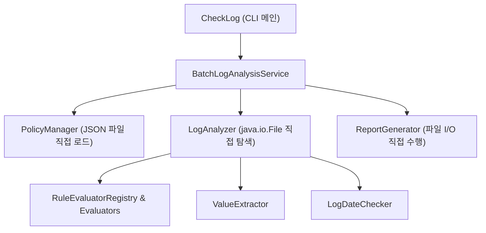

# 00. 헥사고날 아키텍처 & DDD 전환 총괄 로드맵

> **문서 코드**: `HEXA-00`  
> **대상 프로젝트**: `batchLogAnalyze`  
> **학습 목표**: 전통적 계층형(Layered) 구조의 배치 로그 분석기를 순수 도메인 중심의 헥사고날(Ports & Adapters) 아키텍처로 안전하게 점진 전환(Refactoring)하는 전체 청사진을 정립합니다.

---

## 1. 전환 배경 및 목표 (Why & Goal)

### 1.1 현재 시스템의 특징 및 한계 (As-Is)
현재 시스템은 18개 JOB의 다양한 로그 패턴을 신속하게 분석하고 JUnit 5 단위 테스트 및 리포트 자동화를 갖춘 매우 훌륭한 상태입니다. 그러나 다음과 같은 구조적 결합도가 존재합니다:

1. **인프라 종속성**: `BatchLogAnalysisService` 및 `LogAnalyzer`가 `java.io.File`, 로컬 디렉터리 경로, `System.out` 등 인프라 기술에 직접 결합되어 있습니다.
2. **도메인 오염**: 도메인 엔티티(`JobPolicy`, `Rule`, `CheckResult`)가 파일 시스템의 경로 정보(`filePrefix`, `rawPattern`, `fileName`)와 혼재되어 있습니다.
3. **확장 한계**: 만약 로그 소스가 "로컬 파일"에서 "AWS S3 / Kafka / CloudWatch"로 바뀌거나, 결과 출력이 "Markdown 파일"에서 "Slack Webhook / REST API / RDB"로 다변화될 경우 코어 비즈니스 로직을 대대적으로 수정해야 합니다.

### 1.2 목표 아키텍처 (To-Be)
- **도메인 주도 설계 (DDD)**: 비즈니스 핵심 규칙(정규식 평가, 일자 검증, 비영업일 예외, 단계 메트릭 판정)을 순수 Java 객체(POJO)로 완벽 격리.
- **헥사고날 아키텍처 (Ports & Adapters)**: 
  - **Inbound Port / Adapter**: CLI, REST Controller 등 다양한 진입점을 도메인 수정 없이 플러그형으로 연결.
  - **Outbound Port / Adapter**: 로컬 파일, S3, RDB, 슬랙 등 외부 데이터 소스 및 저장소를 도메인과 100% 분리.

---

## 2. As-Is vs To-Be 아키텍처 비교

### 2.1 [As-Is] 계층형 구조 (Layered Architecture)
비즈니스 로직이 파일 시스템(`java.io.File`) 및 콘솔 출력과 직접 연결되어 있습니다.



---

### 2.2 [To-Be] 헥사고날 아키텍처 (Ports and Adapters + DDD)
모든 화살표의 방향이 **중심의 Domain/Application(Core)**을 향하며, 외부 세상은 오직 **Port(인터페이스)**를 통해서만 소통합니다.

```mermaid
flowchart TB
    subgraph DrivingZone ["Driving Side (외부에서 호출하는 영역)"]
        CLI_In["CLI Adapter<br/>(CliCheckLogAdapter)"]
        REST_In["REST Controller Adapter<br/>(미래 확장: Web API)"]
    end

    subgraph HexagonCore ["Hexagonal Core (비즈니스 & 유스케이스)"]
        subgraph PortsIn ["Inbound Ports (유스케이스 인터페이스)"]
            InPort_Analyze["<< Inbound Port >><br/>AnalyzeBatchLogUseCase"]
            InPort_Rename["<< Inbound Port >><br/>RenameLogFilesUseCase"]
        end

        subgraph AppService ["Application Layer"]
            Service_Core["BatchLogAnalysisUseCaseImpl<br/>(오케스트레이션)"]
        end

        subgraph DomainCore ["Pure Domain Layer (DDD Core)"]
            Agg_Policy["JobPolicy Aggregate<br/>(JobPolicy, Rule, Schedule)"]
            Agg_Result["AnalysisSession Aggregate<br/>(Session, CheckResult, StepMetrics)"]
            DomainService_Eval["LogEvaluationEngine<br/>(규칙 평가 도메인 서비스)"]
            DomainService_Date["DatePolicyValidator<br/>(일자 검증 도메인 서비스)"]
        end

        subgraph PortsOut ["Outbound Ports (인프라 추상화 인터페이스)"]
            OutPort_Policy["<< Outbound Port >><br/>LoadPolicyPort"]
            OutPort_Log["<< Outbound Port >><br/>LoadLogPort"]
            OutPort_Report["<< Outbound Port >><br/>SaveReportPort"]
            OutPort_Rename["<< Outbound Port >><br/>RenameFilePort"]
        end
    end

    subgraph DrivenZone ["Driven Side (코어가 외부를 호출하는 영역)"]
        OutAdapter_JsonPolicy["JsonFilePolicyAdapter<br/>(JSON 메타 로더)"]
        OutAdapter_LocalLog["LocalDiskLogAdapter<br/>(디스크 로그 파일 로더)"]
        OutAdapter_MdReport["MarkdownReportFileAdapter<br/>(마크다운 저장)"]
        OutAdapter_ConsoleReport["ConsoleJobpassReportAdapter<br/>(콘솔 출력)"]
    end

    %% 연결 관계
    CLI_In --> InPort_Analyze
    REST_In --> InPort_Analyze
    InPort_Analyze --> Service_Core
    InPort_Rename --> Service_Core

    Service_Core --> DomainCore
    Service_Core --> OutPort_Policy
    Service_Core --> OutPort_Log
    Service_Core --> OutPort_Report
    Service_Core --> OutPort_Rename

    OutPort_Policy <|.. OutAdapter_JsonPolicy
    OutPort_Log <|.. OutAdapter_LocalLog
    OutPort_Report <|.. OutAdapter_MdReport
    OutPort_Report <|.. OutAdapter_ConsoleReport
```

---

## 3. 핵심 아키텍처 원칙 (Core Principles)

### 3.1 100% 도메인 순수성 (Pure POJO)
- `domain` 패키지는 순수 Java 표준 라이브러리(`java.lang.*`, `java.util.*`, `java.time.*`)만을 사용합니다.
- `java.io.File`, `java.nio.file.Path`, Spring Framework(`@Component`, `@Autowired`), Jackson(`@JsonProperty`) 등을 **일절 사용하지 않습니다.**

### 3.2 의존성 역전 원칙 (DIP: Dependency Inversion Principle)
- 고수준 모듈(유스케이스)은 저수준 모듈(파일 시스템, JSON 파서)에 의존하지 않습니다.
- 둘 다 **Port(인터페이스)**에 의존하며, 구체적인 구현체(Adapter)는 외부에서 주입(DI)됩니다.

### 3.3 단방향 의존성 규칙 (Dependency Rule)
- **Adapters ➡️ Ports/Application ➡️ Domain**
- 안쪽 계층은 바깥쪽 계층의 존재를 전혀 알지 못합니다.

---

## 4. 점진적 전환 6단계 전략 (Strangler Fig Pattern)

기존 코드를 한 번에 삭제하고 새로 짜는 방식은 매우 위험합니다.  
**기존 코드와 테스트(126건)를 100% 유지하면서, 신규 헥사고날 패키지를 단계별로 구축하고 검증하는 병렬 공존(Dual Run) 방식**으로 진행합니다.

```
[Step 1] Pure Domain Model 구축 (순수 POJO 도메인 및 도메인 서비스 추출)
   ↓
[Step 2] Port & UseCase 설계 (인바운드/아웃바운드 포트 및 유스케이스 구현)
   ↓
[Step 3] Driven (Outbound) Adapters 구현 (JSON 파서, 디스크 로그 로더, 리포트 어댑터)
   ↓
[Step 4] Driving (Inbound) CLI Adapter 구현 (명령행 인자 파싱 및 실행기 연결)
   ↓
[Step 5] 통합 및 병렬 검증 (As-Is 결과 vs To-Be 결과 1:1 동등성 검증)
   ↓
[Step 6] ArchUnit 아키텍처 규칙 검증 & 점진적 레거시 정리
```

---

## 5. 단계별 완료 기준 (Definition of Done)

| 단계 | 주요 작업 | 완료 검증 기준 (DoD) |
| :---: | :--- | :--- |
| **Step 1** | 순수 도메인 모델(`JobPolicy`, `Rule`, `AnalysisSession`) 및 평가 엔진 구축 | • 도메인 패키지에 외부 라이브러리/I/O import 0건<br/>• 순수 메모리 기반 도메인 단위 테스트 100% PASS |
| **Step 2** | `AnalyzeBatchLogUseCase` 및 In/Out 포트 인터페이스 정의 & 서비스 구현 | • Mockito 기반 포트 Mocking 유스케이스 단위 테스트 통과 (실행 속도 < 10ms) |
| **Step 3** | `JsonFilePolicyAdapter`, `LocalDiskLogAdapter`, `MarkdownReportAdapter` 구현 | • 실제 샘플 파일 기반 어댑터 연동 테스트 통과 |
| **Step 4** | `CliCheckLogAdapter` 구현 및 메인 진입점 연결 | • CLI 파라미터(`--logFileSrc`, `--skipDateCheck`) 정상 동작 |
| **Step 5** | 기존 126개 테스트와 신규 헥사고날 테스트 동시 실행 | • 전체 테스트 스위트 100% PASS 및 동일 보고서 생성 확인 |
| **Step 6** | ArchUnit 아키텍처 의존성 검증 테스트 추가 | • 패키지 간 의존성 위반 0건 확인 |

---

## 6. 다음 문서 안내
- ➡️ [01. DDD 도메인 모델링 & 유비쿼터스 언어](file:///d:/dev/workspace/git.jkoogihw/batchLogAnalyze/docs/hexagonal/01_도메인주도설계(DDD)_모델링_및_유비쿼터스언어.md)로 이동하여 도메인 핵심 객체 설계를 시작합니다.
