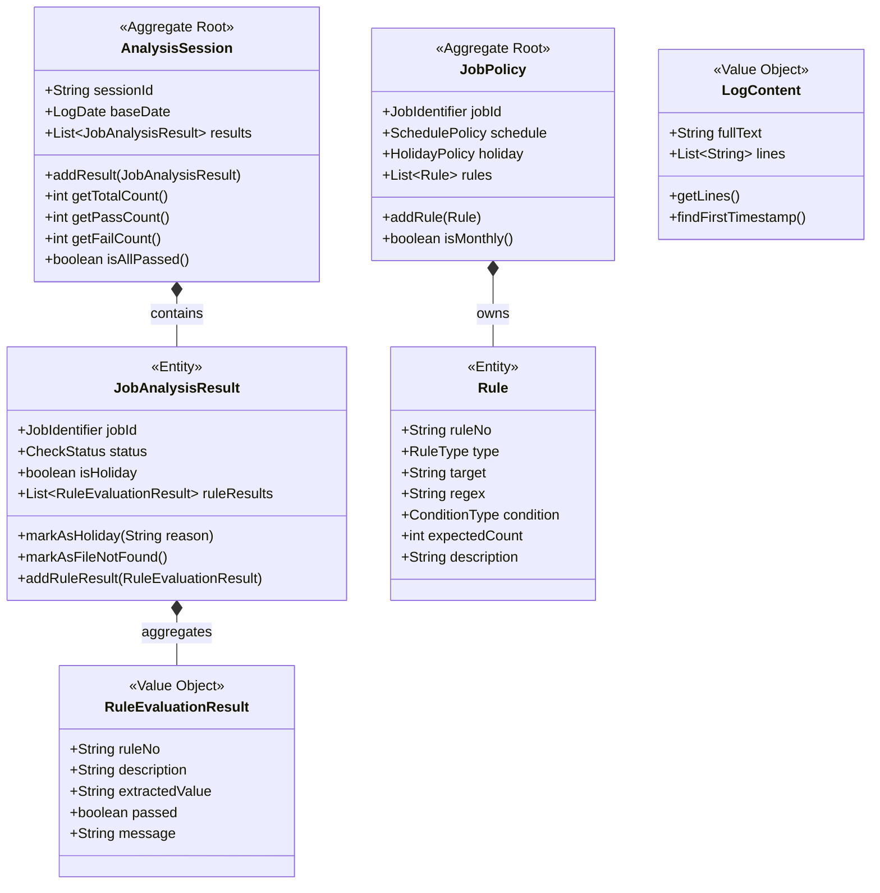

# 01. DDD 도메인 모델링 & 유비쿼터스 언어

> **문서 코드**: `HEXA-01`  
> **대상 패키지**: `com.batch.domain.*`  
> **핵심 원칙**: 외부 의존성(파일 I/O, Spring, Jackson 등)이 일절 배제된 **100% 순수 POJO(Plain Old Java Object)** 도메인 모델링을 구축합니다.

---

## 1. 유비쿼터스 언어 사전 (Ubiquitous Language)

배치 로그 분석 도메인에서 비즈니스 전문가와 개발자가 동일한 의미로 공유하는 핵심 용어 체계입니다.

| 도메인 용어 | 영문 식별자 | 분류 | 정의 및 비즈니스 의미 |
| :--- | :--- | :---: | :--- |
| **배치 정책** | `JobPolicy` | **Aggregate Root** | 개별 배치 작업(18개 JOB)의 식별 정보, 스케줄 유형, 비영업일 예외, 검증 룰 셋을 포괄하는 비즈니스 최상위 단위 |
| **검증 규칙** | `Rule` | **Entity / VO** | 로그 텍스트 내에서 특정 키워드/정규식/스텝 메트릭을 평가하는 단일 검증 규칙 (SEARCH, DISPLAY, STEP_METRICS) |
| **규칙 평가 결과** | `RuleEvaluationResult` | **Value Object** | 개별 규칙에 대한 평가 통과 여부(`passed`), 추출된 값(`extractedValue`), 상세 메시지(`message`)를 담는 불변 객체 |
| **작업 분석 결과** | `JobAnalysisResult` | **Entity** | 하나의 배치 작업(JOB)에 대해 로그 매칭 여부, 비영업일 판정, 복수 규칙 평가 결과, 최종 성공/실패 여부를 총괄하는 결과 객체 |
| **분석 세션** | `AnalysisSession` | **Aggregate Root** | 전체 18개 JOB의 분석 결과 집합과 세션 메타정보(기준일자, 총 소요시간, 통과/실패 수치)를 집계하는 최상위 애그리거트 |
| **로그 콘텐츠** | `LogContent` | **Value Object** | 디스크 파일 형태를 벗어나 메모리에 라인 단위로 적재된 순수 로그 텍스트 불변 객체 |
| **로그 일자** | `LogDate` | **Value Object** | 작업 기준일(`baseDate`)과 로그 타임스탬프(`logDate`)의 일치 여부 및 09:05 전일/당일 분기 검증 책임을 갖는 값 객체 |
| **검증 상태** | `CheckStatus` | **Enum (VO)** | 분석 결과 상태 (`SUCCESS`, `FAILED`, `HOLIDAY`, `FILE_NOT_FOUND`, `MONTHLY_NOT_RUN`) |
| **조건 유형** | `ConditionType` | **Enum (VO)** | 판정 조건식 (`EQUALS_0`, `EQUALS_N`, `ROLLBACK_ZERO`, `COUNT_CHECK`, `ERROR_IF_PRESENT`) |

---

## 2. 도메인 모델 구조도 (DDD Aggregate Diagram)



---

## 3. 핵심 도메인 객체 명세 및 순수 POJO 구현

### 3.1 `JobPolicy` (Aggregate Root)
외부 라이브러리 없이 비즈니스 불변식(규칙 목록 불변성, 스케줄 유효성)을 캡슐화합니다.

```java
package com.batch.domain.model;

import java.util.ArrayList;
import java.util.Collections;
import java.util.List;
import java.util.Objects;

/**
 * [DDD Aggregate Root] 배치 정책 애그리거트
 * 18개 배치 JOB의 고유 식별자, 스케줄 정보, 비영업일 처리 정책, 검증 규칙들을 총괄합니다.
 */
public final class JobPolicy {

    private final JobIdentifier id;
    private final String scheduleTime;
    private final ScheduleType scheduleType;
    private final Integer monthlyLogDay;
    private final HolidayPolicy holidayPolicy;
    private final List<Rule> rules;

    public JobPolicy(JobIdentifier id, String scheduleTime, ScheduleType scheduleType, 
                     Integer monthlyLogDay, HolidayPolicy holidayPolicy, List<Rule> rules) {
        this.id = Objects.requireNonNull(id, "JobIdentifier는 필수입니다");
        this.scheduleTime = scheduleTime != null ? scheduleTime : "00:00";
        this.scheduleType = scheduleType != null ? scheduleType : ScheduleType.DAILY;
        this.monthlyLogDay = monthlyLogDay;
        this.holidayPolicy = holidayPolicy != null ? holidayPolicy : HolidayPolicy.none();
        this.rules = rules != null ? List.copyOf(rules) : Collections.emptyList();
    }

    public JobIdentifier getId() { return id; }
    public String getJobNo() { return id.getJobNo(); }
    public String getJobName() { return id.getJobName(); }
    public String getScheduleTime() { return scheduleTime; }
    public ScheduleType getScheduleType() { return scheduleType; }
    public Integer getMonthlyLogDay() { return monthlyLogDay; }
    public HolidayPolicy getHolidayPolicy() { return holidayPolicy; }
    public List<Rule> getRules() { return rules; }

    public boolean isMonthly() {
        return scheduleType == ScheduleType.MONTHLY;
    }
}
```

---

### 3.2 `LogContent` (Value Object)
파일 I/O와 완전히 분리되어, 순수 메모리 상의 텍스트 라인들을 안전하게 다룹니다.

```java
package com.batch.domain.model;

import java.util.Arrays;
import java.util.Collections;
import java.util.List;
import java.util.regex.Matcher;
import java.util.regex.Pattern;

/**
 * [DDD Value Object] 로그 내용 값 객체
 * 불변(Immutable) 객체로, 로그 본문과 라인 목록 및 패턴 탐색 기능을 캡슐화합니다.
 */
public final class LogContent {

    private static final Pattern TIMESTAMP_PATTERN = Pattern.compile("\\b(\\d{4}-\\d{2}-\\d{2})\\b");

    private final String fullText;
    private final List<String> lines;

    public LogContent(String fullText) {
        if (fullText == null || fullText.isEmpty()) {
            this.fullText = "";
            this.lines = Collections.emptyList();
        } else {
            this.fullText = fullText;
            this.lines = List.of(fullText.split("\\r?\\n"));
        }
    }

    public static LogContent of(String text) {
        return new LogContent(text);
    }

    public String getFullText() { return fullText; }
    public List<String> getLines() { return lines; }
    public String[] getLinesArray() { return lines.toArray(new String[0]); }
    public int size() { return lines.size(); }

    public String findFirstDateString() {
        Matcher m = TIMESTAMP_PATTERN.matcher(fullText);
        return m.find() ? m.group(1) : null;
    }
}
```

---

### 3.3 `AnalysisSession` (Aggregate Root)
전체 배치 분석 실행 결과를 집계하고 전체 성공 여부를 판정합니다.

```java
package com.batch.domain.model;

import java.time.LocalDateTime;
import java.util.ArrayList;
import java.util.Collections;
import java.util.List;

/**
 * [DDD Aggregate Root] 분석 세션 애그리거트
 * 한 번의 배치 로그 분석 작업 실행 단위로, 전체 JOB들의 분석 결과를 집계합니다.
 */
public final class AnalysisSession {

    private final String sessionId;
    private final String baseFolder;
    private final LocalDateTime executedAt;
    private final List<JobAnalysisResult> results;

    public AnalysisSession(String sessionId, String baseFolder) {
        this.sessionId = sessionId;
        this.baseFolder = baseFolder;
        this.executedAt = LocalDateTime.now();
        this.results = new ArrayList<>();
    }

    public void addResult(JobAnalysisResult result) {
        this.results.add(result);
    }

    public List<JobAnalysisResult> getResults() {
        return Collections.unmodifiableList(results);
    }

    public int getTotalJobs() { return results.size(); }
    public long getPassedCount() { return results.stream().filter(JobAnalysisResult::isPassed).count(); }
    public long getFailedCount() { return results.stream().filter(r -> !r.isPassed()).count(); }
    public boolean isAllPassed() { return getFailedCount() == 0; }
}
```

---

## 4. 도메인 서비스 (Domain Services)

어느 특정 엔티티에 온전히 속하기 어려운 순수 비즈니스 계산 및 평가 로직을 담당합니다.

### 4.1 `LogEvaluationEngine`
전략 패턴(Strategy Pattern)을 내장하여, `Rule`의 타입에 따라 `RuleEvaluator`를 찾아 평가를 위임합니다.

```java
package com.batch.domain.service;

import com.batch.domain.evaluator.RuleEvaluator;
import com.batch.domain.evaluator.RuleEvaluatorRegistry;
import com.batch.domain.model.JobAnalysisResult;
import com.batch.domain.model.JobPolicy;
import com.batch.domain.model.LogContent;
import com.batch.domain.model.Rule;
import com.batch.domain.model.RuleEvaluationResult;

/**
 * [DDD Domain Service] 로그 규칙 평가 엔진
 * 주어진 로그 내용에 대해 정책의 모든 규칙을 순차 평가하여 결과 객체에 누적합니다.
 */
public class LogEvaluationEngine {

    private final RuleEvaluatorRegistry registry;

    public LogEvaluationEngine(RuleEvaluatorRegistry registry) {
        this.registry = registry != null ? registry : RuleEvaluatorRegistry.createDefault();
    }

    public JobAnalysisResult evaluate(JobPolicy policy, LogContent logContent) {
        JobAnalysisResult result = JobAnalysisResult.of(policy.getId());

        String fullText = logContent.getFullText();
        String[] lines = logContent.getLinesArray();

        for (Rule rule : policy.getRules()) {
            RuleEvaluator evaluator = registry.getEvaluator(rule.getType());
            RuleEvaluationResult ruleResult = evaluator.evaluate(fullText, lines, rule);
            result.addRuleResult(ruleResult);
        }

        return result;
    }
}
```

---

### 4.2 `DatePolicyValidator`
배치 시작 시간(09:05 기준 분기) 및 월간/일간 일자 정합성 비즈니스 규칙을 담당합니다.

```java
package com.batch.domain.service;

import com.batch.domain.model.JobPolicy;
import com.batch.domain.model.LogContent;

import java.time.LocalDate;
import java.time.format.DateTimeFormatter;

/**
 * [DDD Domain Service] 일자 정책 검증기
 * 09:05 이전/이후 실행 기준일 분기 및 월간 2일자 생성 규칙을 판정합니다.
 */
public class DatePolicyValidator {

    private static final String CUTOFF_TIME = "09:05";

    public boolean isValidDate(String baseDateStr, JobPolicy policy, LogContent logContent) {
        String logDateStr = logContent.findFirstDateString();
        if (logDateStr == null) return false;

        String normalizedLogDate = logDateStr.replace("-", "").substring(2); // YYYY-MM-DD -> YYMMDD

        // 1. 월간 배치 규칙
        if (policy.isMonthly()) {
            int day = Integer.parseInt(normalizedLogDate.substring(4));
            int expectedDay = policy.getMonthlyLogDay() != null ? policy.getMonthlyLogDay() : 2;
            return day == expectedDay;
        }

        // 2. 일간 배치 규칙 (09:05 기준)
        String scheduleTime = policy.getScheduleTime();
        if (scheduleTime.compareTo(CUTOFF_TIME) < 0) {
            // 09:05 이전 -> 당일 일자 매칭
            return baseDateStr.equals(normalizedLogDate);
        } else {
            // 09:05 이후 -> 전일 일자 매칭
            String prevDateStr = calculatePreviousDate(baseDateStr);
            return prevDateStr.equals(normalizedLogDate) || baseDateStr.equals(normalizedLogDate);
        }
    }

    private String calculatePreviousDate(String yyMMdd) {
        LocalDate date = LocalDate.parse("20" + yyMMdd, DateTimeFormatter.ofPattern("yyyyMMdd"));
        return date.minusDays(1).format(DateTimeFormatter.ofPattern("yyMMdd"));
    }
}
```

---

## 5. 도메인 계층 단위 테스트 예시

순수 POJO로만 구성되었기 때문에 Spring 컨텍스트 로딩이나 디스크 파일 없이 **1ms 이내로 초고속 검증**이 가능합니다.

```java
package com.batch.domain;

import com.batch.domain.model.*;
import com.batch.domain.service.LogEvaluationEngine;
import org.junit.jupiter.api.DisplayName;
import org.junit.jupiter.api.Test;

import java.util.List;

import static org.junit.jupiter.api.Assertions.*;

@DisplayName("도메인 단위 테스트: LogEvaluationEngine")
class LogEvaluationEngineTest {

    @Test
    @DisplayName("SEARCH 규칙 평가 시 지정된 횟수와 일치하면 성공 판정한다")
    void testEvaluateSearchRule_Success() {
        // Given
        Rule rule = Rule.builder("01")
                .type(RuleType.SEARCH)
                .target("SUCCESS_CODE")
                .condition(ConditionType.EQUALS_N)
                .expectedCount(2)
                .description("성공 코드 2건 확인")
                .build();

        JobPolicy policy = new JobPolicy(
                JobIdentifier.of("01", "testJob"),
                "03:00", ScheduleType.DAILY, null, null, List.of(rule)
        );

        LogContent log = LogContent.of("Line 1: SUCCESS_CODE\nLine 2: SUCCESS_CODE\nLine 3: END");
        LogEvaluationEngine engine = new LogEvaluationEngine(null);

        // When
        JobAnalysisResult result = engine.evaluate(policy, log);

        // Then
        assertTrue(result.isPassed());
        assertEquals(1, result.getRuleResults().size());
        assertEquals("2", result.getRuleResults().get(0).getExtractedValue());
    }
}
```

---

## 6. 다음 문서 안내
- ➡️ [02. 포트(Ports) & 유스케이스(UseCases) 설계서](file:///d:/dev/workspace/git.jkoogihw/batchLogAnalyze/docs/hexagonal/02_포트(Ports)_및_유스케이스(UseCases)_설계서.md)로 이동하여 도메인을 감싸는 애플리케이션 포트와 유스케이스를 정의합니다.
