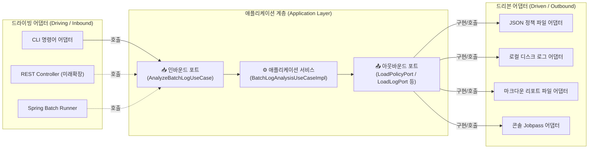

# 02. 포트(Ports) 및 유스케이스(UseCases) 설계서

> **문서 개요**: 본 문서는 헥사고날 아키텍처의 핵심 접점인 **인바운드 포트(Inbound Port, UseCase)**와 **아웃바운드 포트(Outbound Port, SPI)**의 계약(Contract)을 정의하고, 도메인 코어를 조율(Orchestration)하는 **애플리케이션 서비스(Application Service)**의 구현 및 단위 테스트 가이드를 제공합니다.

---

## 1. 포트(Port)의 개념 및 역할

헥사고날 아키텍처에서 **포트(Port)**는 애플리케이션 코어와 외부 세계 사이의 명확한 **경계선(Boundary Contract)**이자 **Java 인터페이스**입니다.



### 1.1 인바운드 포트 (Inbound Port / Driving Port / UseCase)
- **정의**: 외부 세계(사용자, CLI, 웹 요청, 스케줄러)가 애플리케이션 코어에 **"무엇을 수행해 달라"**고 요청하는 진입점입니다.
- **특징**:
  - `UseCase` 접미사를 사용합니다 (예: `AnalyzeBatchLogUseCase`).
  - 매개변수는 순수 입력 DTO인 **Command 객체**를 수신합니다.
  - 반환값은 순수 결과 DTO인 **Response / Result 객체**를 반환합니다.

### 1.2 아웃바운드 포트 (Outbound Port / Driven Port / Secondary Port)
- **정의**: 애플리케이션 서비스가 비즈니스 흐름을 진행하기 위해 외부 인프라(파일 시스템, DB, 메시지 큐 등)에 **"데이터를 가져오거나 저장해 달라"**고 요구하는 규격입니다.
- **특징**:
  - `Port` 접미사를 사용합니다 (예: `LoadJobPoliciesPort`, `SaveAnalysisReportPort`).
  - 도메인 패키지의 순수 모델(`JobPolicy`, `AnalysisSession`, `LogContent`)을 매개변수나 반환값으로 사용하며, 특정 기술(Jackson, `java.io.File`)을 일절 노출하지 않습니다.

---

## 2. 인바운드 포트 (UseCases) 설계

### 2.1 로그 분석 유스케이스 (`AnalyzeBatchLogUseCase`)

```java
package com.batch.hexagonal.application.port.in;

import com.batch.hexagonal.application.port.in.command.AnalyzeBatchLogCommand;
import com.batch.hexagonal.application.port.in.result.BatchAnalysisResult;

/**
 * [인바운드 포트] 배치 로그 분석 및 정합성 검증 유스케이스
 */
public interface AnalyzeBatchLogUseCase {

    /**
     * 지정된 조건(날짜, 대상 JOB, 로그 디렉터리 등)으로 배치 로그를 분석하고 결과를 반환합니다.
     *
     * @param command 분석 요청 명령 객체 (입력값 유효성 검증 완료)
     * @return 배치 분석 세션 요약 결과
     */
    BatchAnalysisResult analyzeLogs(AnalyzeBatchLogCommand command);
}
```

### 2.2 입력 커맨드 (`AnalyzeBatchLogCommand`)
> **설계 원칙**: Command 객체 생성 시점에 필수 파라미터 null 검증 및 포맷 검증을 수행하여, 애플리케이션 내부로 잘못된 데이터가 유입되는 것을 원천 차단(Fail-Fast)합니다.

```java
package com.batch.hexagonal.application.port.in.command;

import com.batch.hexagonal.domain.model.vo.LogDate;
import java.util.Objects;
import java.util.Optional;

/**
 * [입력 커맨드] 배치 로그 분석 요청 DTO
 */
public record AnalyzeBatchLogCommand(
    LogDate targetDate,         // 분석 대상 기준 일자 (예: 2026-09-04)
    String logDirectoryPath,    // 로그 파일이 저장된 기본 디렉터리 경로
    String specificJobCode,     // 특정 JOB 1건만 분석할 경우 (null 이면 전체 분석)
    boolean autoRenameEnabled,  // 분석 성공 시 파일명 자동 변경(JOBPASS) 여부
    String customPolicyPath     // 커스텀 정책 파일 경로 (null 이면 기본 정책 사용)
) {
    public AnalyzeBatchLogCommand {
        Objects.requireNonNull(targetDate, "분석 대상 일자(targetDate)는 필수입니다.");
        Objects.requireNonNull(logDirectoryPath, "로그 디렉터리 경로(logDirectoryPath)는 필수입니다.");
        if (logDirectoryPath.isBlank()) {
            throw new IllegalArgumentException("로그 디렉터리 경로는 공백일 수 없습니다.");
        }
    }

    /**
     * 전체 JOB 대상 분석 생성 정적 팩터리
     */
    public static AnalyzeBatchLogCommand ofAll(LogDate targetDate, String logDirectoryPath, boolean autoRename) {
        return new AnalyzeBatchLogCommand(targetDate, logDirectoryPath, null, autoRename, null);
    }

    /**
     * 단일 JOB 지정 분석 생성 정적 팩터리
     */
    public static AnalyzeBatchLogCommand ofSingleJob(LogDate targetDate, String logDirectoryPath, String jobCode, boolean autoRename) {
        return new AnalyzeBatchLogCommand(targetDate, logDirectoryPath, jobCode, autoRename, null);
    }
}
```

### 2.3 출력 결과 DTO (`BatchAnalysisResult`)

```java
package com.batch.hexagonal.application.port.in.result;

import com.batch.hexagonal.domain.model.vo.JobStatus;
import java.time.LocalDateTime;
import java.util.List;

/**
 * [출력 결과 DTO] 유스케이스 실행 최종 요약 정보
 */
public record BatchAnalysisResult(
    String sessionId,
    String targetDate,
    int totalJobCount,
    int successJobCount,
    int failedJobCount,
    List<JobItemResult> jobResults,
    LocalDateTime analyzedAt
) {
    public record JobItemResult(
        String jobCode,
        String jobName,
        JobStatus status,
        int totalCount,
        int totalPage,
        String failReason
    ) {}

    public boolean isAllSuccess() {
        return failedJobCount == 0;
    }
}
```

---

## 3. 아웃바운드 포트 (Outbound SPI) 설계

아웃바운드 포트는 도메인이 외부 세상과 소통하기 위한 **출구 인터페이스**입니다.

### 3.1 정책 로딩 포트 (`LoadJobPoliciesPort`)

```java
package com.batch.hexagonal.application.port.out;

import com.batch.hexagonal.domain.model.aggregate.JobPolicy;
import java.util.List;
import java.util.Optional;

/**
 * [아웃바운드 포트] JOB 검증 정책 메타데이터를 저장소(JSON, DB 등)로부터 로딩하는 포트
 */
public interface LoadJobPoliciesPort {

    /**
     * 등록된 모든 JOB 정책 목록을 조회합니다.
     */
    List<JobPolicy> loadAllPolicies();

    /**
     * 특정 JOB 코드에 해당하는 단일 정책을 조회합니다.
     */
    Optional<JobPolicy> loadPolicyByJobCode(String jobCode);
}
```

### 3.2 로그 내용 로딩 포트 (`LoadLogContentPort`)

```java
package com.batch.hexagonal.application.port.out;

import com.batch.hexagonal.domain.model.vo.LogContent;
import com.batch.hexagonal.domain.model.vo.LogDate;
import java.util.List;
import java.util.Optional;

/**
 * [아웃바운드 포트] 파일시스템이나 원격 저장소에서 로그 텍스트를 로딩하는 포트
 */
public interface LoadLogContentPort {

    /**
     * 대상 일자와 JOB 코드에 해당하는 로그 본문을 로드합니다.
     */
    Optional<LogContent> loadLog(String logDirectoryPath, String jobCode, LogDate targetDate);

    /**
     * 디렉터리 내에서 대상 일자에 해당하는 모든 JOB의 로그를 일괄 조회합니다.
     */
    List<LogContent> loadAllLogsForDate(String logDirectoryPath, LogDate targetDate);
}
```

### 3.3 리포트 저장 포트 (`SaveAnalysisReportPort`)

```java
package com.batch.hexagonal.application.port.out;

import com.batch.hexagonal.domain.model.aggregate.AnalysisSession;

/**
 * [아웃바운드 포트] 분석 결과를 외부 저장소(Markdown 파일, 콘솔, DB 등)에 기록하는 포트
 */
public interface SaveAnalysisReportPort {

    /**
     * 완료된 분석 세션 데이터를 마크다운 파일 형식으로 디스크에 저장합니다.
     */
    void saveMarkdownReport(AnalysisSession session, String outputDirectory);

    /**
     * 분석 요약 및 건수 결과를 표준 출력 또는 지정된 알림 채널로 전파합니다.
     */
    void publishConsoleSummary(AnalysisSession session);
}
```

### 3.4 파일 이름 변경 포트 (`RenameLogFilePort`)

```java
package com.batch.hexagonal.application.port.out;

import com.batch.hexagonal.domain.model.vo.LogDate;

/**
 * [아웃바운드 포트] 검증 성공한 로그 파일의 파일명을 변경(JOBPASS)하는 포트
 */
public interface RenameLogFilePort {

    /**
     * 특정 로그 파일에 접미사(예: .jobpass)를 추가하여 리네임합니다.
     *
     * @param logDirectoryPath 로그 디렉터리
     * @param jobCode 대상 JOB 코드
     * @param targetDate 분석 일자
     * @return 변경 성공 여부
     */
    boolean renameToJobpass(String logDirectoryPath, String jobCode, LogDate targetDate);
}
```

---

## 4. 애플리케이션 서비스 (오케스트레이터) 구현

애플리케이션 서비스는 **비즈니스 로직(규칙 평가, 정규식 검증 등)을 직접 수행하지 않습니다.**
대신 다음 4단계의 **조율(Orchestration)** 흐름만을 전담합니다:
1. **포트를 통해 데이터 수집** (정책 로딩, 로그 원문 로딩)
2. **도메인 서비스 및 애그리거트에 평가 위임** (`LogEvaluationEngine`, `DatePolicyValidator`)
3. **도메인 상태 변경 및 세션 집계** (`AnalysisSession.recordResult()`)
4. **포트를 통해 결과 저장 및 파일 처리** (`SaveAnalysisReportPort`, `RenameLogFilePort`)

```java
package com.batch.hexagonal.application.service;

import com.batch.hexagonal.application.port.in.AnalyzeBatchLogUseCase;
import com.batch.hexagonal.application.port.in.command.AnalyzeBatchLogCommand;
import com.batch.hexagonal.application.port.in.result.BatchAnalysisResult;
import com.batch.hexagonal.application.port.out.LoadJobPoliciesPort;
import com.batch.hexagonal.application.port.out.LoadLogContentPort;
import com.batch.hexagonal.application.port.out.RenameLogFilePort;
import com.batch.hexagonal.application.port.out.SaveAnalysisReportPort;
import com.batch.hexagonal.domain.model.aggregate.AnalysisSession;
import com.batch.hexagonal.domain.model.aggregate.JobPolicy;
import com.batch.hexagonal.domain.model.entity.JobAnalysisResult;
import com.batch.hexagonal.domain.model.vo.JobStatus;
import com.batch.hexagonal.domain.model.vo.LogContent;
import com.batch.hexagonal.domain.model.vo.SessionId;
import com.batch.hexagonal.domain.service.DatePolicyValidator;
import com.batch.hexagonal.domain.service.LogEvaluationEngine;

import java.time.LocalDateTime;
import java.util.List;
import java.util.Optional;

/**
 * [애플리케이션 서비스] 배치 로그 분석 유스케이스 구현체 (순수 오케스트레이터)
 */
public class BatchLogAnalysisService implements AnalyzeBatchLogUseCase {

    private final LoadJobPoliciesPort loadJobPoliciesPort;
    private final LoadLogContentPort loadLogContentPort;
    private final SaveAnalysisReportPort saveAnalysisReportPort;
    private final RenameLogFilePort renameLogFilePort;

    private final LogEvaluationEngine evaluationEngine;
    private final DatePolicyValidator datePolicyValidator;

    public BatchLogAnalysisService(
            LoadJobPoliciesPort loadJobPoliciesPort,
            LoadLogContentPort loadLogContentPort,
            SaveAnalysisReportPort saveAnalysisReportPort,
            RenameLogFilePort renameLogFilePort,
            LogEvaluationEngine evaluationEngine,
            DatePolicyValidator datePolicyValidator) {
        this.loadJobPoliciesPort = loadJobPoliciesPort;
        this.loadLogContentPort = loadLogContentPort;
        this.saveAnalysisReportPort = saveAnalysisReportPort;
        this.renameLogFilePort = renameLogFilePort;
        this.evaluationEngine = evaluationEngine;
        this.datePolicyValidator = datePolicyValidator;
    }

    @Override
    public BatchAnalysisResult analyzeLogs(AnalyzeBatchLogCommand command) {
        // 1. 분석 세션 애그리거트 생성
        AnalysisSession session = AnalysisSession.startNew(
                SessionId.generate(),
                command.targetDate()
        );

        // 2. 아웃바운드 포트를 통한 정책 로딩
        List<JobPolicy> policies = loadPolicies(command);

        // 3. 각 JOB별 로그 분석 수행 (도메인 엔진 위임)
        for (JobPolicy policy : policies) {
            Optional<LogContent> logContentOpt = loadLogContentPort.loadLog(
                    command.logDirectoryPath(),
                    policy.getJobCode(),
                    command.targetDate()
            );

            if (logContentOpt.isEmpty()) {
                // 로그 파일 누락 처리
                session.recordResult(JobAnalysisResult.failed(
                        policy.getJobCode(),
                        policy.getJobName(),
                        "로그 파일을 찾을 수 없습니다."
                ));
                continue;
            }

            LogContent logContent = logContentOpt.get();

            // 순수 도메인 엔진을 통한 규칙 평가
            JobAnalysisResult result = evaluationEngine.evaluate(policy, logContent);

            // 날짜 정책 정합성 2차 검증
            if (result.getStatus() == JobStatus.SUCCESS) {
                boolean dateValid = datePolicyValidator.validateDateConsistency(
                        policy, logContent, command.targetDate()
                );
                if (!dateValid) {
                    result = JobAnalysisResult.failed(
                            policy.getJobCode(),
                            policy.getJobName(),
                            "로그 내부 날짜 정책이 기준 일자와 일치하지 않습니다."
                    );
                }
            }

            session.recordResult(result);

            // 4. 자동 리네임 옵션 처리
            if (command.autoRenameEnabled() && result.getStatus() == JobStatus.SUCCESS) {
                renameLogFilePort.renameToJobpass(
                        command.logDirectoryPath(),
                        policy.getJobCode(),
                        command.targetDate()
                );
            }
        }

        // 5. 세션 종료 및 리포트 저장 아웃바운드 호출
        session.complete();
        saveAnalysisReportPort.saveMarkdownReport(session, command.logDirectoryPath());
        saveAnalysisReportPort.publishConsoleSummary(session);

        // 6. 인바운드 결과 DTO 변환 및 반환
        return toResultDto(session);
    }

    private List<JobPolicy> loadPolicies(AnalyzeBatchLogCommand command) {
        if (command.specificJobCode() != null && !command.specificJobCode().isBlank()) {
            return loadJobPoliciesPort.loadPolicyByJobCode(command.specificJobCode())
                    .map(List::of)
                    .orElseGet(List::of);
        }
        return loadJobPoliciesPort.loadAllPolicies();
    }

    private BatchAnalysisResult toResultDto(AnalysisSession session) {
        List<BatchAnalysisResult.JobItemResult> items = session.getResults().stream()
                .map(r -> new BatchAnalysisResult.JobItemResult(
                        r.getJobCode(),
                        r.getJobName(),
                        r.getStatus(),
                        r.getExtractedCount("totalCount").orElse(0),
                        r.getExtractedCount("totalPage").orElse(0),
                        r.getFailReason()
                ))
                .toList();

        return new BatchAnalysisResult(
                session.getSessionId().value(),
                session.getTargetDate().formatted(),
                session.getTotalJobCount(),
                session.getSuccessJobCount(),
                session.getFailedJobCount(),
                items,
                LocalDateTime.now()
        );
    }
}
```

---

## 5. 포트 기반 순수 단위 테스트 (Spring & I/O 0% Mocking)

헥사고날 구조의 가장 큰 강점은 **Spring Context 로딩(0.01초 소요)이나 실제 파일 I/O 없이도 모든 유스케이스 흐름을 완벽히 테스트**할 수 있다는 점입니다.

```java
package com.batch.hexagonal.application.service;

import com.batch.hexagonal.application.port.in.command.AnalyzeBatchLogCommand;
import com.batch.hexagonal.application.port.in.result.BatchAnalysisResult;
import com.batch.hexagonal.application.port.out.LoadJobPoliciesPort;
import com.batch.hexagonal.application.port.out.LoadLogContentPort;
import com.batch.hexagonal.application.port.out.RenameLogFilePort;
import com.batch.hexagonal.application.port.out.SaveAnalysisReportPort;
import com.batch.hexagonal.domain.model.aggregate.JobPolicy;
import com.batch.hexagonal.domain.model.entity.JobAnalysisResult;
import com.batch.hexagonal.domain.model.vo.JobStatus;
import com.batch.hexagonal.domain.model.vo.LogContent;
import com.batch.hexagonal.domain.model.vo.LogDate;
import com.batch.hexagonal.domain.service.DatePolicyValidator;
import com.batch.hexagonal.domain.service.LogEvaluationEngine;
import org.junit.jupiter.api.BeforeEach;
import org.junit.jupiter.api.DisplayName;
import org.junit.jupiter.api.Test;
import org.junit.jupiter.api.extension.ExtendWith;
import org.mockito.Mock;
import org.mockito.junit.jupiter.MockitoExtension;

import java.util.List;
import java.util.Optional;

import static org.assertj.core.api.Assertions.assertThat;
import static org.mockito.ArgumentMatchers.any;
import static org.mockito.BDDMockito.given;
import static org.mockito.Mockito.verify;

@ExtendWith(MockitoExtension.class)
class BatchLogAnalysisServiceTest {

    @Mock private LoadJobPoliciesPort loadJobPoliciesPort;
    @Mock private LoadLogContentPort loadLogContentPort;
    @Mock private SaveAnalysisReportPort saveAnalysisReportPort;
    @Mock private RenameLogFilePort renameLogFilePort;
    @Mock private LogEvaluationEngine evaluationEngine;
    @Mock private DatePolicyValidator datePolicyValidator;

    private BatchLogAnalysisService service;

    @BeforeEach
    void setUp() {
        service = new BatchLogAnalysisService(
                loadJobPoliciesPort,
                loadLogContentPort,
                saveAnalysisReportPort,
                renameLogFilePort,
                evaluationEngine,
                datePolicyValidator
        );
    }

    @Test
    @DisplayName("로그 분석 성공 시 리포트가 저장되고 파일이 jobpass로 리네임된다")
    void analyzeLogs_Success_ShouldSaveReportAndRename() {
        // given
        LogDate targetDate = LogDate.of(2026, 9, 4);
        AnalyzeBatchLogCommand command = AnalyzeBatchLogCommand.ofAll(targetDate, "logs/20260904", true);

        JobPolicy dummyPolicy = JobPolicy.builder()
                .jobCode("JOB_01")
                .jobName("상품비교설명확인서")
                .build();

        LogContent dummyLog = LogContent.of("JOB_01", "2026-09-04 10:00:00 [INFO] totalCount : 3, 건");

        JobAnalysisResult successResult = JobAnalysisResult.builder()
                .jobCode("JOB_01")
                .jobName("상품비교설명확인서")
                .status(JobStatus.SUCCESS)
                .build();

        given(loadJobPoliciesPort.loadAllPolicies()).willReturn(List.of(dummyPolicy));
        given(loadLogContentPort.loadLog("logs/20260904", "JOB_01", targetDate)).willReturn(Optional.of(dummyLog));
        given(evaluationEngine.evaluate(dummyPolicy, dummyLog)).willReturn(successResult);
        given(datePolicyValidator.validateDateConsistency(dummyPolicy, dummyLog, targetDate)).willReturn(true);

        // when
        BatchAnalysisResult result = service.analyzeLogs(command);

        // then
        assertThat(result.totalJobCount()).isEqualTo(1);
        assertThat(result.successJobCount()).isEqualTo(1);
        assertThat(result.isAllSuccess()).isTrue();

        // 포트 호출 검증
        verify(saveAnalysisReportPort).saveMarkdownReport(any(), any());
        verify(saveAnalysisReportPort).publishConsoleSummary(any());
        verify(renameLogFilePort).renameToJobpass("logs/20260904", "JOB_01", targetDate);
    }
}
```

---

## 6. 포트 & 유스케이스 체크리스트

1. [ ] `application.port.in` 패키지에 유스케이스 인터페이스와 Command/Result DTO가 정의되었는가?
2. [ ] `application.port.out` 패키지의 포트 인터페이스들이 도메인 객체만 사용하고 있는가? (`File`, `Jackson` 등 인프라 타입 사용 금지)
3. [ ] `BatchLogAnalysisService`는 비즈니스 로직을 직접 파싱하지 않고 순수 도메인 엔진(`LogEvaluationEngine`)에 위임하는가?
4. [ ] Mockito를 활용한 유스케이스 단위 테스트가 외부 파일이나 Spring Context 없이 50ms 이내에 통과하는가?
