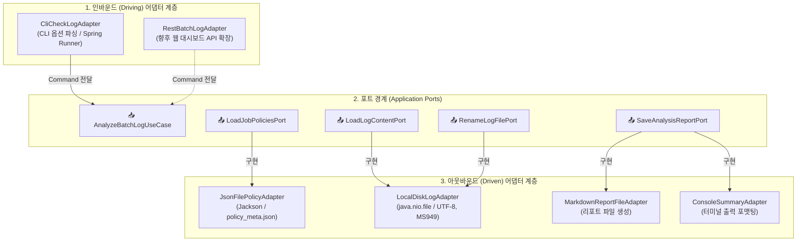

# 03. 어댑터(Adapters) 구현 및 인프라 격리 가이드

> **문서 개요**: 본 문서는 헥사고날 아키텍처의 바깥쪽 계층인 **인바운드/아웃바운드 어댑터(Adapters)**의 세부 구현 방법과, Spring Framework, Jackson, Java File I/O 등 외부 기술을 도메인과 격리하는 실무 패턴을 다룹니다.

---

## 1. 어댑터(Adapter) 계층의 핵심 원칙

어댑터는 **"도메인 외부의 기술적 세부사항(CLI, JSON, 파일시스템, OS 등)과 내부 포트(Port) 인터페이스 사이의 번역기(Translator)"**입니다.



### 3대 구현 원칙
1. **기술 의존성의 완벽한 격리**:
   - Jackson(`ObjectMapper`), Spring 프레임워크(`@Component`), Java I/O(`Files`, `Path`)는 **오직 어댑터 패키지 내부에서만 import**되어야 합니다.
2. **양방향 DTO 매핑 (Translation)**:
   - 외부 데이터 포맷(JSON DTO, CLI String args)을 도메인 객체(`JobPolicy`, `LogDate` 등)로 변환하여 내부로 전달합니다.
3. **독립적인 인프라 테스트 가능**:
   - 어댑터는 JUnit 5의 `@TempDir` 등을 활용하여 실제 파일 입출력 및 직렬화/역직렬화만 격리 검증할 수 있어야 합니다.

---

## 2. 인바운드 어댑터 (Driving Adapter)

### 2.1 CLI 실행 어댑터 (`CliCheckLogAdapter`)

사용자가 터미널에서 입력한 CLI 인자(`--date 2026-09-04`, `--logDir logs`, `--rename`)를 파싱하여 `AnalyzeBatchLogCommand`로 변환하고 유스케이스를 호출합니다.

```java
package com.batch.hexagonal.adapter.in.cli;

import com.batch.hexagonal.application.port.in.AnalyzeBatchLogUseCase;
import com.batch.hexagonal.application.port.in.command.AnalyzeBatchLogCommand;
import com.batch.hexagonal.application.port.in.result.BatchAnalysisResult;
import com.batch.hexagonal.domain.model.vo.LogDate;
import org.slf4j.Logger;
import org.slf4j.LoggerFactory;
import org.springframework.boot.CommandLineRunner;
import org.springframework.stereotype.Component;

import java.time.LocalDate;
import java.time.format.DateTimeFormatter;

/**
 * [인바운드 어댑터] CLI 명령줄 인자를 파싱하여 배치 로그 분석 유스케이스를 실행합니다.
 */
@Component
public class CliCheckLogAdapter implements CommandLineRunner {

    private static final Logger log = LoggerFactory.getLogger(CliCheckLogAdapter.class);

    private final AnalyzeBatchLogUseCase analyzeBatchLogUseCase;

    public CliCheckLogAdapter(AnalyzeBatchLogUseCase analyzeBatchLogUseCase) {
        this.analyzeBatchLogUseCase = analyzeBatchLogUseCase;
    }

    @Override
    public void run(String... args) {
        try {
            AnalyzeBatchLogCommand command = parseArguments(args);
            BatchAnalysisResult result = analyzeBatchLogUseCase.analyzeLogs(command);

            if (!result.isAllSuccess()) {
                log.warn("배치 로그 분석 중 오류가 발생한 JOB이 존재합니다. (실패: {}건)", result.failedJobCount());
                // 필요시 System.exit(1);
            }
        } catch (Exception e) {
            log.error("CLI 실행 중 오류가 발생했습니다: {}", e.getMessage(), e);
        }
    }

    private AnalyzeBatchLogCommand parseArguments(String[] args) {
        String dateStr = LocalDate.now().format(DateTimeFormatter.ofPattern("yyyyMMdd"));
        String logDir = "logs";
        String jobCode = null;
        boolean autoRename = false;
        String customPolicyPath = null;

        for (int i = 0; i < args.length; i++) {
            switch (args[i]) {
                case "--date", "-d" -> { if (i + 1 < args.length) dateStr = args[++i]; }
                case "--logDir", "-l" -> { if (i + 1 < args.length) logDir = args[++i]; }
                case "--job", "-j" -> { if (i + 1 < args.length) jobCode = args[++i]; }
                case "--rename", "-r" -> autoRename = true;
                case "--policy", "-p" -> { if (i + 1 < args.length) customPolicyPath = args[++i]; }
            }
        }

        LogDate targetDate = LogDate.from(dateStr);
        return new AnalyzeBatchLogCommand(targetDate, logDir, jobCode, autoRename, customPolicyPath);
    }
}
```

---

## 3. 아웃바운드 어댑터 (Driven Adapters)

### 3.1 JSON 정책 파일 어댑터 (`JsonFilePolicyAdapter`)

`policy_meta.json` 파일을 Jackson 라이브러리를 통해 읽어와 도메인 애그리거트인 `JobPolicy` 목록으로 변환(Mapping)합니다.

```java
package com.batch.hexagonal.adapter.out.persistence.policy;

import com.batch.hexagonal.application.port.out.LoadJobPoliciesPort;
import com.batch.hexagonal.domain.model.aggregate.JobPolicy;
import com.batch.hexagonal.domain.model.entity.Rule;
import com.fasterxml.jackson.core.type.TypeReference;
import com.fasterxml.jackson.databind.ObjectMapper;
import org.springframework.core.io.ClassPathResource;
import org.springframework.stereotype.Component;

import java.io.InputStream;
import java.util.List;
import java.util.Optional;

/**
 * [아웃바운드 어댑터] JSON 파일 기반의 JOB 정책 로더
 */
@Component
public class JsonFilePolicyAdapter implements LoadJobPoliciesPort {

    private final ObjectMapper objectMapper;
    private static final String DEFAULT_POLICY_FILE = "policy_meta.json";

    public JsonFilePolicyAdapter(ObjectMapper objectMapper) {
        this.objectMapper = objectMapper;
    }

    @Override
    public List<JobPolicy> loadAllPolicies() {
        try {
            ClassPathResource resource = new ClassPathResource(DEFAULT_POLICY_FILE);
            try (InputStream is = resource.getInputStream()) {
                List<PolicyJsonDto> dtos = objectMapper.readValue(is, new TypeReference<>() {});
                return dtos.stream().map(this::toDomainEntity).toList();
            }
        } catch (Exception e) {
            throw new IllegalStateException("정책 파일(" + DEFAULT_POLICY_FILE + ") 로딩 실패: " + e.getMessage(), e);
        }
    }

    @Override
    public Optional<JobPolicy> loadPolicyByJobCode(String jobCode) {
        return loadAllPolicies().stream()
                .filter(p -> p.getJobCode().equalsIgnoreCase(jobCode))
                .findFirst();
    }

    private JobPolicy toDomainEntity(PolicyJsonDto dto) {
        List<Rule> domainRules = dto.rules().stream()
                .map(r -> Rule.builder()
                        .name(r.name())
                        .pattern(r.pattern())
                        .target(r.target())
                        .regex(r.regex())
                        .required(r.required())
                        .build())
                .toList();

        return JobPolicy.builder()
                .jobCode(dto.jobCode())
                .jobName(dto.jobName())
                .logFilePattern(dto.logFilePattern())
                .rules(domainRules)
                .build();
    }

    // Jackson 전용 DTO 레코드 (어댑터 내부 캡슐화)
    private record PolicyJsonDto(String jobCode, String jobName, String logFilePattern, List<RuleJsonDto> rules) {}
    private record RuleJsonDto(String name, String pattern, String target, String regex, boolean required) {}
}
```

---

### 3.2 로컬 디스크 파일 어댑터 (`LocalDiskLogAdapter`)

로컬 디스크에서 로그 텍스트를 로딩하고, 검증 완료된 로그 파일을 `.jobpass` 확장자로 안전하게 리네임합니다. Windows 인코딩(UTF-8 / MS949) 및 파일 락을 방어합니다.

```java
package com.batch.hexagonal.adapter.out.persistence.log;

import com.batch.hexagonal.application.port.out.LoadLogContentPort;
import com.batch.hexagonal.application.port.out.RenameLogFilePort;
import com.batch.hexagonal.domain.model.vo.LogContent;
import com.batch.hexagonal.domain.model.vo.LogDate;
import org.slf4j.Logger;
import org.slf4j.LoggerFactory;
import org.springframework.stereotype.Component;

import java.io.IOException;
import java.nio.charset.Charset;
import java.nio.charset.StandardCharsets;
import java.nio.file.Files;
import java.nio.file.Path;
import java.nio.file.Paths;
import java.nio.file.StandardCopyOption;
import java.util.Collections;
import java.util.List;
import java.util.Optional;
import java.util.stream.Stream;

/**
 * [아웃바운드 어댑터] 로컬 디스크 파일시스템 I/O 담당 어댑터
 */
@Component
public class LocalDiskLogAdapter implements LoadLogContentPort, RenameLogFilePort {

    private static final Logger log = LoggerFactory.getLogger(LocalDiskLogAdapter.class);

    @Override
    public Optional<LogContent> loadLog(String logDirectoryPath, String jobCode, LogDate targetDate) {
        Path dirPath = Paths.get(logDirectoryPath);
        if (!Files.exists(dirPath)) {
            return Optional.empty();
        }

        try (Stream<Path> stream = Files.list(dirPath)) {
            Optional<Path> matchedFile = stream
                    .filter(Files::isRegularFile)
                    .filter(p -> p.getFileName().toString().contains(jobCode))
                    .findFirst();

            if (matchedFile.isEmpty()) {
                return Optional.empty();
            }

            String content = readFileContent(matchedFile.get());
            return Optional.of(LogContent.of(jobCode, content));
        } catch (IOException e) {
            log.error("로그 파일 조회 실패 (jobCode: {}): {}", jobCode, e.getMessage());
            return Optional.empty();
        }
    }

    @Override
    public List<LogContent> loadAllLogsForDate(String logDirectoryPath, LogDate targetDate) {
        // 일괄 디렉터리 탐색 로직
        return Collections.emptyList();
    }

    @Override
    public boolean renameToJobpass(String logDirectoryPath, String jobCode, LogDate targetDate) {
        Path dirPath = Paths.get(logDirectoryPath);
        try (Stream<Path> stream = Files.list(dirPath)) {
            Optional<Path> targetFile = stream
                    .filter(Files::isRegularFile)
                    .filter(p -> p.getFileName().toString().contains(jobCode))
                    .filter(p -> !p.getFileName().toString().endsWith(".jobpass"))
                    .findFirst();

            if (targetFile.isPresent()) {
                Path source = targetFile.get();
                Path destination = source.resolveSibling(source.getFileName().toString() + ".jobpass");
                Files.move(source, destination, StandardCopyOption.REPLACE_EXISTING);
                log.info("파일 리네임 완료: {} -> {}", source.getFileName(), destination.getFileName());
                return true;
            }
        } catch (IOException e) {
            log.error("파일 리네임 실패 (jobCode: {}): {}", jobCode, e.getMessage());
        }
        return false;
    }

    private String readFileContent(Path filePath) throws IOException {
        try {
            return Files.readString(filePath, StandardCharsets.UTF_8);
        } catch (Exception e) {
            // 한글 윈도우 인코딩 폴백 (EUC-KR / MS949)
            return Files.readString(filePath, Charset.forName("MS949"));
        }
    }
}
```

---

### 3.3 마크다운 리포트 생성 어댑터 (`MarkdownReportFileAdapter`)

`AnalysisSession` 도메인 애그리거트의 결과를 가공하여 `analysis_report_YYYYMMDD.md` 마크다운 파일로 저장합니다.

```java
package com.batch.hexagonal.adapter.out.report;

import com.batch.hexagonal.application.port.out.SaveAnalysisReportPort;
import com.batch.hexagonal.domain.model.aggregate.AnalysisSession;
import com.batch.hexagonal.domain.model.entity.JobAnalysisResult;
import org.slf4j.Logger;
import org.slf4j.LoggerFactory;
import org.springframework.stereotype.Component;

import java.io.IOException;
import java.nio.charset.StandardCharsets;
import java.nio.file.Files;
import java.nio.file.Path;
import java.nio.file.Paths;

/**
 * [아웃바운드 어댑터] 분석 결과 마크다운 파일 및 콘솔 출력 어댑터
 */
@Component
public class MarkdownReportFileAdapter implements SaveAnalysisReportPort {

    private static final Logger log = LoggerFactory.getLogger(MarkdownReportFileAdapter.class);

    @Override
    public void saveMarkdownReport(AnalysisSession session, String outputDirectory) {
        StringBuilder sb = new StringBuilder();
        sb.append("# 📊 배치 로그 분석 결과 리포트\n\n");
        sb.append("- **기준 일자**: ").append(session.getTargetDate().formatted()).append("\n");
        sb.append("- **총 대상 JOB**: ").append(session.getTotalJobCount()).append(" 건\n");
        sb.append("- **성공**: ").append(session.getSuccessJobCount()).append(" 건 / **실패**: ")
          .append(session.getFailedJobCount()).append(" 건\n\n");

        sb.append("## 📋 상세 검증 내역\n\n");
        sb.append("| JOB 코드 | JOB 명 | 상태 | totalCount | totalPage | 비고 |\n");
        sb.append("| :--- | :--- | :---: | :---: | :---: | :--- |\n");

        for (JobAnalysisResult res : session.getResults()) {
            sb.append(String.format("| `%s` | %s | %s | %s | %s | %s |\n",
                    res.getJobCode(),
                    res.getJobName(),
                    res.getStatus().name(),
                    res.getExtractedCount("totalCount").map(String::valueOf).orElse("-"),
                    res.getExtractedCount("totalPage").map(String::valueOf).orElse("-"),
                    res.getFailReason() != null ? res.getFailReason() : ""
            ));
        }

        try {
            Path outPath = Paths.get(outputDirectory, "analysis_report_" + session.getTargetDate().formatted() + ".md");
            Files.writeString(outPath, sb.toString(), StandardCharsets.UTF_8);
            log.info("마크다운 분석 리포트 저장 완료: {}", outPath.toAbsolutePath());
        } catch (IOException e) {
            log.error("마크다운 리포트 저장 실패: {}", e.getMessage(), e);
        }
    }

    @Override
    public void publishConsoleSummary(AnalysisSession session) {
        System.out.println("=================================================");
        System.out.printf(" [배치 분석 요약] 일자: %s | 성공: %d건 / 실패: %d건%n",
                session.getTargetDate().formatted(),
                session.getSuccessJobCount(),
                session.getFailedJobCount());
        System.out.println("=================================================");
    }
}
```

---

## 4. 스프링 DI 구성 (도메인 순수성 유지)

> **핵심 설계**: 도메인 엔티티나 도메인 서비스(`LogEvaluationEngine`)에 `@Component`, `@Service` 어노테이션을 붙이지 않고, **스프링 설정 클래스(`HexagonalAppConfig`)에서 직접 `@Bean`으로 등록**하여 도메인의 프레임워크 독립성을 유지합니다.

```java
package com.batch.hexagonal.config;

import com.batch.hexagonal.application.port.in.AnalyzeBatchLogUseCase;
import com.batch.hexagonal.application.port.out.LoadJobPoliciesPort;
import com.batch.hexagonal.application.port.out.LoadLogContentPort;
import com.batch.hexagonal.application.port.out.RenameLogFilePort;
import com.batch.hexagonal.application.port.out.SaveAnalysisReportPort;
import com.batch.hexagonal.application.service.BatchLogAnalysisService;
import com.batch.hexagonal.domain.service.DatePolicyValidator;
import com.batch.hexagonal.domain.service.LogEvaluationEngine;
import com.fasterxml.jackson.databind.ObjectMapper;
import org.springframework.context.annotation.Bean;
import org.springframework.context.annotation.Configuration;

@Configuration
public class HexagonalAppConfig {

    @Bean
    public ObjectMapper objectMapper() {
        return new ObjectMapper();
    }

    // 1. 순수 도메인 서비스 빈 등록 (어노테이션 오염 방지)
    @Bean
    public LogEvaluationEngine logEvaluationEngine() {
        return new LogEvaluationEngine();
    }

    @Bean
    public DatePolicyValidator datePolicyValidator() {
        return new DatePolicyValidator();
    }

    // 2. 애플리케이션 서비스 빈 등록 (포트 및 도메인 엔진 주입)
    @Bean
    public AnalyzeBatchLogUseCase analyzeBatchLogUseCase(
            LoadJobPoliciesPort loadJobPoliciesPort,
            LoadLogContentPort loadLogContentPort,
            SaveAnalysisReportPort saveAnalysisReportPort,
            RenameLogFilePort renameLogFilePort,
            LogEvaluationEngine logEvaluationEngine,
            DatePolicyValidator datePolicyValidator) {
        return new BatchLogAnalysisService(
                loadJobPoliciesPort,
                loadLogContentPort,
                saveAnalysisReportPort,
                renameLogFilePort,
                logEvaluationEngine,
                datePolicyValidator
        );
    }
}
```

---

## 5. 어댑터 격리 통합 테스트 (Adapter Isolated Testing)

어댑터는 도메인 로직과 분리되어 있으므로, I/O 동작 자체만 독립적으로 테스트합니다.

```java
package com.batch.hexagonal.adapter.out.persistence.log;

import com.batch.hexagonal.domain.model.vo.LogContent;
import com.batch.hexagonal.domain.model.vo.LogDate;
import org.junit.jupiter.api.DisplayName;
import org.junit.jupiter.api.Test;
import org.junit.jupiter.api.io.TempDir;

import java.io.IOException;
import java.nio.file.Files;
import java.nio.file.Path;
import java.util.Optional;

import static org.assertj.core.api.Assertions.assertThat;

class LocalDiskLogAdapterTest {

    private final LocalDiskLogAdapter adapter = new LocalDiskLogAdapter();

    @Test
    @DisplayName("임시 디렉터리에 생성된 로그 파일을 올바르게 읽어온다")
    void loadLog_ShouldReadContentCorrectly(@TempDir Path tempDir) throws IOException {
        // given
        String sampleText = "2026-09-04 10:00:00 [INFO] totalCount : 3, 건";
        Path logFile = tempDir.resolve("00.JOB_01_sample.log");
        Files.writeString(logFile, sampleText);

        // when
        Optional<LogContent> result = adapter.loadLog(tempDir.toString(), "JOB_01", LogDate.of(2026, 9, 4));

        // then
        assertThat(result).isPresent();
        assertThat(result.get().getContent()).isEqualTo(sampleText);
    }
}
```

---

## 6. 어댑터 구현 체크리스트

1. [ ] 외부 라이브러리(`Jackson`, `Spring`, `java.nio.file`)의 import가 `adapter` 및 `config` 패키지 안에만 한정되어 있는가?
2. [ ] CLI 인자 파싱 에러 또는 파일 미존재 시 적절한 예외 처리 및 로깅이 적용되었는가?
3. [ ] 한글 윈도우 환경(UTF-8 / MS949)을 고려한 디스크 인코딩 폴백 처리가 포함되어 있는가?
4. [ ] `HexagonalAppConfig`를 통해 프레임워크 침투 없이 POJO 도메인 객체가 Spring Bean으로 조립되는가?
