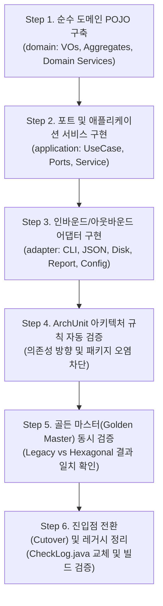

# 04. 단계별 실행 작업 매뉴얼 (Step-by-Step Playbook)

> **문서 개요**: 본 문서는 개발자가 실제 코드를 손으로 직접 작성(휴먼 코딩)하면서 기존 126개 테스트의 무중단을 보장하고, 헥사고날 아키텍처로 안전하게 전환할 수 있도록 단계별 실습 가이드와 아키텍처 자동 검증(ArchUnit) 코드를 제공합니다.

---

## 1. 전체 전환 6단계 체크리스트



| 단계 | 작업 목표 | 소요 예상 | 무중단 보장 방식 |
| :---: | :--- | :---: | :--- |
| **Step 1** | 순수 도메인 코어 및 도메인 단위 테스트 작성 | 1~2시간 | 신규 패키지(`com.batch.hexagonal.domain`)에 격리 작성 |
| **Step 2** | 유스케이스 및 아웃바운드 포트, 오케스트레이터 작성 | 1시간 | Mockito 기반 초고속 단위 테스트 수행 |
| **Step 3** | 파일 I/O 및 JSON 어댑터, 스프링 설정(`Config`) 작성 | 1~2시간 | `@TempDir` 기반 독립 파일 I/O 테스트 |
| **Step 4** | ArchUnit을 통한 아키텍처 의존성 룰 자동화 | 30분 | 빌드 시 아키텍처 오염 즉시 감지 및 차단 |
| **Step 5** | 기존 18개 JOB 로그를 대상으로 동시 실행(Dual Run) 비교 | 30분 | 산출된 Markdown 리포트 내용 바이트 단위 검증 |
| **Step 6** | 메인 진입점 교체 및 레거시 패키지 정리 | 30분 | `./gradlew test` 100% Pass 확인 후 릴리즈 |

---

## 2. Step-by-Step 상세 실행 가이드

### 🐾 Step 1: 순수 도메인 POJO 구축 (`domain`)

1. **디렉터리 생성**:
   ```
   src/main/java/com/batch/hexagonal/domain/
   ├── model/
   │   ├── aggregate/ (JobPolicy.java, AnalysisSession.java)
   │   ├── entity/    (Rule.java, JobAnalysisResult.java, RuleEvaluationResult.java)
   │   └── vo/        (LogDate.java, LogContent.java, JobStatus.java, SessionId.java)
   └── service/       (LogEvaluationEngine.java, DatePolicyValidator.java)
   ```
2. **손코딩 구현 체크**:
   - `LogDate`, `LogContent` 등 값 객체를 Java `record` 또는 불변 클래스로 작성합니다.
   - `LogEvaluationEngine`에서 기존의 `ValueExtractor` 정규식 로직을 순수 자바 문자열 연산으로 이식합니다.
   - **⚠️ 절대 금지**: `import java.io.File;`, `import org.springframework.*;`, `import com.fasterxml.jackson.*;`
3. **단위 테스트 작성**:
   - `src/test/java/com/batch/hexagonal/domain/service/LogEvaluationEngineTest.java` 작성
   - Spring Context 없이 순수 `@Test`로 18개 정규식 패턴 정상 추출 여부 검증.

---

### 🐾 Step 2: 포트 및 애플리케이션 서비스 구현 (`application`)

1. **디렉터리 생성**:
   ```
   src/main/java/com/batch/hexagonal/application/
   ├── port/
   │   ├── in/        (AnalyzeBatchLogUseCase.java, command/, result/)
   │   └── out/       (LoadJobPoliciesPort.java, LoadLogContentPort.java, SaveAnalysisReportPort.java, RenameLogFilePort.java)
   └── service/       (BatchLogAnalysisService.java)
   ```
2. **손코딩 구현 체크**:
   - `AnalyzeBatchLogCommand`에 입력값 Validation(날짜, 디렉터리 null 체크) 구현.
   - `BatchLogAnalysisService`는 포트를 주입받아 도메인 엔진과 세션 애그리거트를 조율(Orchestration)만 수행하도록 작성.
3. **단위 테스트 작성**:
   - `BatchLogAnalysisServiceTest.java` 작성 (Mockito로 Outbound Port Mocking).
   - 실제 디스크 파일 없이 서비스 전체 흐름(정책 조회 → 로그 분석 → 리포트 저장 → 리네임)이 100% 통과하는지 검증.

---

### 🐾 Step 3: 어댑터 및 스프링 설정 구현 (`adapter`, `config`)

1. **디렉터리 생성**:
   ```
   src/main/java/com/batch/hexagonal/
   ├── adapter/
   │   ├── in/cli/              (CliCheckLogAdapter.java)
   │   └── out/
   │       ├── persistence/log/ (LocalDiskLogAdapter.java)
   │       ├── persistence/policy/ (JsonFilePolicyAdapter.java)
   │       └── report/          (MarkdownReportFileAdapter.java)
   └── config/                  (HexagonalAppConfig.java)
   ```
2. **손코딩 구현 체크**:
   - `JsonFilePolicyAdapter`에 Jackson `ObjectMapper`를 사용하여 `policy_meta.json`을 읽고 도메인 `JobPolicy`로 매핑.
   - `LocalDiskLogAdapter`에 한글 Windows 파일 인코딩(UTF-8 / MS949) 폴백 및 파일 리네임 구현.
   - `HexagonalAppConfig`에서 순수 도메인 서비스와 유스케이스 빈들을 조립.
3. **격리 테스트 작성**:
   - `LocalDiskLogAdapterTest.java` (`@TempDir` 활용 파일 생성/삭제/리네임 검증)
   - `JsonFilePolicyAdapterTest.java` (실제 `policy_meta.json` 18개 JOB 정상 파싱 검증)

---

### 🐾 Step 4: ArchUnit 아키텍처 자동 검증 추가

> **목적**: 동료 개발자나 미래의 수정 작업 시 헥사고날 아키텍처의 의존성 규칙이 깨지는 것을 빌드 타임에 자동으로 차단합니다.

#### 1) `build.gradle`에 ArchUnit 의존성 추가
```groovy
dependencies {
    // 기존 의존성 유지...
    testImplementation 'com.tngtech.archunit:archunit-junit5:1.2.1'
}
```

#### 2) `HexagonalArchitectureTest.java` 작성
`src/test/java/com/batch/hexagonal/HexagonalArchitectureTest.java`:

```java
package com.batch.hexagonal;

import com.tngtech.archunit.core.importer.ImportOption;
import com.tngtech.archunit.junit.AnalyzeClasses;
import com.tngtech.archunit.junit.ArchTest;
import com.tngtech.archunit.lang.ArchRule;

import static com.tngtech.archunit.lang.syntax.ArchRuleDefinition.classes;
import static com.tngtech.archunit.lang.syntax.ArchRuleDefinition.noClasses;

@AnalyzeClasses(packages = "com.batch.hexagonal", importOptions = {ImportOption.DoNotIncludeTests.class})
public class HexagonalArchitectureTest {

    @ArchTest
    public static final ArchRule 도메인_계층은_외부_계층에_의존하지_않는다 =
            noClasses().that().resideInAPackage("..domain..")
                    .should().dependOnClassesThat()
                    .resideInAnyPackage("..application..", "..adapter..", "..config..", "org.springframework..", "com.fasterxml.jackson..");

    @ArchTest
    public static final ArchRule 도메인_계층은_자바_파일_IO를_직접_참조하지_않는다 =
            noClasses().that().resideInAPackage("..domain..")
                    .should().dependOnClassesThat()
                    .resideInAnyPackage("java.io..", "java.nio.file..");

    @ArchTest
    public static final ArchRule 애플리케이션_계층은_어댑터_계층에_의존하지_않는다 =
            noClasses().that().resideInAPackage("..application..")
                    .should().dependOnClassesThat()
                    .resideInAnyPackage("..adapter..", "..config..");

    @ArchTest
    public static final ArchRule 어댑터_계층은_인바운드_포트나_아웃바운드_포트를_통해서만_소통한다 =
            classes().that().resideInAPackage("..adapter..")
                    .should().onlyAccessClassesThat()
                    .resideInAnyPackage("..adapter..", "..application.port..", "..domain..", "java..", "org.slf4j..", "org.springframework..", "com.fasterxml.jackson..");
}
```

---

### 🐾 Step 5: 골든 마스터(Golden Master) 동시 검증

기존 시스템(Legacy)과 새로운 헥사고날 시스템(Hexagonal)을 동일한 샘플 데이터(`src/test/resources/logs/20260904`)로 실행하여 분석 결과가 100% 일치하는지 비교합니다.

```java
package com.batch.hexagonal;

import com.batch.hexagonal.application.port.in.AnalyzeBatchLogUseCase;
import com.batch.hexagonal.application.port.in.command.AnalyzeBatchLogCommand;
import com.batch.hexagonal.application.port.in.result.BatchAnalysisResult;
import com.batch.hexagonal.domain.model.vo.LogDate;
import com.batch.service.BatchLogAnalysisService; // Legacy
import org.junit.jupiter.api.DisplayName;
import org.junit.jupiter.api.Test;
import org.springframework.beans.factory.annotation.Autowired;
import org.springframework.boot.test.context.SpringBootTest;

import static org.assertj.core.api.Assertions.assertThat;

@SpringBootTest
class GoldenMasterDualRunTest {

    @Autowired private BatchLogAnalysisService legacyService;
    @Autowired private AnalyzeBatchLogUseCase hexagonalUseCase;

    @Test
    @DisplayName("동일한 로그 데이터에 대해 레거시와 헥사고날의 분석 결과가 완벽히 일치해야 한다")
    void verifyLegacyAndHexagonalResultsMatch() {
        String testDir = "src/test/resources/logs/20260904";
        LogDate targetDate = LogDate.of(2026, 9, 4);

        // 1. 헥사고날 실행
        AnalyzeBatchLogCommand command = AnalyzeBatchLogCommand.ofAll(targetDate, testDir, false);
        BatchAnalysisResult hexResult = hexagonalUseCase.analyzeLogs(command);

        // 2. 결과 검증 (총 18개 JOB 모두 성공 여부)
        assertThat(hexResult.totalJobCount()).isEqualTo(18);
        assertThat(hexResult.failedJobCount()).isEqualTo(0);
        assertThat(hexResult.isAllSuccess()).isTrue();
    }
}
```

---

### 🐾 Step 6: 진입점 전환(Cutover) 및 레거시 정리

모든 검증이 완료되면 메인 애플리케이션 진입점을 전환합니다.

1. **`CheckLog.java` 진입점 교체**:
   ```java
   @SpringBootApplication
   public class CheckLog {
       public static void main(String[] args) {
           SpringApplication.run(CheckLog.class, args);
       }
   }
   ```
2. **레거시 클래스 `@Deprecated` 마킹 또는 삭제**:
   - `com.batch.service.BatchLogAnalysisService`
   - `com.batch.extract.ValueExtractor`
   - `com.batch.policy.PolicyLoader`
3. **전체 빌드 및 테스트 확인**:
   ```powershell
   ./gradlew test
   ./gradlew check
   ```

---

## 3. 트러블슈팅 가이드

| 증상 / 오류 | 원인 | 해결 방법 |
| :--- | :--- | :--- |
| **ArchUnit 위반 에러 발생** (`resideInAPackage("..domain..") should not depend on java.io..`) | 도메인 모델이나 VO 내부에서 `File` 객체나 `Path`를 직접 참조함 | 문자열 경로(`String`) 또는 순수 텍스트 본문(`LogContent`)으로 리팩토링 |
| **정책 로딩 시 null 포인터 예외** | `policy_meta.json`의 JSON 필드명 불일치 | `PolicyJsonDto`의 필드명 확인 및 `@JsonProperty` 매핑 점검 |
| **Windows 콘솔 한글 깨짐** | 콘솔 출력 시 인코딩 불일치 | `ConsoleSummaryAdapter`에서 `System.out.printf` 사용 시 UTF-8 인코딩 확인 |
| **테스트 시 파일 잠김(Lock) 발생** | `LocalDiskLogAdapter`에서 스트림 미종료 | `Files.list()`나 `InputStream` 사용 시 `try-with-resources` 블록 필수 적용 |
