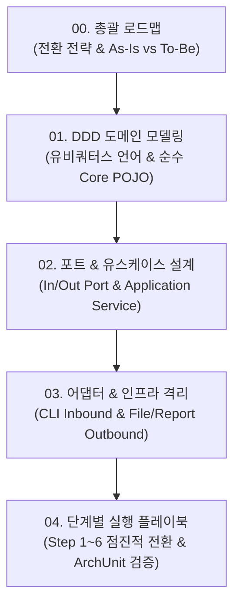

# 🧭 헥사고날 아키텍처 & DDD 전환 학습 및 실무 가이드

> **목적**: 기존 계층형(Layered) 구조로 작성된 배치 로그 분석 시스템(`batchLogAnalyze`)을 **도메인 주도 설계(DDD)**와 **헥사고날 아키텍처(포트와 어댑터 패턴)** 기반으로 안전하고 점진적으로 전환(Migration)하기 위한 종합 가이드 및 실행 매뉴얼입니다.

---

## 📚 문서 체계 및 학습 로드맵

본 가이드 문서는 일괄적인 코드 변경에 따른 부작용을 방지하고, **개발자가 개념을 학습하며 한 단계씩 손으로 직접 구현(휴먼 코딩)**할 수 있도록 총 5편의 상세 문서로 구성되어 있습니다.

---

## 📑 상세 문서 목록

| 번호 | 문서명 | 주요 내용 | 링크 |
| :---: | :--- | :--- | :---: |
| **00** | **총괄 로드맵 & 아키텍처 비교** | • 헥사고날 + DDD 도입 배경 및 핵심 가치 • As-Is vs To-Be 구조도 및 의존성 역전 원리 • 점진적 전환(Strangler Fig) 전략 및 완료 기준(DoD) | [00_헥사고날_DDD_전환_총괄_로드맵.md](file:///d:/dev/workspace/git.jkoogihw/batchLogAnalyze/docs/hexagonal/00_헥사고날_DDD_전환_총괄_로드맵.md) |
| **01** | **DDD 도메인 모델링 & 순수 Core** | • 배치 분석 도메인 유비쿼터스 언어 정의 • 애그리거트 루트(Aggregate Root), 엔티티, VO 설계 • I/O 및 프레임워크 의존성이 0%인 순수 비즈니스 엔진 | [01_도메인주도설계(DDD)_모델링_및_유비쿼터스언어.md](file:///d:/dev/workspace/git.jkoogihw/batchLogAnalyze/docs/hexagonal/01_도메인주도설계(DDD)_모델링_및_유비쿼터스언어.md) |
| **02** | **포트(Ports) & 유스케이스(UseCases)** | • 인바운드 포트(유스케이스 계약) 정의 (`AnalyzeBatchLogUseCase`) • 아웃바운드 포트(인프라 계약) 정의 (`LoadPolicyPort`, `LoadLogPort` 등) • Command/Query 분리 및 애플리케이션 서비스 오케스트레이션 | [02_포트(Ports)_및_유스케이스(UseCases)_설계서.md](file:///d:/dev/workspace/git.jkoogihw/batchLogAnalyze/docs/hexagonal/02_포트(Ports)_및_유스케이스(UseCases)_설계서.md) |
| **03** | **어댑터(Adapters) 구현 & 인프라 격리** | • 인바운드 어댑터: CLI 인자 파서 및 실행기 • 아웃바운드 어댑터: JSON 정책 파일, 로컬 로그 디스크, 리포트 생성기 • 외부 기술(Spring, Jackson, Java I/O)의 어댑터 계층 완전 격리 | [03_어댑터(Adapters)_구현_및_인프라_격리_가이드.md](file:///d:/dev/workspace/git.jkoogihw/batchLogAnalyze/docs/hexagonal/03_어댑터(Adapters)_구현_및_인프라_격리_가이드.md) |
| **04** | **단계별 실행 플레이북 (Step-by-Step)** | • 1단계부터 6단계까지 손으로 직접 코딩하는 실무 체크리스트 • 기존 126개 단위 테스트와의 병렬 유지(Dual Run) 검증 • ArchUnit을 활용한 아키텍처 규칙 자동 검증 코드 포함 | [04_단계별_실행_작업_매뉴얼(Step-by-Step_Playbook).md](file:///d:/dev/workspace/git.jkoogihw/batchLogAnalyze/docs/hexagonal/04_단계별_실행_작업_매뉴얼(Step-by-Step_Playbook).md) |

---

## 🎯 전환의 핵심 원칙 (Core Rules)

1. **기존 테스트 100% 무중단 유지 (Dual Run)**:
   - 새 헥사고날 구조를 별도 패키지(`com.batch.hexagonal.*`) 또는 점진적 하위 패키지에 구축하면서, 기존 126개 테스트가 깨지지 않고 공존하도록 합니다.
2. **도메인 순수성 100% 보장**:
   - `domain` 패키지는 `java.io.File`, `java.nio.file.Path`, Spring Framework, Jackson 라이브러리를 **절대 import하지 않습니다**.
3. **포트를 통한 의존성 역전 (DIP)**:
   - 비즈니스 로직은 "어디서 로그를 읽어오고 어디로 출력하는지" 알지 못하며, 오직 포트(인터페이스) 규격에만 의존합니다.
