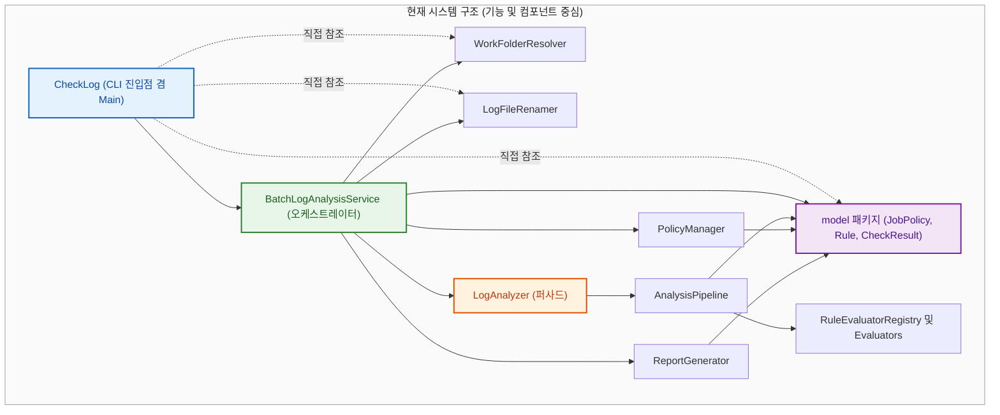
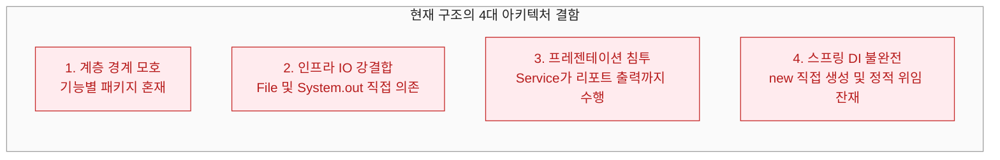
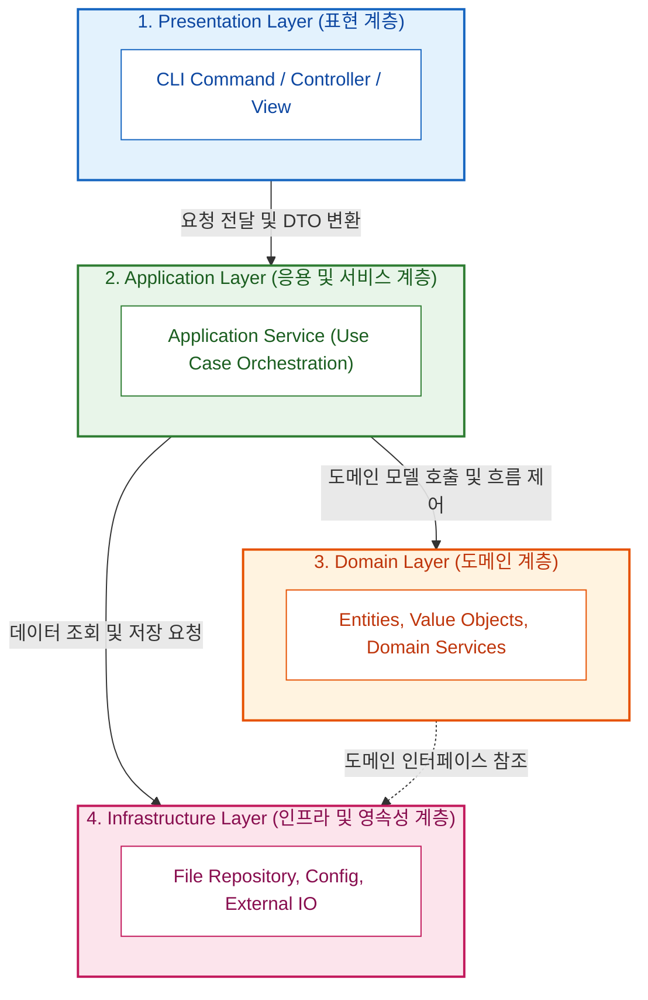

# 01. 현재 구조 분석 및 레이어드 아키텍처 장단점 비교

> **문서 코드**: `LAYERED-01`  
> **대상 프로젝트**: `batchLogAnalyze`  
> **목적**: 현재 구축된 **컴포넌트 중심 OOP 구조**의 설계적 특징과 한계를 면밀히 진단하고, **레이어드 아키텍처(Layered Architecture)**의 핵심 원칙 및 두 아키텍처 간의 심층 장단점을 비교 분석합니다.

---

## 1. 현재 시스템 구조 진단 (As-Is: Component-Centric OOP)

### 1.1 현재 구조의 탄생 배경
초기 프로젝트는 복잡한 배치 로그의 18개 JOB 규칙을 신속하고 정확하게 판정하기 위해 **객체지향 설계(OOP)와 디자인 패턴(전략 패턴, 파이프라인 패턴, 도메인 캡슐화)**에 중점을 두고 설계되었습니다.

그 결과, `RuleEvaluatorRegistry`(전략 패턴), `AnalysisPipeline`(책임 연쇄 패턴), `JobAnalysisContext`(파라미터 객체) 등 객체 수준의 응집도와 다형성은 훌륭하게 갖추어졌으나, **Spring Boot 프레임워크가 지향하는 표준적인 4계층(Layered Architecture) 관심사 분리는 고려되지 않은 채 기능(Feature) 단위 패키지 구조**로 자리잡게 되었습니다.

---

### 1.2 현재 구조의 강점 (OOP 관점)
1. **높은 도메인 알고리즘 응집도**:
   - `RuleEvaluatorRegistry`를 통해 새로운 로그 검증 규칙이 추가되어도 기존 코드를 수정하지 않고 새 Evaluator만 등록하면 되는 **개방-폐쇄 원칙(OCP)**을 완벽히 만족합니다.
2. **풍부한 도메인 캡슐화**:
   - `CheckResult`, `RuleResult`, `LogContent` 등 핵심 모델이 단순히 Getter/Setter만 가진 빈 껍데기(Anemic Domain Model)가 아니라 스스로 상태를 판정하고 변환하는 풍부한 행위(Rich Domain Model)를 가지고 있습니다.
3. **파이프라인 기반의 유연한 흐름**:
   - `HolidayStep` ➡️ `FileSearchStep` ➡️ `DateCheckStep` ➡️ `RuleEvaluationStep`의 파이프라인 단계 분리로 단일 작업의 검증 순서가 매우 명확합니다.

---

### 1.3 현재 구조의 아키텍처적 한계 (Layered 관점)

1. **계층 경계(Layer Boundary)의 모호함**:
   - 패키지가 `analyzer`, `extract`, `policy`, `report`, `model`, `service`, `config`와 같이 **수평적 기술/기능 단위**로 쪼개져 있어, "어디까지가 비즈니스 로직이고 어디서부터가 인프라/입출력인가?"에 대한 명확한 계층 구분이 없습니다.
2. **인프라(파일 I/O, 디스크 경로)에 대한 직접 강결합**:
   - `BatchLogAnalysisService`, `LogAnalyzer`, `WorkFolderResolver`, `LogFileRenamer` 등의 비즈니스/서비스 클래스들이 모두 `java.io.File` 객체를 파라미터로 직접 주고받으며 디스크 파일 시스템을 직접 조작합니다.
   - 이로 인해 파일 시스템이 아닌 다른 환경(메모리, DB, S3 등)에서의 재사용이 불가능합니다.
3. **프레젠테이션(UI/출력) 책임의 서비스 계층 침투**:
   - `BatchLogAnalysisService.analyze()` 내부에서 비즈니스 검증뿐 아니라 `ReportGenerator.printConsoleReport()`(콘솔 출력) 및 `ReportGenerator.saveMarkdownReport()`(파일 저장)까지 직접 호출합니다.
   - 즉, 서비스가 **"비즈니스 유스케이스 처리"**와 **"결과 화면/파일 렌더링"**이라는 서로 다른 두 가지 관심사를 동시에 수행하고 있습니다.
4. **하위 호환성을 위한 정적(static) 메서드 및 `new` 키워드 잔재**:
   - Spring의 핵심인 IoC(제어의 역전) 컨테이너가 빈(Bean)을 온전히 관리하지 못하고, `private static final BatchLogAnalysisService service = new BatchLogAnalysisService();` 처럼 new로 직접 생성하여 사용하는 구조가 남아있습니다.

---

## 2. 레이어드 아키텍처(Layered Architecture)의 본질

레이어드 아키텍처는 시스템을 **유사한 책임을 가진 수평적 계층(Horizontal Layers)**으로 분할하고, **단방향 하향식 의존성(Top-Down Dependency)**을 통해 관심사를 철저히 분리하는 가장 검증된 엔터프라이즈 아키텍처 스타일입니다.

### 2.1 표준 4계층의 역할과 책임

| 계층 (Layer) | 주요 역할 및 책임 | 본 프로젝트 매핑 대상 |
| :--- | :--- | :--- |
| **1. Presentation** | • 사용자/외부 요청 수신 및 유효성 검증 • 비즈니스 결과를 사용자/콘솔/파일 형식으로 렌더링 • HTTP 요청/CLI 인자 파싱 및 응답 포맷팅 | • `CheckLog` (CLI 파서 &amp; Runner) • `ConsoleReportView` • `MarkdownReportView` |
| **2. Application** | • 사용자 유스케이스(Use Case)의 전체 흐름 조율(Orchestration) • 트랜잭션 경계 설정 및 여러 도메인 객체/리포지토리 협업 • 계층 간 통신을 위한 DTO(Request/Response) 변환 | • `BatchLogAnalyzeService` • `LogFileRenameService` • DTO (`AnalysisRequestDto`, `AnalysisResponseDto`) |
| **3. Domain** | • 비즈니스 핵심 규칙 및 정책 판정(엔티티, VO) • 비즈니스 상태 변경 및 유효성 규칙 검증 • 특정 프레임워크나 외부 I/O에 독립적인 순수 로직 | • `JobPolicy`, `Rule`, `CheckResult` • `LogEvaluationEngine` • `DateValidationPolicy` • `HolidayChecker` |
| **4. Infrastructure** | • 데이터베이스, 로컬 파일 시스템, 외부 API 연동 • 영속성(Persistence) 구현체 및 시스템 설정 로드 • 저수준 I/O(디렉터리 탐색, Jackson JSON 파싱) | • `FileLogRepository` • `JsonPolicyRepository` • `LocalWorkFolderResolver` • `BatchProperties` |

---

### 2.2 레이어드 아키텍처의 3대 핵심 규칙

1. **단방향 하향식 의존성 (Top-Down Only)**:
   - 상위 계층은 바로 아래 계층(또는 그 아래 계층)을 참조할 수 있지만, **하위 계층은 상위 계층을 절대 참조(import)해서는 안 됩니다.**
   - ❌ 잘못된 예: `Domain`이나 `Infrastructure`에서 `Presentation`의 컨트롤러나 뷰 클래스를 import하는 경우.
2. **계층별 관심사의 완벽한 격리 (Separation of Concerns)**:
   - Presentation은 "어떻게 보여줄 것인가?"만 고민합니다.
   - Application은 "어떤 순서로 작업을 실행할 것인가?"만 오케스트레이션합니다.
   - Domain은 "비즈니스 규칙이 참인가 거짓인가?"만 판단합니다.
   - Infrastructure는 "어디서 어떻게 데이터를 읽고 쓸 것인가?"만 수행합니다.
3. **계층 간 데이터 전송의 규격화 (DTO 활용)**:
   - Presentation 계층과 Application 계층 간에는 도메인 엔티티를 날것으로 노출하기보다 **요청/응답 DTO**를 통해 데이터를 주고받음으로써 계층 간 결합을 느슨하게 만듭니다.

---

## 3. As-Is(현재 OOP) vs To-Be(레이어드) 심층 비교 분석

### 3.1 10대 평가 항목 비교표

| 평가 항목 | 현재 구조 (As-Is: 컴포넌트 OOP) | 레이어드 아키텍처 (To-Be) | 개선 및 학습 효과 |
| :--- | :--- | :--- | :--- |
| **1. 관심사 분리 (SoC)** | ⚠️ 보통 (서비스가 I/O와 뷰 렌더링까지 담당) | ⭐️ **최상 (4개 계층별 단일 책임 확립)** | 비즈니스 로직과 I/O/출력의 완벽한 분리 |
| **2. 패키지 가독성** | ⚠️ 보통 (기능별 8개 패키지 수평 나열) | ⭐️ **우수 (presentation/application/domain/infra 4단 구조)** | Spring 개발자 누구나 첫눈에 위치 파악 가능 |
| **3. 의존성 방향성** | ⚠️ 복잡 (상호 참조 및 정적 위임 존재) | ⭐️ **명확 (위에서 아래로 단방향 흐름)** | 스파게티 의존성 및 순환 참조 원천 차단 |
| **4. 파일 시스템 결합도** | ❌ 높음 (`java.io.File`이 전 계층에 침투) | ⭐️ **낮음 (`File` 처리는 Infra/Repository로 국한)** | 도메인 및 서비스가 파일 객체로부터 해방 |
| **5. Spring DI 활용성** | ⚠️ 부분적 (`new` 직접 생성 및 static 공존) | ⭐️ **100% 완전 (모든 계층 컴포넌트 Bean 관리)** | 완벽한 제어의 역전(IoC) 및 라이프사이클 관리 |
| **6. 단위 테스트 용이성** | ⭐️ 우수 (이미 주요 모듈 테스트 존재) | ⭐️ **최상 (계층별 Mockito 격리 테스트 완비)** | 파일 I/O 없이 순수 Service/Domain 단위 테스트 |
| **7. 확장성 (Multi-Channel)**| ❌ 낮음 (콘솔/마크다운 외 채널 추가 시 Service 수정) | ⭐️ **높음 (Service 수정 없이 Web/REST/Slack 계층 추가)** | Presentation 계층만 추가하면 웹/API 지원 가능 |
| **8. 계층 간 DTO 격리** | ❌ 없음 (`JobPolicy`, `CheckResult` 직접 노출) | ⭐️ **우수 (`RequestDto`, `ResponseDto` 격리)** | 엔티티 변경이 외부 API나 뷰에 영향 주지 않음 |
| **9. 신규 개발자 온보딩** | ⚠️ 보통 (독자적인 OOP 구조 학습 필요) | ⭐️ **매우 빠름 (업계 표준 3/4-Tier 패턴)** | Java/Spring 백엔드 표준 멘탈 모델과 일치 |
| **10. 헥사고날 전환 준비도** | ⚠️ 낮음 (인프라와 도메인이 섞여 있어 분리 어려움) | ⭐️ **최상 (이미 Infra/Domain이 분리되어 DIP 적용 용이)** | 포트(Port)와 어댑터(Adapter) 추출이 매우 자연스러움 |

---

### 3.2 트레이드오프 (Trade-offs) 분석

#### 🟢 전환 시 얻는 이점 (Pros)
1. **역할의 명확화**: "이 코드가 어느 계층에 속해야 하는가?"라는 명확한 기준이 생겨 코드 작성 시 고민이 줄어듭니다.
2. **Spring 생태계와의 완벽한 조화**: Spring Boot의 `@Controller`, `@Service`, `@Repository`, `@Component` 애노테이션과 1:1로 정확히 대응됩니다.
3. **독립적인 계층별 테스트**: Infrastructure를 Mockito로 모킹하여 파일 디스크 없이 1ms 이하의 초고속 단위 테스트가 가능해집니다.
4. **헥사고날 아키텍처로의 디딤돌**: 인프라와 도메인의 경계를 먼저 정리해 두면, 향후 헥사고날의 핵심인 DIP(의존성 역전)를 적용하기가 10배 쉬워집니다.

#### 🔴 전환 시 발생하는 비용 (Cons & Mitigation)
1. **클래스 및 파일 수 증가**: DTO, Repository 인터페이스/구현체 등이 추가되어 파일 수가 약 20~30% 증가합니다.
   - 💡 *대응*: 계층별 책임을 명확히 하여 파일 수가 늘어도 오히려 탐색 속도와 유지보수성은 향상됩니다.
2. **단순 호출 계층(Sinkhole Layer)**: 일부 단순 조회 로직의 경우 Controller ➡️ Service ➡️ Repository로 단순히 거쳐가기만 하는 패스스루 현상이 발생할 수 있습니다.
   - 💡 *대응*: 본 프로젝트는 로그 검증, 날짜 체크, 공휴일 판정 등 풍부한 도메인 로직이 존재하므로 싱크홀 문제가 거의 발생하지 않습니다.

---

## 4. 결론 및 로드맵 제언

현재의 `batchLogAnalyze`는 **OOP적 기틀(전략 패턴, 파이프라인, 도메인 캡슐화)이 매우 단단하게 잡혀 있는 훌륭한 코드베이스**입니다.  
따라서 도메인 내부 알고리즘을 뜯어고칠 필요 없이, **상하 계층(Presentation / Application / Domain / Infrastructure)을 명확히 나누고 의존성 방향을 정리하는 레이어드 아키텍처 리팩토링**을 진행하기에 최적의 상태입니다.

다음 문서인 [02. 레이어드 아키텍처 설계 및 패키지 구조](file:///d:/dev/workspace/git.jkoogihw/batchLogAnalyze/docs/layered/02_레이어드_아키텍처_설계_및_패키지_구조.md)에서 구체적인 4계층 배치도와 클래스 설계를 확인하십시오.
