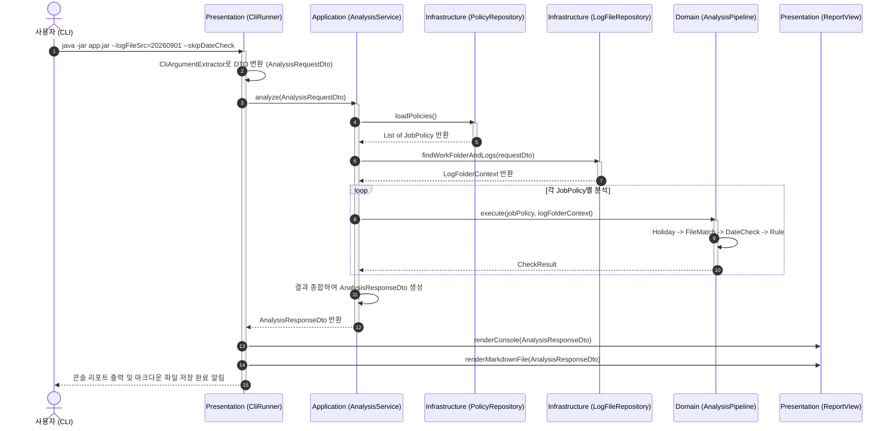
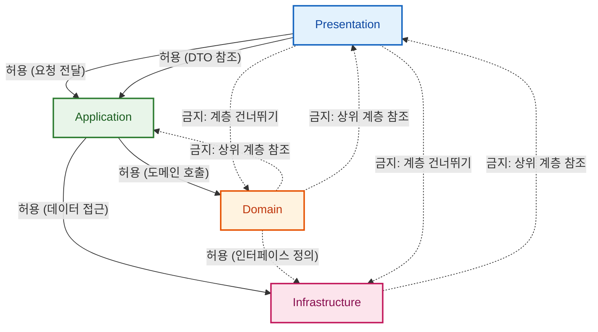

# 02. 레이어드 아키텍처 상세 설계 및 패키지 구조

> **문서 코드**: `LAYERED-02`  
> **대상 프로젝트**: `batchLogAnalyze`  
> **목적**: Spring Boot 표준 4계층(Presentation, Application, Domain, Infrastructure)에 따른 구체적인 패키지 구조, 클래스 재배치 매핑, 계층 간 데이터 흐름(Sequence) 및 DTO 설계 규격을 정의합니다.

---

## 1. 표준 4계층 패키지 구조 설계

### 1.1 패키지 트리 비교 (Before vs After)

```
[Before: As-Is 컴포넌트 구조]                [After: To-Be 표준 4계층 구조]
com.batch                                  com.batch
├── CheckLog.java                          ├── BatchLogApplication.java (부트스트랩)
├── analyzer/                              │
│   ├── HolidayChecker.java                ├── presentation/              # [1. 표현 계층]
│   ├── JobAnalysisContext.java            │   ├── cli/
│   ├── LogAnalyzer.java                   │   │   ├── BatchLogCliRunner.java
│   ├── LogDateChecker.java                │   │   └── CliArgumentExtractor.java
│   ├── LogFileLocator.java                │   └── view/
│   ├── evaluator/                         │       ├── ConsoleReportView.java
│   └── pipeline/                          │       ├── MarkdownReportView.java
├── config/                                │       └── JobpassReportFormatter.java
│   └── BatchConfig.java                   │
├── exception/                             ├── application/               # [2. 응용 서비스 계층]
│   ├── BatchAnalysisException.java        │   ├── service/
│   └── BatchErrorCode.java                │   │   ├── BatchLogAnalysisService.java
├── extract/                               │   │   └── LogFileRenameService.java
│   └── ValueExtractor.java                │   └── dto/
├── model/                                 │       ├── AnalysisRequestDto.java
│   ├── AnalysisSummary.java               │       ├── AnalysisResponseDto.java
│   ├── CheckResult.java                   │       └── RenameResultDto.java
│   ├── JobPolicy.java                     │
│   ├── Rule.java                          ├── domain/                    # [3. 도메인 계층]
│   └── ... (Enums)                        │   ├── model/                 # 순수 비즈니스 엔티티 & VO
├── policy/                                │   │   ├── JobPolicy.java
│   ├── PolicyLoader.java                  │   │   ├── Rule.java
│   ├── PolicyManager.java                 │   │   ├── CheckResult.java
│   └── loader/                            │   │   ├── StepMetrics.java
├── report/                                │   │   └── ... (Enums)
│   ├── ConsoleReportWriter.java           │   ├── service/               # 도메인 서비스 & 정책
│   ├── JobpassReportRenderer.java         │   │   ├── HolidayChecker.java
│   ├── MarkdownReportWriter.java          │   │   ├── LogDateChecker.java
│   │   └── ReportGenerator.java           │   │   └── ValueExtractor.java
└── service/                               │   ├── evaluator/             # 룰 평가 전략 패턴 (OCP)
    ├── BatchLogAnalysisService.java       │   │   ├── RuleEvaluator.java
    ├── LogFileRenamer.java                │   │   └── RuleEvaluatorRegistry.java
    └── WorkFolderResolver.java            │   └── pipeline/              # 분석 파이프라인 (Chain)
                                           │       ├── AnalysisPipeline.java
                                           │       └── AnalysisContext.java
                                           │
                                           └── infrastructure/            # [4. 인프라 계층]
                                               ├── config/
                                               │   └── BatchAppConfig.java
                                               ├── repository/            # 파일/영속성 접근
                                               │   ├── LogFileRepository.java
                                               │   ├── JsonPolicyRepository.java
                                               │   └── LocalDiskFolderResolver.java
                                               └── exception/
                                                   ├── BatchException.java
                                                   └── BatchErrorCode.java
```

---

## 2. 계층별 상세 역할 및 클래스 재배치 매핑

### 2.1 클래스 마이그레이션 매핑 테이블

| 기존 클래스 (As-Is) | 신규 계층 (Layer) | 신규 패키지 및 클래스명 (To-Be) | 역할 변화 및 리팩토링 포인트 |
| :--- | :--- | :--- | :--- |
| `com.batch.CheckLog` | **Presentation** | `presentation.cli.BatchLogCliRunner`<br/>`presentation.cli.CliArgumentExtractor` | • Main 실행 및 CLI 인자 파싱만 전담<br/>• 비즈니스 로직과 static 정적 위임 제거 |
| `com.batch.report.*` | **Presentation** | `presentation.view.ConsoleReportView`<br/>`presentation.view.MarkdownReportView`<br/>`presentation.view.JobpassReportFormatter` | • Application 계층에서 분리되어 순수 뷰(View) 렌더링만 전담<br/>• DTO 데이터를 받아 콘솔 출력 및 파일 저장 |
| `com.batch.service.BatchLogAnalysisService` | **Application** | `application.service.BatchLogAnalysisService` | • 비즈니스 흐름 오케스트레이션 전담<br/>• 뷰 출력(Report) 및 파일 직접 조작 로직 제거<br/>• `AnalysisResponseDto` 반환 |
| `com.batch.service.LogFileRenamer` | **Application** | `application.service.LogFileRenameService` | • 파일명 일괄 변경 유스케이스 서비스화 |
| `com.batch.model.*` | **Domain** | `domain.model.*` (`JobPolicy`, `Rule`, `CheckResult` 등) | • 순수 도메인 비즈니스 데이터 및 행위 캡슐화 |
| `com.batch.analyzer.evaluator.*` | **Domain** | `domain.evaluator.*` | • 도메인 규칙 평가 전략 패턴 엔진 유지 |
| `com.batch.analyzer.pipeline.*` | **Domain** | `domain.pipeline.*` | • 도메인 비즈니스 검증 파이프라인 유지 |
| `com.batch.analyzer.HolidayChecker` | **Domain** | `domain.service.HolidayChecker` | • 공휴일 판정 도메인 서비스 |
| `com.batch.analyzer.LogDateChecker` | **Domain** | `domain.service.LogDateChecker` | • 로그 일자 유효성 판정 도메인 서비스 |
| `com.batch.extract.ValueExtractor` | **Domain** | `domain.service.ValueExtractor` | • 텍스트 정규식 파싱 도메인 서비스 |
| `com.batch.policy.PolicyManager`<br/>`com.batch.policy.loader.*` | **Infrastructure** | `infrastructure.repository.JsonPolicyRepository`<br/>`infrastructure.repository.PolicyRepository` | • JSON 파일 I/O를 담당하는 영속성 Repository로 규격화 |
| `com.batch.service.WorkFolderResolver`<br/>`com.batch.analyzer.LogFileLocator` | **Infrastructure** | `infrastructure.repository.LogFileRepository`<br/>`infrastructure.repository.LocalDiskFolderResolver` | • 디스크 탐색, 파일 스캔, 경로 결정을 전담하는 인프라 컴포넌트화 |
| `com.batch.config.BatchConfig` | **Infrastructure** | `infrastructure.config.BatchAppConfig` | • Spring `@ConfigurationProperties` 표준 구성 |

---

## 3. 계층 간 상호작용 및 시퀀스 다이어그램 (Sequence Flow)

사용자가 CLI 명령어를 실행했을 때, 4개 계층을 거쳐 처리되는 전체 흐름입니다.



---

## 4. 계층 간 데이터 전송 객체 (DTO) 설계

### 4.1 요청 DTO (`AnalysisRequestDto`)
```java
package com.batch.application.dto;

public class AnalysisRequestDto {
    private final String logFileSrc;
    private final boolean autoRename;
    private final boolean skipDateCheck;

    public AnalysisRequestDto(String logFileSrc, boolean autoRename, boolean skipDateCheck) {
        this.logFileSrc = logFileSrc;
        this.autoRename = autoRename;
        this.skipDateCheck = skipDateCheck;
    }

    public String getLogFileSrc() { return logFileSrc; }
    public boolean isAutoRename() { return autoRename; }
    public boolean isSkipDateCheck() { return skipDateCheck; }
}
```

### 4.2 응답 DTO (`AnalysisResponseDto`)
```java
package com.batch.application.dto;

import com.batch.domain.model.CheckResult;
import java.util.List;

public class AnalysisResponseDto {
    private final boolean success;
    private final String folderName;
    private final int totalJobs;
    private final int normalJobs;
    private final int errorJobs;
    private final List<CheckResult> jobResults;

    // Builder 또는 생성자 제공
    public boolean isSuccess() { return success; }
    public String getFolderName() { return folderName; }
    public int getTotalJobs() { return totalJobs; }
    public int getNormalJobs() { return normalJobs; }
    public int getErrorJobs() { return errorJobs; }
    public List<CheckResult> getJobResults() { return jobResults; }
}
```

---

## 5. 레이어드 아키텍처의 엄격한 의존성 규칙 (Dependency Rules)



1. **규칙 1: Presentation은 Infrastructure를 직접 호출하지 않는다.**
2. **규칙 2: Application은 비즈니스 흐름 제어에 집중하며 뷰(View)를 조작하지 않는다.**
3. **규칙 3: Domain은 가장 독립적이어야 한다.**
4. **규칙 4: Spring IoC를 100% 활용한다.**

---

## 6. 다음 문서 안내

- ➡️ [03. 단계별 전환 실행 매뉴얼 (Playbook)](file:///d:/dev/workspace/git.jkoogihw/batchLogAnalyze/docs/layered/03_단계별_전환_실행_매뉴얼(Playbook).md)으로 이동하여 실제 소스 코드 리팩토링 단계와 Before/After 구현 가이드를 확인하십시오.
