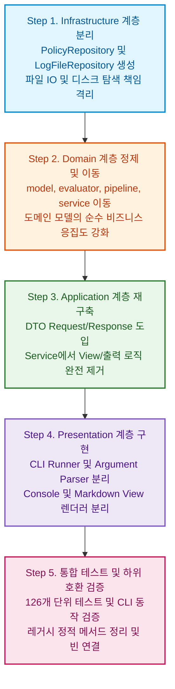

# 03. 단계별 전환 실행 매뉴얼 (Step-by-Step Playbook)

> **문서 코드**: `LAYERED-03`  
> **대상 프로젝트**: `batchLogAnalyze`  
> **목적**: 기존 18개 배치 JOB 분석 기능과 126개 단위 테스트를 100% 정상 작동 상태로 유지하면서, 현재의 컴포넌트 OOP 구조를 4계층 레이어드 아키텍처로 안전하고 체계적으로 전환하는 상세 실행 절차를 제공합니다.

---

## 1. 전환 기본 원칙 (Refactoring Principles)

```
[원칙 1: 안전한 점진적 전환]
  • 기존 코드를 한 번에 삭제하지 않고, 하위 호환 레이어를 두거나 단계별로 기능을 이관합니다.

[원칙 2: 100% 테스트 기반 검증]
  • 각 단계(Step)가 완료될 때마다 Gradle 단위 테스트(126건)를 수행하여 회귀 버그(Regression)를 방지합니다.

[원칙 3: Spring IoC 완전 전환]
  • `new` 키워드로 생성하던 인스턴스를 `@Service`, `@Repository`, `@Component`로 등록하여
    생성자 주입(Constructor Injection) 기반의 완벽한 DI 환경을 구축합니다.
```

---

## 2. 5단계 전환 로드맵 (5-Step Roadmap)



---

## 3. 단계별 상세 실행 절차 및 Before / After 코드

### 🛠️ Step 1: Infrastructure 계층 분리 (Repository 패턴 도입)

기존 `PolicyManager`, `WorkFolderResolver`, `LogFileLocator`에 흩어져 있던 파일 I/O와 디렉터리 스캔 책임을 `infrastructure.repository`로 규격화합니다.

#### 1) `PolicyRepository` 인터페이스 및 구현체 생성
```java
// infrastructure/repository/PolicyRepository.java
package com.batch.infrastructure.repository;

import com.batch.domain.model.JobPolicy;
import java.util.List;

public interface PolicyRepository {
    List<JobPolicy> findAllPolicies();
    JobPolicy findByJobId(String jobId);
}
```

```java
// infrastructure/repository/JsonPolicyRepository.java
package com.batch.infrastructure.repository;

import com.batch.domain.model.JobPolicy;
import org.springframework.stereotype.Repository;
import java.util.List;

@Repository
public class JsonPolicyRepository implements PolicyRepository {
    // 기존 PolicyManager의 JSON 파일 파싱 로직을 담당
    @Override
    public List<JobPolicy> findAllPolicies() {
        // policies.json 파일 로드 및 파싱 로직
        return ...;
    }

    @Override
    public JobPolicy findByJobId(String jobId) {
        return findAllPolicies().stream()
                .filter(p -> p.jobId.equals(jobId))
                .findFirst()
                .orElse(null);
    }
}
```

#### 2) `LogFileRepository` 생성
```java
// infrastructure/repository/LogFileRepository.java
package com.batch.infrastructure.repository;

import com.batch.domain.model.JobPolicy;
import org.springframework.stereotype.Repository;
import java.io.File;
import java.util.List;

@Repository
public class LogFileRepository {
    // 기존 WorkFolderResolver 및 LogFileLocator 로직 이관
    public File resolveWorkFolder(String logFileSrc, String baseFolder) { ... }
    public boolean hasLogFiles(File dir) { ... }
    public File findTargetFile(File[] logFiles, JobPolicy policy) { ... }
}
```

---

### 🛠️ Step 2: Domain 계층 정제 및 이동

비즈니스 엔티티와 평가 로직을 `domain` 패키지 하위로 정리합니다.

1. **`com.batch.model.*`** ➡️ **`com.batch.domain.model.*`**
   - `JobPolicy`, `Rule`, `CheckResult`, `RuleResult`, `StepMetrics`, `LogContent`
   - `RuleType`, `ConditionType`, `HolidayType`, `ScheduleType`, `CheckStatus`
2. **`com.batch.analyzer.evaluator.*`** ➡️ **`com.batch.domain.evaluator.*`**
   - `RuleEvaluator`, `RuleEvaluatorRegistry`, `SearchRuleEvaluator`, `DisplayRuleEvaluator`, `StepMetricsRuleEvaluator`
3. **`com.batch.analyzer.pipeline.*`** ➡️ **`com.batch.domain.pipeline.*`**
   - `AnalysisPipeline`, `AnalysisStep`, `HolidayStep`, `FileSearchStep`, `DateCheckStep`, `RuleEvaluationStep`
4. **`com.batch.analyzer.HolidayChecker`, `LogDateChecker`, `ValueExtractor`** ➡️ **`com.batch.domain.service.*`**

---

### 🛠️ Step 3: Application 계층 재구축 (Service & DTO)

기존 `BatchLogAnalysisService`에서 **리포트 출력(`ReportGenerator.printConsoleReport`, `saveMarkdownReport`)** 책임을 완전히 걷어내고, **순수 비즈니스 오케스트레이션 및 DTO 반환**으로 정제합니다.

#### 💡 [Before / After 코드 비교] `BatchLogAnalysisService`

```java
// =========================================================================
// [Before: As-Is] 리포트 출력과 파일 I/O가 뒤섞인 서비스
// =========================================================================
@Service
public class BatchLogAnalysisService {
    public AnalysisSummary analyze(String logFileSrc, boolean autoRename, boolean skipDateCheck) {
        // 1. 정책 로드
        policyManager.loadPolicies();
        List<JobPolicy> policies = policyManager.getPolicies();
        
        // 2. 디스크 폴더 탐색
        File resolvedFolder = folderResolver.resolve(logFileSrc, baseFolder);
        
        // 3. 분석 수행...
        for (JobPolicy policy : policies) { ... }
        
        // ❌ 문제점: 서비스 계층에서 화면/파일 출력을 직접 수행함
        ReportGenerator.printConsoleReport(summary);
        summary.reportFile = ReportGenerator.saveMarkdownReport(summary);
        
        return summary;
    }
}
```

```java
// =========================================================================
// [After: To-Be] 관심사가 분리된 표준 Layered Application Service
// =========================================================================
package com.batch.application.service;

import com.batch.application.dto.AnalysisRequestDto;
import com.batch.application.dto.AnalysisResponseDto;
import com.batch.domain.model.*;
import com.batch.domain.pipeline.AnalysisPipeline;
import com.batch.infrastructure.repository.LogFileRepository;
import com.batch.infrastructure.repository.PolicyRepository;
import org.springframework.stereotype.Service;

import java.io.File;
import java.util.ArrayList;
import java.util.List;

@Service
public class BatchLogAnalysisService {

    private final PolicyRepository policyRepository;
    private final LogFileRepository logFileRepository;
    private final AnalysisPipeline pipeline;

    public BatchLogAnalysisService(PolicyRepository policyRepository,
                                  LogFileRepository logFileRepository,
                                  AnalysisPipeline pipeline) {
        this.policyRepository = policyRepository;
        this.logFileRepository = logFileRepository;
        this.pipeline = pipeline;
    }

    /**
     * 비즈니스 유스케이스: 배치 로그 분석 실행 (DTO 입출력)
     */
    public AnalysisResponseDto analyze(AnalysisRequestDto request) {
        // 1. 정책 조회 (Repository 위임)
        List<JobPolicy> policies = policyRepository.findAllPolicies();

        // 2. 대상 폴더 및 파일 탐색 (Repository 위임)
        File workFolder = logFileRepository.resolveWorkFolder(request.getLogFileSrc(), null);
        boolean hasLogs = workFolder != null && logFileRepository.hasLogFiles(workFolder);

        List<CheckResult> results = new ArrayList<>();

        if (hasLogs) {
            File[] logFiles = workFolder.listFiles((dir, name) -> name.toLowerCase().endsWith(".log"));
            for (JobPolicy policy : policies) {
                JobAnalysisContext context = JobAnalysisContext.builder()
                        .workFolder(workFolder)
                        .logFiles(logFiles)
                        .policy(policy)
                        .folderName(workFolder.getName())
                        .skipDateCheck(request.isSkipDateCheck())
                        .build();

                results.add(pipeline.execute(context));
            }
            return AnalysisResponseDto.success(workFolder.getName(), policies.size(), results);
        } else {
            // 폴더 미존재 또는 로그 없음 실패 처리
            for (JobPolicy policy : policies) {
                results.add(CheckResult.fileNotFound(policy));
            }
            return AnalysisResponseDto.failure(request.getLogFileSrc(), policies.size(), results);
        }
        // ⭐️ View 호출(Console/Markdown)은 Presentation 계층으로 완전히 위임됨!
    }
}
```

---

### 🛠️ Step 4: Presentation 계층 구현 (CLI Runner & Views)

사용자의 입력을 받고, Application 서비스를 호출한 후, 반환된 DTO를 화면(콘솔)과 파일(마크다운)로 렌더링하는 전용 프레젠테이션 컴포넌트를 구성합니다.

#### 1) `ConsoleReportView` (콘솔 출력 전담)
```java
package com.batch.presentation.view;

import com.batch.application.dto.AnalysisResponseDto;
import org.springframework.stereotype.Component;

@Component
public class ConsoleReportView {
    public void render(AnalysisResponseDto response) {
        // 기존 ReportGenerator.printConsoleReport 로직 수행
        System.out.println("================================================================================");
        System.out.println("  [배치 분석 결과 종합 요약] 대상: " + response.getFolderName());
        System.out.println("================================================================================");
        // ...
    }
}
```

#### 2) `MarkdownReportView` (마크다운 파일 생성 전담)
```java
package com.batch.presentation.view;

import com.batch.application.dto.AnalysisResponseDto;
import org.springframework.stereotype.Component;
import java.io.File;

@Component
public class MarkdownReportView {
    public File render(AnalysisResponseDto response) {
        // 기존 ReportGenerator.saveMarkdownReport 로직 수행
        return ...;
    }
}
```

#### 3) `BatchLogCliRunner` (CLI 실행기 - Spring `CommandLineRunner`)
```java
package com.batch.presentation.cli;

import com.batch.application.dto.AnalysisRequestDto;
import com.batch.application.dto.AnalysisResponseDto;
import com.batch.application.service.BatchLogAnalysisService;
import com.batch.presentation.view.ConsoleReportView;
import com.batch.presentation.view.MarkdownReportView;
import org.springframework.boot.CommandLineRunner;
import org.springframework.stereotype.Component;

@Component
public class BatchLogCliRunner implements CommandLineRunner {

    private final BatchLogAnalysisService analysisService;
    private final CliArgumentExtractor argumentExtractor;
    private final ConsoleReportView consoleReportView;
    private final MarkdownReportView markdownReportView;

    public BatchLogCliRunner(BatchLogAnalysisService analysisService,
                              CliArgumentExtractor argumentExtractor,
                              ConsoleReportView consoleReportView,
                              MarkdownReportView markdownReportView) {
        this.analysisService = analysisService;
        this.argumentExtractor = argumentExtractor;
        this.consoleReportView = consoleReportView;
        this.markdownReportView = markdownReportView;
    }

    @Override
    public void run(String... args) {
        // 1. 인자 파싱 및 DTO 변환 (Presentation)
        AnalysisRequestDto requestDto = argumentExtractor.extract(args);

        // 2. 비즈니스 로직 실행 (Application)
        AnalysisResponseDto responseDto = analysisService.analyze(requestDto);

        // 3. 결과 렌더링 (Presentation)
        consoleReportView.render(responseDto);
        markdownReportView.render(responseDto);
    }
}
```

---

### 🛠️ Step 5: 하위 호환성 유지 및 통합 검증

기존 CLI 스크립트(`CheckLog.launch`, `CheckLogTest.launch`) 및 외부 클래스에서 `CheckLog.runAnalysis(args)`를 호출하는 레거시 코드가 존재하므로, 기존 `CheckLog` 클래스를 얇은 Facade 래퍼로 유지하여 100% 하위 호환성을 보장합니다.

```java
// com.batch.CheckLog (하위 호환성 유지용 Facade)
package com.batch;

import com.batch.application.dto.AnalysisRequestDto;
import com.batch.application.dto.AnalysisResponseDto;
import com.batch.application.service.BatchLogAnalysisService;
import org.springframework.boot.SpringApplication;
import org.springframework.boot.autoconfigure.SpringBootApplication;
import org.springframework.context.ApplicationContext;

@SpringBootApplication
public class CheckLog {

    public static void main(String[] args) {
        SpringApplication.run(CheckLog.class, args);
    }

    // 기존 정적 호출 호환 메서드
    public static AnalysisSummary runAnalysis(String[] args) {
        ApplicationContext context = SpringApplication.run(CheckLog.class, args);
        BatchLogAnalysisService service = context.getBean(BatchLogAnalysisService.class);
        // DTO 호출 및 구 Summary 변환 반환...
        return ...;
    }
}
```

---

## 4. 리팩토링 체크리스트 (Definition of Done)

- [ ] `com.batch.presentation` 패키지에 CLI 파서 및 View 렌더러가 격리되었는가?
- [ ] `com.batch.application.service` 내부에 `System.out` 및 파일 직접 쓰기 코드가 모두 제거되었는가?
- [ ] `com.batch.domain` 패키지가 상위 계층(presentation, application)을 import하지 않는가?
- [ ] `com.batch.infrastructure.repository`로 파일/JSON 접근이 일원화되었는가?
- [ ] 모든 클래스가 Spring Bean으로 등록되어 `@Autowired` 또는 생성자 주입으로 연결되었는가?
- [ ] 전체 126개 단위 테스트가 100% 성공(PASS)하는가?
