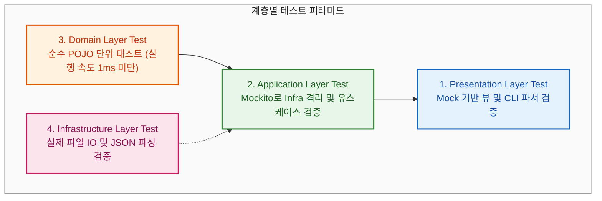

# 04. 테스트 전략 및 아키텍처 검증 (ArchUnit)

> **문서 코드**: `LAYERED-04`  
> **대상 프로젝트**: `batchLogAnalyze`  
> **목적**: 레이어드 아키텍처가 확립된 시스템에서 각 계층별(Presentation, Application, Domain, Infrastructure) 최적화된 테스트 전략을 수립하고, **ArchUnit**을 활용하여 계층 침범 및 아키텍처 위반을 코드로 자동 검증하는 방법을 다룹니다.

---

## 1. 계층별 테스트 피라미드 (Layered Test Pyramid)

레이어드 아키텍처의 가장 큰 이점 중 하나는 **"테스트 대상의 관심사에 따라 테스트 범위와 격리 수준을 명확히 나눌 수 있다는 점"**입니다.



| 계층 (Layer) | 테스트 목적 | 사용 도구 및 기법 | 실행 속도 |
| :--- | :--- | :--- | :--- |
| **Domain Test** | • 룰 평가 로직, 일자 검증, 정규식 추출, 공휴일 체크의 순수 알고리즘 검증 | • 순수 JUnit 5 (외부 Mock 없음) | 🚀 초고속 (< 1ms) |
| **Application Test** | • 유스케이스 실행 흐름(정책 조회 ➡️ 분석 ➡️ 결과 집계) 오케스트레이션 검증 | • JUnit 5 + Mockito (`@Mock`, `@InjectMocks`) | 🚀 초고속 (< 5ms) |
| **Presentation Test** | • CLI 인자 파싱 및 결과 뷰(Console, Markdown) 포맷팅 규격 검증 | • JUnit 5 + Mockito / AssertJ | ⚡ 고속 (< 10ms) |
| **Infrastructure Test** | • 실제 `policies.json` 파일 파싱 및 로컬 디렉터리 스캔 정상 동작 검증 | • SpringBootTest / TempDir 임시 파일 검증 | ⏱️ 보통 (50~200ms) |

---

## 2. 계층별 단위 테스트 코드 예시

### 2.1 [Domain 계층] 순수 규칙 평가 단위 테스트
외부 Mockito 없이 순수 Java 객체만으로 빠르고 안정적인 테스트를 수행합니다.

```java
@Test
@DisplayName("[도메인] ORA- 에러가 포함된 로그는 SearchRuleEvaluator에 의해 FAIL 판정된다")
void testSearchRuleEvaluator_Fail() {
    // Given
    RuleEvaluator evaluator = new SearchRuleEvaluator();
    Rule rule = Rule.failRule("01", RuleType.SEARCH_FAIL, "ORA-", "오라클 DB 에러");
    String logText = "2026-09-01 10:00:00 ERROR ORA-01017: invalid username/password";
    String[] lines = logText.split("\n");

    // When
    RuleResult result = evaluator.evaluate(logText, lines, rule);

    // Then
    assertFalse(result.isPass());
    assertEquals(CheckStatus.FAIL, result.getStatus());
    assertTrue(result.getDetail().contains("ORA-"));
}
```

---

### 2.2 [Application 계층] Service 격리 단위 테스트 (Mockito)
`PolicyRepository`와 `LogFileRepository`를 Mocking하여 파일 I/O 없이 비즈니스 오케스트레이션 흐름만을 100% 격리 검증합니다.

```java
@ExtendWith(MockitoExtension.class)
class BatchLogAnalysisServiceTest {

    @Mock
    private PolicyRepository policyRepository;

    @Mock
    private LogFileRepository logFileRepository;

    @Mock
    private AnalysisPipeline pipeline;

    @InjectMocks
    private BatchLogAnalysisService analysisService;

    @Test
    @DisplayName("[애플리케이션] 정책이 로드되고 로그 파일이 존재할 때 분석 파이프라인이 정상 호출된다")
    void testAnalyze_SuccessFlow() {
        // Given
        JobPolicy policy = JobPolicy.builder("01", "COMM_JOB").filePrefix("COMM").build();
        when(policyRepository.findAllPolicies()).thenReturn(List.of(policy));

        File mockFolder = new File("src/test/resources/sample_logs/20260901");
        when(logFileRepository.resolveWorkFolder(any(), any())).thenReturn(mockFolder);
        when(logFileRepository.hasLogFiles(mockFolder)).thenReturn(true);
        when(pipeline.execute(any())).thenReturn(CheckResult.pass(policy));

        AnalysisRequestDto request = new AnalysisRequestDto("20260901", false, false);

        // When
        AnalysisResponseDto response = analysisService.analyze(request);

        // Then
        assertTrue(response.isSuccess());
        assertEquals(1, response.getTotalJobs());
        verify(pipeline, times(1)).execute(any()); // 도메인 파이프라인 호출 확인
    }
}
```

---

## 3. ArchUnit을 활용한 아키텍처 규칙 자동 검증

사람이 코드를 작성하다 보면 실수로 Presentation 계층에서 Repository를 직접 부르거나, Domain 계층에서 Spring Controller를 import하는 등 **아키텍처 침범(Architecture Erosion)**이 발생할 수 있습니다.  
**ArchUnit**은 이러한 아키텍처 규칙을 JUnit 테스트 코드로 작성하여 빌드(`gradle test`) 시 자동으로 검증합니다.

### 3.1 ArchUnit 의존성 추가 (`build.gradle`)
```groovy
dependencies {
    testImplementation 'com.tngtech.archunit:archunit-junit5:1.2.1'
}
```

### 3.2 핵심 아키텍처 규칙 검증 테스트 코드
```java
package com.batch.architecture;

import com.tngtech.archunit.core.importer.ImportOption;
import com.tngtech.archunit.junit.AnalyzeClasses;
import com.tngtech.archunit.junit.ArchTest;
import com.tngtech.archunit.lang.ArchRule;

import static com.tngtech.archunit.lang.syntax.ArchRuleDefinition.classes;
import static com.tngtech.archunit.lang.syntax.ArchRuleDefinition.noClasses;
import static com.tngtech.archunit.library.Architectures.layeredArchitecture;

@AnalyzeClasses(packages = "com.batch", importOptions = ImportOption.DoNotIncludeTests.class)
public class LayeredArchitectureTest {

    /**
     * [규칙 1] 표준 4계층 레이어드 아키텍처 의존성 정의
     */
    @ArchTest
    public static final ArchRule layered_architecture_rules = layeredArchitecture()
            .consideringAllDependencies()
            .layer("Presentation").definedBy("..presentation..")
            .layer("Application").definedBy("..application..")
            .layer("Domain").definedBy("..domain..")
            .layer("Infrastructure").definedBy("..infrastructure..")

            // 계층 간 접근 허용 규칙
            .whereLayer("Presentation").mayNotBeAccessedByAnyLayer()
            .whereLayer("Application").mayOnlyBeAccessedByLayers("Presentation")
            .whereLayer("Domain").mayOnlyBeAccessedByLayers("Application", "Infrastructure")
            .whereLayer("Infrastructure").mayOnlyBeAccessedByLayers("Application");

    /**
     * [규칙 2] Presentation 계층은 Infrastructure 계층을 직접 참조할 수 없다 (계층 건너뛰기 방지)
     */
    @ArchTest
    public static final ArchRule presentation_should_not_access_infrastructure = noClasses()
            .that().resideInAPackage("..presentation..")
            .should().dependOnClassesThat().resideInAPackage("..infrastructure.repository..");

    /**
     * [규칙 3] Domain 계층은 상위 계층(Presentation, Application)을 절대 참조하지 않는다
     */
    @ArchTest
    public static final ArchRule domain_should_not_depend_on_upper_layers = noClasses()
            .that().resideInAPackage("..domain..")
            .should().dependOnClassesThat().resideInAnyPackage("..presentation..", "..application..");

    /**
     * [규칙 4] Service 클래스는 오직 application.service 패키지에만 위치해야 한다
     */
    @ArchTest
    public static final ArchRule services_should_be_in_service_package = classes()
            .that().haveSimpleNameEndingWith("Service")
            .should().resideInAnyPackage("..application.service..", "..domain.service..");
}
```

---

## 4. 아키텍처 가드레일의 실무적 효과

1. **자동화된 코드 리뷰어 역할**:
   - 신규 입사자나 주니어 개발자가 계층 규칙을 어기고 잘못 import할 경우, 로컬 및 CI 빌드에서 즉시 테스트 실패(Red)가 발생하여 잘못된 코드가 머지되는 것을 원천 차단합니다.
2. **리팩토링 안정성 보장**:
   - 대규모 리팩토링이나 기능 추가 시에도 아키텍처 원칙이 훼손되지 않고 지속적으로 유지됩니다.
