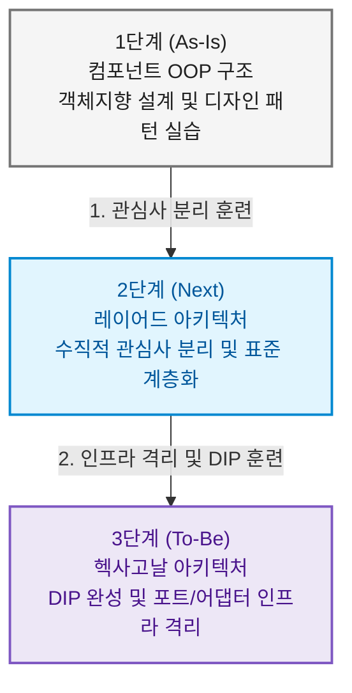
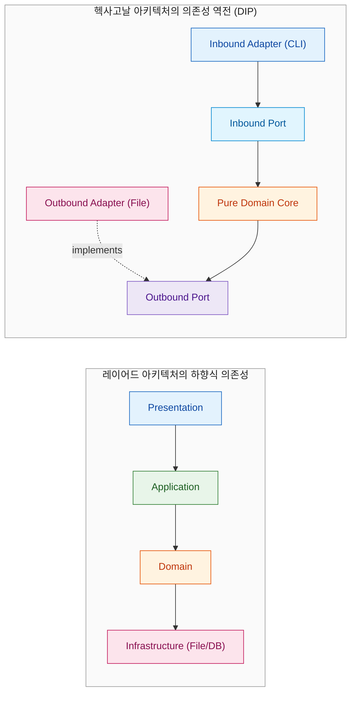
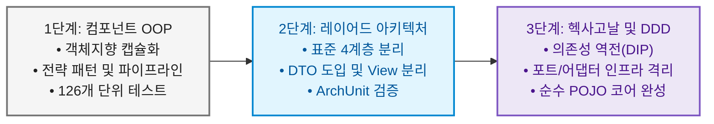

# 05. 레이어드에서 헥사고날로의 진화 학습 가이드

> **문서 코드**: `LAYERED-05`  
> **대상 프로젝트**: `batchLogAnalyze`  
> **목적**: 레이어드 아키텍처의 구조적 한계점과 이를 극복하기 위한 **의존성 역전 원칙(DIP)**을 이해하고, 레이어드 아키텍처에서 **헥사고날 아키텍처(Hexagonal Architecture / Ports & Adapters)**로 자연스럽게 도약할 수 있는 1:1 매핑 가이드와 멘탈 모델을 정립합니다.

---

## 1. 단계적 아키텍처 학습의 의의 (Why Step-by-Step?)

초급/중급 개발자가 곧바로 헥사고날 아키텍처로 진입하면, **"인바운드 포트, 아웃바운드 포트, 어댑터, 유스케이스, 도메인 엔티티, 매퍼 DTO"** 등 수많은 추상화 레이어로 인해 큰 인지 부하(Cognitive Load)를 겪게 됩니다.



1. **1단계 (컴포넌트 OOP)**에서 *전략 패턴(Strategy)*과 *파이프라인 패턴(Pipeline)*을 통해 **단일 책임(SRP)**과 **개방-폐쇄 원칙(OCP)**을 체득했습니다.
2. **2단계 (레이어드 아키텍처)**를 통해 UI/출력(Presentation), 흐름제어(Application), 업무규칙(Domain), I/O저장(Infrastructure)의 **수직적 관심사 분리(SoC)**를 체득합니다.
3. **3단계 (헥사고날 아키텍처)**에서는 레이어드의 마지막 약점인 "인프라 종속성"을 끊어내고, **의존성 역전(DIP)**을 통해 순수 비즈니스 코어를 지켜내는 클린 아키텍처를 완성합니다.

---

## 2. 레이어드 아키텍처의 내재적 한계 (Why Hexagonal?)

레이어드 아키텍처는 훌륭하지만, 대규모 시스템이나 복잡한 도메인으로 성장할 때 다음과 같은 구조적 한계를 마주합니다:



### 1) 하향식 의존성으로 인한 "인프라 중심(DB-Driven)" 사고방식 유발
- 레이어드에서는 상위 계층이 하위 계층에 의존하므로, 필연적으로 가장 밑바닥에 있는 **Infrastructure(DB 테이블, 디스크 파일 구조)를 먼저 설계하고 그 위에 비즈니스 로직을 얹는 형태**가 되기 쉽습니다.

### 2) 도메인의 외부 기술 종속 (Lack of Pure Isolation)
- `Infrastructure` 계층의 변경(예: JSON 파일 ➡️ RDB 테이블 또는 S3)이 상위의 `Application` 계층이나 `Domain` 계층의 메서드 시그니처에 영향을 주기 쉽습니다.

### 3) 멀티 채널 입력/출력 확장의 비대칭성
- 새 입력 채널(Web REST API, Slack Command)을 붙이는 것은 Presentation 계층 추가로 비교적 쉽지만, **새 출력 채널(DB 저장, Kafka 발행, Slack 알림)을 추가할 때는 Application Service 코드를 계속 뜯어고쳐야 합니다.**

---

## 3. 레이어드 ➡️ 헥사고날 1:1 컴포넌트 변환 매핑

레이어드 아키텍처의 각 컴포넌트는 헥사고날 아키텍처의 포트/어댑터와 1:1로 매우 직관적으로 대응됩니다.

| 레이어드 아키텍처 (Layered) | 헥사고날 아키텍처 (Hexagonal) | 헥사고날에서의 역할 변화 및 전환 방법 |
| :--- | :--- | :--- |
| `presentation.cli.BatchLogCliRunner` | **Driving (Inbound) Adapter**<br/>(`adapter.in.cli.CliCheckLogAdapter`) | CLI 명령어를 파싱하여 인바운드 포트(UseCase)를 호출하는 어댑터로 전환 |
| `presentation.view.ConsoleReportView`<br/>`presentation.view.MarkdownReportView` | **Driven (Outbound) Adapter**<br/>(`adapter.out.report.ConsoleReportAdapter`<br/>`adapter.out.report.MarkdownReportAdapter`) | `SaveReportPort` 출력 포트를 구현(implements)하는 아웃바운드 어댑터로 전환 |
| `application.service.BatchLogAnalysisService` | **Application Service &amp; Inbound Port**<br/>(`port.in.AnalyzeBatchLogUseCase`<br/>`application.service.AnalyzeBatchLogUseCaseImpl`) | 서비스의 인터페이스를 `Inbound Port`로 선언하고, 서비스 구현체는 외부 포트들을 조립(Orchestration) |
| `domain.model.*`<br/>`domain.service.*`<br/>`domain.evaluator.*` | **Pure Domain Core (DDD)**<br/>(`domain.model.*`, `domain.service.*`) | 프레임워크나 외부 I/O가 0%인 100% 순수 POJO 도메인 모델로 유지 |
| `infrastructure.repository.PolicyRepository`<br/>`infrastructure.repository.LogFileRepository` | **Driven (Outbound) Port &amp; Adapter**<br/>• Port: `port.out.LoadPolicyPort`, `LoadLogPort`<br/>• Adapter: `adapter.out.persistence.*` | 인터페이스는 Core(`port.out`)에 두고, 구현체는 `adapter.out`에 두어 의존성을 180도 역전시킴 |

---

## 4. 의존성 역전(DIP)의 시각적 비교

### [레이어드] 의존성 흐름: 비즈니스가 인프라를 바라봄
```
[Application Service]  ──────▶  [LogFileRepository (Infrastructure)]
  (고수준 비즈니스)                     (저수준 파일/디스크 기술)
```

### [헥사고날] 의존성 흐름: 인프라가 비즈니스 포트를 바라봄 (DIP)
```
[Application Service]  ──────▶  [«interface» LoadLogPort]  ◀─────── [LocalDiskLogAdapter]
   (고수준 비즈니스)                 (코어 내부의 계약)                 (인프라 구현체)
```

---

## 5. 아키텍처 진화 성숙도 요약 (Maturity Roadmap)



이제 여러분은 **현재의 OOP 구조를 레이어드 아키텍처로 안전하게 재배치**할 수 있는 모든 준비를 마쳤습니다.  
레이어드 아키텍처가 손에 익고 나면, 기구축된 [docs/hexagonal/ 로드맵](file:///d:/dev/workspace/git.jkoogihw/batchLogAnalyze/docs/hexagonal/00_헥사고날_DDD_전환_총괄_로드맵.md)을 따라 완벽한 헥사고날 아키텍처로 한 걸음 더 나아갈 수 있습니다!
