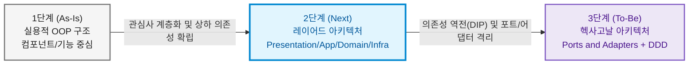

# 🏛️ 배치 로그 분석기 레이어드 아키텍처(Layered Architecture) 전환 및 학습 가이드

> **문서 코드**: `LAYERED-README`  
> **대상 프로젝트**: `batchLogAnalyze` (Spring Boot 기반 배치 로그 분석기)  
> **학습 목표**: 현재의 **컴포넌트/객체 중심 OOP 구조**를 Spring 생태계 표준인 **전통적 4계층 레이어드 아키텍처(Layered Architecture)**로 체계적으로 전환하고, 향후 **헥사고날 아키텍처(Hexagonal Architecture)**로 진화하기 위한 탄탄한 아키텍처적 기초를 확립합니다.

---

## 📌 아키텍처 진화 단계 (Architectural Evolution)

본 프로젝트는 아키텍처 학습과 실무 적용을 위해 다음과 같은 **3단계 진화 로드맵**을 따릅니다:

1. **1단계 (현재 상태 - As-Is)**: 실용적 객체지향 설계(전략 패턴, 파이프라인 패턴, 도메인 캡슐화)가 잘 되어 있으나, 패키지가 기능별로 혼재되어 있고 I/O와 비즈니스가 섞여 있는 상태.
2. **2단계 (본 가이드 목표 - Next)**: 표준 4계층(Presentation, Application Service, Domain, Infrastructure)으로 관심사를 수직 분리하고, Spring Framework의 표준 계층 규격을 완성하는 단계.
3. **3단계 (최종 목표 - To-Be)**: 레이어드 구조의 하향식 인프라 의존성을 의존성 역전 원칙(DIP)으로 완전히 끊어내고, 순수 도메인을 중심에 두는 헥사고날 아키텍처로 도약하는 단계.

---

## 📑 레이어드 아키텍처 문서 목차 (Documentation Index)

본 디렉토리(`/docs/layered/`)는 레이어드 아키텍처 전환을 완벽히 마스터할 수 있도록 5개의 전문 가이드 문서로 구성되어 있습니다.

| 번호 | 문서명 | 주요 내용 | 링크 |
| :---: | :--- | :--- | :---: |
| **01** | **현재 구조 분석 및 레이어드 장단점 비교** | • 현재 컴포넌트 OOP 구조의 한계 분석 • 레이어드 아키텍처 개념 및 핵심 원칙 • As-Is vs To-Be 심층 비교표 및 트레이드오프 | [문서 바로가기](file:///d:/dev/workspace/git.jkoogihw/batchLogAnalyze/docs/layered/01_현재구조_분석_및_레이어드_장단점_비교.md) |
| **02** | **레이어드 아키텍처 상세 설계 및 패키지 구조** | • 표준 4계층(Presentation, Application, Domain, Infrastructure) 정의 • 클래스 재배치 맵 & 의존성 흐름 다이어그램 • 계층 간 DTO 및 데이터 흐름 설계 | [문서 바로가기](file:///d:/dev/workspace/git.jkoogihw/batchLogAnalyze/docs/layered/02_레이어드_아키텍처_설계_및_패키지_구조.md) |
| **03** | **단계별 전환 실행 매뉴얼 (Playbook)** | • 5단계 점진적 리팩토링 절차 • Infrastructure(Repository/IO) 분리 가이드 • Before / After 코드 상세 비교 예시 | [문서 바로가기](file:///d:/dev/workspace/git.jkoogihw/batchLogAnalyze/docs/layered/03_단계별_전환_실행_매뉴얼(Playbook).md) |
| **04** | **테스트 전략 및 아키텍처 검증 (ArchUnit)** | • 계층별 테스트 분리 (Presentation, Service, Domain, Repository) • Mockito 단위 테스트 및 계층 통합 테스트 • ArchUnit을 활용한 레이어 침범 방지 자동화 규칙 | [문서 바로가기](file:///d:/dev/workspace/git.jkoogihw/batchLogAnalyze/docs/layered/04_테스트_전략_및_아키텍처_검증(ArchUnit).md) |
| **05** | **레이어드에서 헥사고날로의 진화 학습 가이드** | • 레이어드 아키텍처의 구조적 한계(DIP 부재) • 레이어드 ➡️ 헥사고날 전환 매핑 가이드 • 아키텍처 사고방식의 질적 도약 포인트 | [문서 바로가기](file:///d:/dev/workspace/git.jkoogihw/batchLogAnalyze/docs/layered/05_레이어드에서_헥사고날로의_진화_학습가이드.md) |

---

## 🎯 학습 핵심 체크포인트 (Key Takeaways)

1. **관심사의 분리 (Separation of Concerns)**:
   - CLI 인자 파싱 및 결과 텍스트 포맷팅은 **Presentation 계층**의 몫입니다.
   - 비즈니스 유스케이스 흐름(분석 실행, 파일명 변경 오케스트레이션)은 **Application 계층**의 몫입니다.
   - 로그 룰 평가, 공휴일 체크, 날짜 검증 규칙은 **Domain 계층**의 몫입니다.
   - 디렉터리 스캔, 실제 파일 읽기/쓰기, JSON 파싱은 **Infrastructure 계층**의 몫입니다.

2. **단방향 하향식 의존성 (Top-Down Dependency)**:
   - 상위 계층은 하위 계층을 알 수 있지만, 하위 계층은 상위 계층을 절대 참조하지 않습니다.
   - `Presentation` ➡️ `Application` ➡️ `Domain` ➡️ `Infrastructure` (또는 `Application` ➡️ `Infrastructure`)

3. **단계적 전환의 이점**:
   - 곧바로 헥사고날로 건너뛰면 포트, 어댑터, 매퍼 등의 보일러플레이트로 인해 길을 잃기 쉽습니다.
   - 먼저 레이어드 아키텍처를 통해 **"인프라(파일 I/O)와 도메인/서비스를 패키지 및 클래스 레벨에서 분리하는 감각"**을 익히면, 이후 헥사고날의 의존성 역전(DIP)과 포트 설계가 매우 직관적으로 와닿게 됩니다.
