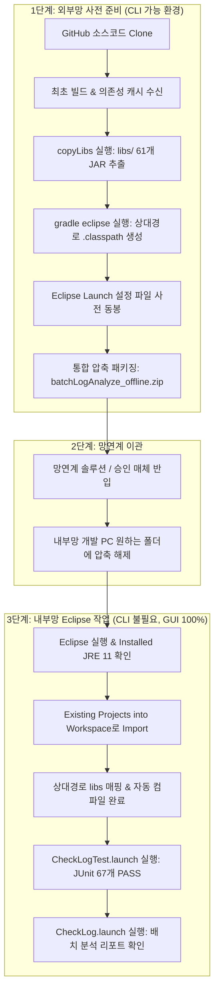

# 내부망 환경 프로젝트 이관 및 Eclipse 설정 가이드

> **문서 버전:** 1.1.0  
> **최종 수정일:** 2026-09-03  
> **대상 시스템:** 배치 로그 자동 분석 시스템 (`batchLogAnalyze`)  
> **적용 환경:** 인터넷/Nexus 차단 및 CLI(Java/PowerShell) 실행이 제한된 내부망(폐쇄망) 환경

---

## 1. 개요 및 목적 (Overview & Objectives)

### 1.1 배경 및 핵심 보안 제약 조건
1. **완전 폐쇄망:** 인터넷 연결 및 사내 Nexus(계정 분실/암호화 모듈 종속) 접근이 전면 차단되어 있습니다.
2. **CLI 스크립트 실행 불가 (중요):**  
   사내 보안 정책(AppLocker, Script Execution Policy 등)으로 인해 **내부망 PC에서 PowerShell 스크립트(`.ps1`) 실행 및 CLI 상에서의 `java`, `javac` 직접 실행이 차단**되어 있습니다.
3. **Eclipse IDE 자립성 필요:**  
   따라서 내부망에서는 CLI 명령어나 `gradlew.bat`에 의존하지 않고, **Eclipse IDE 내장 컴파일러(ECJ)와 Eclipse 내 Installed JRE만으로 컴파일/빌드/테스트/실행이 100% 자립적으로 완결**되어야 합니다.

### 1.2 가이드 목적
1. 외부망에서 필요한 모든 소스코드, 61개 의존성 JAR(`libs/`), Eclipse 프로젝트 메타데이터(`.project`, 상대 경로 `.classpath`) 및 원클릭 실행 설정(`.launch`)을 완벽하게 패키징합니다.
2. 내부망에서 CLI 실행 없이 **Eclipse GUI 작업만으로 프로젝트를 Import하고 즉시 실행/검증**하는 표준 절차를 제공합니다.

---

## 2. 핵심 개념 학습 (Core Concepts & Technical Background)

### 2.1 왜 CLI(`java`/`javac`)가 차단되어도 Eclipse에서는 정상 동작하는가?
- **시스템 CLI 컴파일러 vs Eclipse 내장 컴파일러 (ECJ):**  
  Windows 명령 프롬프트나 PowerShell에서 `javac`를 실행하려면 OS의 `PATH` 및 실행 권한이 필요합니다.  
  하지만 **Eclipse는 자체 내장 Java 컴파일러(Eclipse Compiler for Java, ECJ)** 를 내장하고 있어, OS의 `javac.exe`를 전혀 호출하지 않고도 Java 소스코드를 증분 컴파일(Incremental Build)합니다.
- **Eclipse Installed JRE 실행 메커니즘:**  
  Eclipse는 프로젝트 실행 시 OS 전역 환경 변수 대신 Eclipse 내부 설정(`Window -> Preferences -> Java -> Installed JREs`)에 등록된 JVM 바이너리를 직접 호출하므로 CLI 제한을 우회하여 안전하게 실행됩니다.

### 2.2 상대 경로(`.classpath`)의 필수성
- 외부망에서 `gradle eclipse`를 실행할 때 절대 경로(`D:/dev/...`)가 들어가면 내부망 PC의 폴더 경로가 다를 때 라이브러리 인식 오류가 발생합니다.
- 본 프로젝트는 `build.gradle`의 `eclipse.classpath.file.whenMerged` 설정을 통해 모든 라이브러리를 **`libs/xxx.jar` 형태의 프로젝트 상대 경로**로 자동 치환하여 생성하므로, 내부망의 어느 경로에 압축을 풀어도 즉시 정상 인식됩니다.

### 2.3 Eclipse Run Configuration (`.launch`) 사전 내장
- 내부망에서 CLI 명령(`gradle run`, `java -jar ...`)을 칠 수 없으므로, Eclipse용 실행 설정 파일(`CheckLog.launch`, `CheckLogTest.launch`)을 프로젝트에 사전 내장하여 원클릭으로 메인 프로그램 및 JUnit 테스트를 실행할 수 있도록 지원합니다.

---

## 3. 전체 이관 프로세스 흐름도 (End-to-End Workflow)



---

## 4. 단계별 상세 작업 절차 (Step-by-Step Procedure)

### [Step 1] 외부망: GitHub 소스 다운로드 및 오프라인 패키징 (외부 PC)

> **안내:** 이 단계는 인터넷과 CLI가 정상 동작하는 **외부망 PC**에서 1회 수행합니다.

```powershell
# 1. 소스코드 Clone
cd D:\dev\workspace
git clone https://github.com/jkoogihw/batchLogAnalyze.git
cd batchLogAnalyze

# 2. 최초 빌드 및 캐시 수신
.\gradlew.bat test

# 3. 61개 의존성 JAR를 libs/ 폴더로 복사
.\gradlew.bat copyLibs --offline

# 4. 상대경로 .classpath 및 Eclipse 메타데이터 생성
.\gradlew.bat eclipse --offline

# 5. 내부망 반입용 zip 압축 (Launch 파일, libs, .classpath 포함)
Compress-Archive -Path * -DestinationPath "..\batchLogAnalyze_offline.zip" -Force
```

- **처리 결과:**
  - `libs/` 폴더에 61개의 독립 실행형 JAR 완비
  - `.classpath`에 `libs/*.jar` 상대 경로 매핑 완료
  - `CheckLog.launch` 및 `CheckLogTest.launch` 동봉 완료

---

### [Step 2] 망연계: 내부망으로 파일 이관

1. 사내 보안 절차에 따라 `batchLogAnalyze_offline.zip` 파일을 내부망 개발 PC로 반입합니다.
2. 내부망 PC의 원하는 작업 디렉토리에 압축을 해제합니다.  
   *(예: `C:\workspace\batchLogAnalyze` 또는 `D:\projects\batchLogAnalyze` 등 아무 위치나 무방)*

---

### [Step 3] 내부망: Eclipse 설정 및 프로젝트 Import (CLI 명령 불필요)

> **안내:** 내부망에서는 터미널이나 PowerShell을 일절 실행하지 않고 **오직 Eclipse GUI만 사용**합니다.

#### 1) Eclipse Installed JRE 설정 (최초 1회 확인)
1. Eclipse 상단 메뉴: **`Window` -> `Preferences`** 이동.
2. **`Java` -> `Installed JREs`** 클릭.
3. JDK 11 (또는 JRE 11)이 등록되어 있는지 확인합니다.
   - 미등록 시: `Add...` -> `Standard VM` -> 내부망에 설치/배치된 JDK 11 디렉토리(예: `D:\dev\bin\java\jdk-11.0.5`) 선택 후 `Finish`.
4. 등록된 JDK 11 체크박스를 기본값으로 선택 후 `Apply and Close`.

#### 2) 프로젝트 Import (Existing Projects into Workspace)
1. Eclipse 상단 메뉴: **`File` -> `Import...`** 클릭.
2. **`General` -> `Existing Projects into Workspace`** 선택 후 `Next`.
3. **`Select root directory`**에서 압축을 푼 프로젝트 폴더 선택:
   - 예: `D:\dev\workspace\git.jkoogihw\batchLogAnalyze`
4. Projects 목록에 `batchLogAnalyze`가 체크된 것을 확인하고 **`Finish`** 클릭.
5. **결과:** Eclipse가 상대 경로 `.classpath`를 즉시 인식하여 프로젝트에 빨간색 엑스(컴파일 에러) 없이 빌드 완료됨.

---

### [Step 4] 내부망: 테스트 및 어플리케이션 실행 검증 (원클릭)

#### (1) JUnit 5 전체 단위/통합 테스트 실행 (67개)
- **방법 A (Launch 파일 활용):**  
  Eclipse Package Explorer에서 프로젝트 내 **`CheckLogTest.launch`** 우클릭 -> **`Run As`** -> **`CheckLogTest`** 클릭.
- **방법 B (GUI 직접 실행):**  
  `src/test/java` 폴더 우클릭 -> **`Run As`** -> **`JUnit Test`** 클릭.

**[예상 결과]**  
Eclipse `JUnit` 탭에 녹색 바(Green Bar)가 표시되며 **`Runs: 67/67 (Errors: 0, Failures: 0)`** 확인.

#### (2) 배치 로그 분석기 (CheckLog) 메인 프로그램 실행
- **방법 A (Launch 파일 활용):**  
  Package Explorer에서 **`CheckLog.launch`** 우클릭 -> **`Run As`** -> **`CheckLog`** 클릭.
- **방법 B (Java Application 실행):**  
  `src/main/java/com/batch/CheckLog.java` 파일 우클릭 -> **`Run As`** -> **`Java Application`** 클릭.

**[예상 결과]**  
Eclipse `Console` 뷰에 17개 배치 JOB 분석 결과 및 Markdown 리포트 생성 완료 메시지 출력.

---

## 5. 보안 제약 환경에서의 트러블슈팅 (Troubleshooting)

### Q1. 내부망에서 PowerShell(.ps1) 실행 차단 오류(ExecutionPolicy)가 발생합니다.
- **영향도:** **영향 없음.**  
- **설명:** 내부망에서는 `.ps1`이나 `.bat` 스크립트를 실행할 필요가 없습니다. Eclipse 내부 컴파일러(ECJ)와 `.launch` 설정만으로 모든 기능이 100% 구동됩니다.

### Q2. CLI에서 `java` 또는 `javac` 명령어가 실행되지 않거나 접근 거부됩니다.
- **영향도:** **영향 없음.**  
- **설명:** Eclipse는 OS의 `javac`를 사용하지 않고 자체 내장 컴파일러를 사용합니다. Eclipse의 `Installed JREs`에 등록된 Java 경로만 지정되어 있으면 완벽히 실행됩니다.

### Q3. 프로젝트 Import 후 빨간색 느낌표("Unbound classpath container")가 뜹니다.
- **원인:** 내부망 Eclipse의 Installed JRE 명칭이 `JavaSE-11`과 매핑되지 않은 경우.
- **해결:**  
  1. 프로젝트 우클릭 -> **`Build Path` -> `Configure Build Path...`**  
  2. `Libraries` 탭에서 `JRE System Library` 더블 클릭  
  3. `Workspace default JRE` 또는 `Alternate JRE`에서 등록된 Java 11 선택 후 `Finish`.

### Q4. 신규 라이브러리 JAR 추가 시 내부망 반영 방법
- 내부망 PC의 프로젝트 내 `libs/` 폴더에 JAR 파일을 붙여넣은 후, Eclipse Package Explorer에서 `libs` 폴더 우클릭 -> **`Refresh (F5)`** 만 수행하면 즉시 반영됩니다.

---

## 6. 최종 점검 체크리스트

| 점검 항목 | 점검 기준 | 확인 |
| :--- | :--- | :---: |
| **CLI 독립성** | 내부망에서 PowerShell / CLI / gradlew 명령어 일절 사용하지 않음 | ✅ |
| **의존성 완비** | `libs/` 폴더 내 61개 JAR 완비 (Spring Boot 2.3.12, JUnit 5 등) | ✅ |
| **상대 경로 매핑** | `.classpath`에 `libs/*.jar` 상대 경로 적용 완료 | ✅ |
| **원클릭 실행** | `CheckLog.launch`, `CheckLogTest.launch` 동봉 완료 | ✅ |
| **테스트 검증** | Eclipse JUnit Runner로 67개 테스트 100% 통과 | ✅ |
| **어플리케이션 구동** | `CheckLog.java` Run As Java Application 정상 실행 | ✅ |
